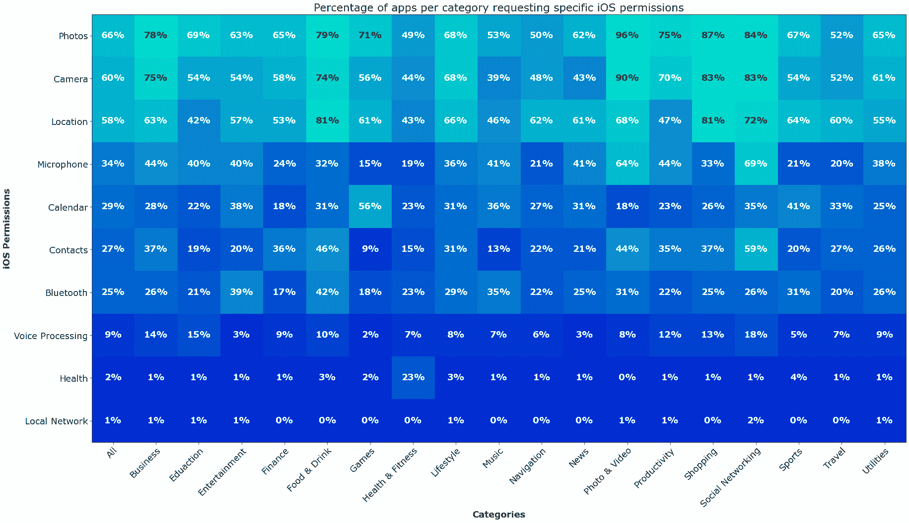
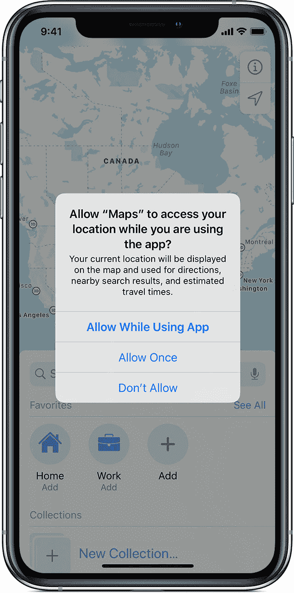
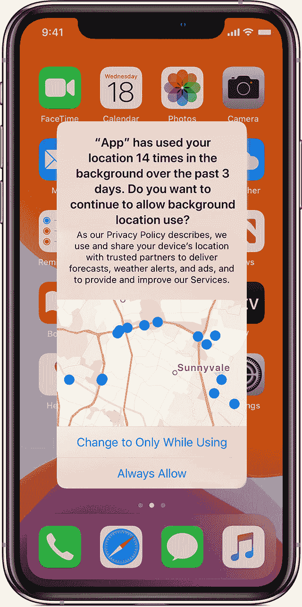

# 流行的 iOS 应用程序请求过多的用户数据权限

> 原文：<https://devops.com/popular-ios-apps-request-excessive-user-data-permissions/>

大多数应用程序需要某种用户数据才能正常运行。谷歌地图需要位置数据来提供路线服务。Twitter 需要照片库访问权限来上传照片，等等。许多用户毫不犹豫地允许访问个人信息。然而，近年来，很明显，许多应用程序正在收集(和泄露)过量的个人数据，导致严重的隐私问题。这导致苹果在最近的 iOS 更新和营销活动中高度重视用户隐私。

通常，用户数据是在后台收集的，用于合法的用例，例如定制[个性化用户体验](https://devops.com/maintaining-progressive-delivery-quality-with-feature-flags/)和优化应用程序性能。但是，许多应用程序也在未经用户明确同意的情况下，通过将用户数据转售给第三方广告数据经纪人来赚钱。更严重的是，最近的研究表明，商业可用的“匿名”数据可以去匿名化。如果位置数据被暴露，可能会将处于危险中的人置于实际的危险之中。这些都是美国监管机构尚未回应和解决的微妙的隐私侵犯。

为了揭示应用程序正在收集的数据，Jamf 最近进行的一项研究分析了 App Store 上近 10 万个热门应用程序请求的 iOS 权限。该研究发现，四个最受欢迎的移动应用权限是照片胶卷、相机、位置数据和麦克风。调查结果还显示，流行的应用程序一直在请求访问不符合应用程序核心目的的数据。

用户应该有意识地意识到他们允许应用程序访问的数据。然而，商业领袖和应用程序开发者也有责任限制不必要的数据收集，并减少数据过度暴露的可能性。如果落入坏人之手，对麦克风或摄像头等设备硬件的访问可能会被用来窃取敏感材料。此外，如果泄露，个人身份信息(PII)漏洞可能会给企业带来灾难性的损失。

下面，我将回顾 Jamf 研究的主要收获，并考虑在应用程序开发过程中，持续不断的权限请求是否加剧了隐私问题。

## 四个最常被请求的应用权限

Jamf 的研究发现，前四种类型的应用权限是照片库访问、相机访问、位置数据和麦克风访问。此外，其他受欢迎的领域包括日历信息、联系人和蓝牙。请求较少的应用程序权限包括语音处理、健康数据和本地网络访问。这项研究根据应用商店的类别对应用进行了分类，如商业、教育、娱乐、新闻、购物、旅游和其他领域。

### 1.照片

到目前为止，请求最多的数据访问类型是照片。所有类别中至少有一半的应用程序请求访问用户照片库。自然，这种要求在 YouTube、FaceApp 或 Splice 等照片和视频 App 中最为常见；96%的此类应用程序要求访问照片。其次是 87%的购物应用(亚马逊、商店、易贝等。)，以及 84%的社交网络应用(脸书、Instagram、Twitter 等。).

这里的问题是，预期的照片库访问的级别可能是高度可变的。例如，仅仅为了上传一张照片而授予对整个相机胶卷以及几十年的旧个人照片的访问权就授予了一种相当侵犯性的特权。这使得苹果公司[加强了隐私控制](https://developer.apple.com/documentation/photokit/delivering_an_enhanced_privacy_experience_in_your_photos_app)——用户现在可以选择只允许访问选定的图像或整卷图像。

考虑到这些新的限制，应用程序开发者应该采取措施尊重用户隐私。注意潜在的照片限制，设计应用程序只为手头的任务收集必要的照片。

### 2.照相机

下一个请求最多的权限是摄像机访问权限。这在照片和视频应用程序中最为常见，其中 90%的应用程序会请求相机访问。这在购物和社交网络应用(各占 83%)以及 Zoom、Slack 或 WebEx 等商务应用(75%)中也很常见。类似于关于照片库访问的发现，启用相机访问是普遍存在的。但是，无限期授予也是最危险的权限之一。如果一个不良行为者获得了帐户访问权，这个漏洞可能使他们能够监视用户。

同样，开发者应该考虑只在手头的任务需要时引入相机功能。显然，在用户不知情的情况下调用摄像头访问是不道德的。即使是与相机相关的错误也会产生极大的影响。例如，2020 年针对 Instagram 的一项[诉讼称，该应用在监视用户。由于其潜在的威胁，高安全性设施已经完全禁用了摄像机硬件。](https://appleinsider.com/articles/20/07/25/instagram-claims-bug-triggered-ios-14-camera-notifications-when-not-in-use)

### 3.位置

位置跟踪是另一个非常有用的权限，但在现代应用程序开发中有时会被过度描述。位置数据包括用于确定用户大概位置的蜂窝、Wi-Fi、GPS 和蓝牙数据。收集位置数据最多的类别包括购物和食品饮料，两者都占 81%。社交网络和照片及视频应用类别分别占 72%和 68%。

如今，iOS 隐私设置提供了一个在后台跟踪位置数据的检查。iOS 用户现在可以选择:“使用应用时允许”、“允许一次”或“不允许”。

当应用程序在后台跟踪数据时，状态栏中会显示一个蓝色指示器，以提高用户的意识。当应用程序使用大量位置数据时，iOS 还会提醒用户，并提供[种方法来完全关闭位置服务](https://support.apple.com/en-us/HT203033)。安卓也紧随其后推出了“只有在应用程序正在使用时才允许”的功能。

位置追踪感觉有点毛骨悚然。如果落入坏人之手，它很容易被用于邪恶的目的。在所有许可授予选项中，位置数据对最终用户来说更是一个物理安全问题。从用户的角度来看，他们应该只在使用应用程序时启用位置跟踪。从开发人员的角度来看，他们在收集和存储这样的 PII 时应该非常小心，以确保不违反规定。

### 4.麦克风

最后，访问用户的麦克风是第四个最常请求的权限。调查发现，69%的社交网络应用程序、64%的照片和视频应用程序以及 41%的商业和生产力应用程序(Asana、谷歌日历、TimeTree 等)。)都想把话筒递过来。

在这里，潜在的隐私问题类似于涉及摄像头访问的问题。坏演员可能会激活麦克风来监听私人谈话，记录环境噪音，并将发现卖给广告经纪人。为了增加用户的意识，iOS 14 现在需要一个橙色的点来显示，表明麦克风正在使用中。

## 其他用户隐私问题

用户行为跟踪和应用程序到应用程序的信息交换是隐私问题的另一个持续领域。公司经常将这类信息转售给数据经纪人，然后利用这些信息在第三方网站上提炼高度有针对性的广告活动。这就是你在谷歌上搜索的结果，产品广告会出现在你的 Instagram feed 中。苹果刚刚开始用他们的应用程序跟踪透明度功能来反击这种做法。在 iOS 14.5 中，应用程序开发人员必须询问他们是否可以跟踪你的活动。

最近的分析证实，商业上可获得的消费者数据尽管被贴上了“匿名化”的标签，但可以通过证实其他应用程序上的行为，成功地用来拼凑出用户的准确图片。例如，用户能够追踪并查明导致一名天主教牧师在 Grindr 上[出柜的行为。智能手机应用程序数据同样可能被掠夺者用来监视名人或政治家，构成切实的安全威胁。](https://www.nbcnews.com/tech/security/priest-outed-grindr-app-highlights-rampant-data-tracking-rcna1493)

另一个令人担忧的原因是与照片相关的元数据。人们经常将 GPS 嵌入到图像中，以帮助组织他们的照片记忆。如果这不可避免地与照片联系在一起，它基本上允许位置数据共享给拥有照片库访问权限的各方，否则他们可能没有位置跟踪权限。

## 从大数据到大问题

或许这份报告最奇怪的发现是，所有应用程序都在请求似乎与其核心价值主张无关的权限。例如，为什么 87%的购物应用程序需要访问用户的整个照片库？46%的食品和饮料应用程序*真的需要访问用户的个人联系人才能下送餐订单吗？导航应用*真的需要你的个人日历信息来计算市区的路线吗？**

答案并不美好。多年来，跟踪和收集大量用户数据一直是一种业务需求。毫无疑问，有一个论点是，通过创新功能和大数据在人工智能中的作用来增强用户体验。然而，这种正在进行的做法继续蔓延到道德灰色地带。事实是，应用程序收集的个人数据越多，在此过程中产生的潜在隐私问题和安全威胁载体就越多。

请求对设备上硬件和数据收集的权限并不总是必要的。因此，为了保持安全并限制数据过度暴露，不要过度规定数据收集。如果不是你 app 核心功能的根本，就不要收藏，也不要存储。在要求许多设备权限之前要三思，并定期审核应用程序权限请求，以将其保持在最低限度。随着 iOS 和 Android 引入新的平台准则来提高用户隐私，开发者应该为用户授予越来越少的数据收集权限做好准备。这是他们的权利。

如果科技公司投资于诚实、道德的商业模式，而不依赖于收集用户数据并将其转售给可疑的广告商，那将是一件好事。对于那些挖掘用户数据但声称匿名的人，我想指出的是[报告](https://www.nytimes.com/2019/07/23/health/data-privacy-protection.html)显示匿名数据只不过是[纯粹的神话](https://www.theguardian.com/technology/2019/jul/23/anonymised-data-never-be-anonymous-enough-study-finds)。