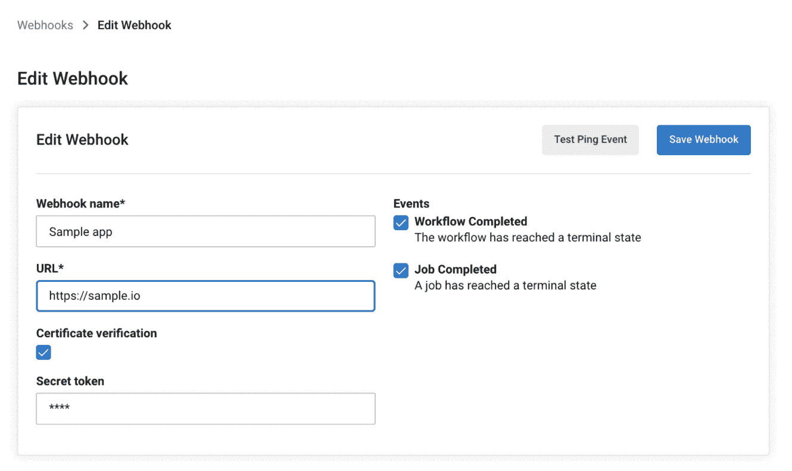

# CircleCI 押注 Webhooks 简化 DevOps 集成

> 原文：<https://devops.com/circleci-bets-on-webhooks-to-streamline-devops-integrations/>

CircleCI 今天宣布了 [CircleCI webhooks](https://www.businesswire.com/news/home/20210902005166/en/CircleCI-Announces-Webhook-Integrations-with-Datadog-Sumo-Logic-and-Other-Technology-Partners-to-Increase-Developer-Productivity-for-Software-Teams) ，这是一项功能，它使软件工程团队能够构建集成，以近乎实时的方式对 CircleCI 作业和工作流状态通知做出反应。

CircleCI 业务发展副总裁 Tom Trahan 表示，该公司实施 webhooks 的最新版本将成为 CircleCI 围绕其持续集成/持续交付(CI/CD)平台扩展生态系统的基础，web hooks 可以在事件发生时随时发送消息。

例如，CircleCI 平台现在可以使用 webhooks 来集成 Datadog 的 CI 可见性工具，该工具现在可以用于显示 circle CI 指标。类似地，Sumo Logic 也使用 webhooks 来使其持续智能观察平台能够跟踪 CircleCI 平台上的事件。这些功能现在可通过 CircleCI 平台的软件即服务(SaaS)版获得。

Trahan 表示，主要目标是通过提高流程编排水平来减少跨多个平台的 DevOps 工作流中的摩擦，DevOps 团队可以利用这些流程编排，而不必使用低级应用程序编程接口(API)来创建和维护集成。

他补充说，Webhooks 可以简化开发人员的工作流程，同时提高整体工程速度。Trahan 指出，此外，DevOps 团队对事件进行三角测量也应该变得更加简单，这样可以更快地解决事件。

CircleCI 依靠 [webhooks](https://devops.com/?s=webhooks) 来加强其对 DevOps 的最佳方法的支持，使组织能够以他们认为最合适的方式混合和搭配工具，而不是局限于单一的集成 DevOps 平台。同类最佳的方法通常使利用新工具变得更加简单。缺点是开发运维团队在集成了构成开发运维工作流的所有工具之后需要维护的集成级别。

目前还不清楚依靠 webhooks 实时共享跨多个平台发生的事件的消息会对集成产生什么影响。然而，在不要求开发运维团队放弃一个工具而使用另一个工具的情况下，任何简化开发运维环境的努力都可能会受到欢迎。毕竟，花在管理 DevOps 平台上的每一分钟都意味着可用于构建和部署应用程序的时间大大减少。

将由每个 DevOps 团队决定最佳的 DevOps 方法在多大程度上适合他们的组织。随着越来越多的组织意识到他们已经变得多么依赖软件，例如，驱动数字化业务转型计划，许多 IT 领导者正在制定一个在整个组织内标准化 DevOps 平台的方案。然而，实现这一目标可能很困难，因为企业中的各个部门已经采用了各种各样的工具和平台。

与此同时，在软件更新对利润和收入产生深远影响的时代，随着组织寻找进一步加快应用程序开发和部署的方法，对开发人员和工程生产力的关注只会增加。事实上，一个软件项目的延迟会对大范围的计划产生连锁影响，这些计划由于依赖于延迟的项目而无法进行。考虑到所有这些延迟可能对收入产生的影响，组织对软件开发项目延迟的容忍度正在逐渐降低，这是可以理解的。