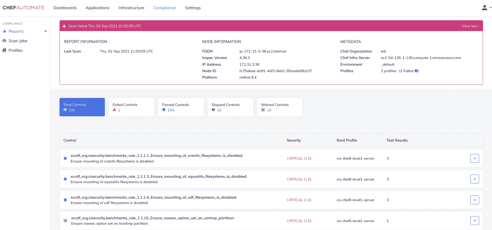

# 进展扩大了 Chef 自动化产品组合

> 原文：<https://devops.com/progress-expands-chef-automation-portfolio/>

在 ChefCon 2021 大会之前，Progress today 在[发布了 Progress Chef 自动化平台](https://www.globenewswire.com/news-release/2021/09/07/2292434/0/en/Progress-to-Unveil-New-Capabilities-at-ChefConf-2021-that-Ensure-Successful-DevSecOps-Adoption.html)的一系列增强功能，包括托管服务和软件即服务(SaaS)版本，以及与云服务和其他第三方工具的更紧密集成。

Chef business in Progress 的工程副总裁 Sudhir Reddy 表示，目前处于测试阶段的 SaaS 平台，与 Progress 提供的托管服务相结合，将使自动化平台更容易被更多的组织使用。

Progress 现在还扩展了其 Chef Compliance Automation for Cloud Resources 产品在亚马逊网络服务(AWS)、微软 Azure 和谷歌云平台(GCP)上的覆盖范围，除了提供与 Azure Policy 的集成之外，还包括符合每个云环境最佳实践的 Chef premium 内容，Azure Policy 是微软的一套工具，可将资源与一组定义云基础设施应如何使用的业务规则进行比较。

最后，Progress 增强了 Chef Enterprise Automation Stack，在合规性和基础架构自动化[之间提供了更紧密的集成](https://devops.com/?s=automation),同时增加了基础架构操作仪表板、对 Windows 补丁管理的支持、与第三方机密管理工具的集成，以及对 Chef Workstation 和 Chef Test Kitchen 的改进，以简化应用程序开发流程中的测试。

随着 SaaS 平台的发布和托管服务的推出，Chef 加入了一长串 IT 供应商的行列，这些供应商不再承担内部 IT 运营团队部署和保护其平台的责任。Reddy 说，很明显，现在更多的组织希望花更多的时间来构建和部署软件，而不是代表他们管理自动化这些任务的平台。

目前还不清楚有多少已经部署了平台的 It 团队可能会转移到 SaaS 平台，或者依赖 IT 供应商代表他们管理该平台。然而，在新冠肺炎疫情之后，许多 IT 团队继续在家工作，以帮助对抗病毒的传播。其中许多组织要么自己将平台转移到云，采用 SaaS 平台，要么完全外包 IT 平台的管理。还有许多小型组织根本没有独立建立 IT 自动化平台所需的内部专业知识和资源。

Reddy 指出，这种方法还使得在更大的 DevSecOps 工作流环境中融合安全性、合规性和 it 运营管理变得更加简单。

IT 自动化的最大矛盾一直是实现它所需的专业知识水平。例如，缺乏创建自动化行动手册所需专业知识的组织无法从 IT 自动化平台中获得太多价值。只有较大的公司从 It 自动化投资中获得了最大的收益。然而，随着 IT 自动化通过 SaaS 平台和托管服务变得越来越容易实现，从中受益所需的专业知识水平自然会下降。事实上，随着人工智能(AI for IT operations，AIOps)的出现，许多人工 IT 任务越来越多地被自动化。

现在说整个 It 行业是否处于下一波自动化浪潮的风口浪尖还为时过早，但在这一点上，构成实现这一目标所需的原始汤的原材料只是在等待催化剂。