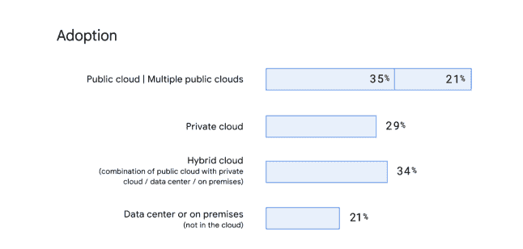
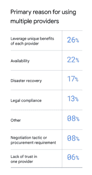
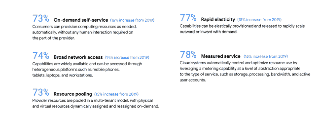
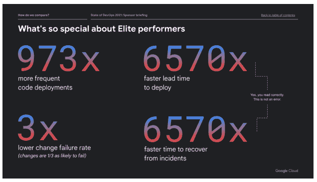

# 加速开发运维报告的状态:向云迁移

> 原文：<https://devops.com/accelerate-state-of-devops-report-the-move-to-multi-cloud/>

对 [2021 加速开发运维状态报告](https://cloud.google.com/devops/state-of-devops/) (SODR)数据的分析显示，越来越多的组织选择[云计算](https://devops.com/?s=multi-cloud)和混合云解决方案。在我们的调查中，受访者被问及他们的主要服务或应用程序托管在哪里，结果显示公共云的使用正在增加。

在今年的 1，200 名调查受访者中，55%的人表示他们正在使用公共云，比 2019 年增加了 5%。在这大约 660 人中，21%表示他们使用多家云提供商，34%表示使用混合云战略。为了澄清起见，多云是指使用两个或更多公共云提供商，混合云是指使用内部数据中心和/或私有云和一个或多个公共云。

我们的数据表明，使用多个提供商的首要原因是利用每个提供商为市场带来的独特优势。每个云提供商都提供基本的计算和存储服务，但是通过利用同类最佳的云计算功能，而不是局限于特定的供应商，可以最好地建立同类最佳的业务。事实上，26%的受访者表示这是他们采用多云或混合云方法的主要原因。

第二大原因是可用性，占 22%。世界各地的公司越来越认同软件公司，并依赖软件作为他们的主要业务驱动力。软件使公司能够向客户交付价值，超越竞争对手，对市场事件做出反应，并为市场带来创新。这一核心产品的可用性不是一个“好东西”，而是必不可少的。然而，事实是，计算机和网络是脆弱的——它们会出故障。如果我们接受这个事实，我们就能设计和建造为这种可能性做好准备的系统。各公司正在采取策略来应对这些风险，这些策略可以减小变化的爆炸半径，并允许系统即使在出现故障时也能继续运行。

说到最坏的情况，灾难恢复(DR)是采用多个云提供商的第三大原因。事实上，云和数据中心的全球扩散让公司重新思考灾难恢复的实际意义。系统停机、运营商争先恐后地重建系统并从磁带备份恢复的时代已经一去不复返了，云就是备份。云加全自动管道的采用创造了围绕灾难恢复的范式转变，允许公司围绕零停机时间设计其灾难恢复策略。

除了混合和多云战略的增加，我们还看到云计算的五个基本特征的使用增加。[国家标准与技术研究院](https://www.nist.gov/) (NIST)将五个基本特征定义为:

这五个特征必须被接受并用于实现云的价值。一家采用云但没有采用这些特征的公司只是将他们的运营环境从一个地方转移到另一个地方，但没有获得任何东西。事实上，对新环境、新定价模式的不熟悉，以及多年来在本地运行所带来的优化不足，往往会导致失望。成功的公司拥有这五个特征。

我们从以前的报告中了解到，这些特征对于交付高性能或精英性能水平的软件是必不可少的。我们看到五个特征的采用率在 73%到 78%之间，最低的是按需自助服务(73%)，最高的是测量服务(78%)。毫无疑问，这种采用率的提高是我们今年看到的精英员工令人瞠目结舌的表现的关键驱动力。

现在，精英级员工的部署频率提高了 973 倍，部署准备时间缩短了 6，570 倍，变更失败率降低了 3 倍，当发生故障时，从事故中恢复的时间加快了 6，570 倍。回去再读一遍——不，这些不是打字错误，也不是数据中的错误！表现出色的公司将新功能推向市场的速度比表现不佳的公司快 6，570 倍。这是我们看到软件交付绩效和整体业务绩效之间直接联系的原因之一。

我们鼓励您阅读完整的 [2021 年开发运维加速状态报告](https://cloud.google.com/devops/state-of-devops/)。报告中有很多很棒的信息，包括增加了第五个关键指标，没错；“四把钥匙”现在变成了“五把钥匙”“新的衡量标准是什么？”你问？嗯，我想你得看报告才能知道。🙂