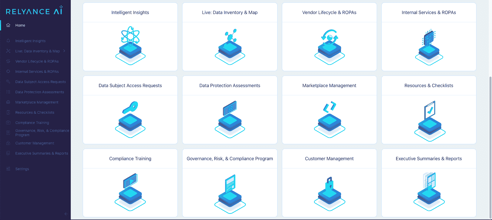

# Relyance AI 使用 ML 算法将合规性左移

> 原文：<https://devops.com/relyance-ai-shifts-compliance-left-using-ml-algorithms/>

Relyance AI 本周从隐身状态中脱颖而出，推出了一个同名平台，用于在更大的 DevOps 工作流环境中实时管理隐私和数据治理。

Relyance AI 联合首席执行官 Leila Golchehreh 刚刚筹集了 3000 万美元的种子资金，他表示，组织现在可以快速准确地回答基本的隐私问题，并通过将需求直接映射到代码库来确保合规性和治理。她补充说，该平台使用[机器学习](https://devops.com/?s=machine+learning)算法，实时提供了直到源代码的透明性和可见性。

Relyance AI 联合首席执行官 Abhi Sharma 还指出，当今大多数法律和数据保护团队对数字运营的了解有限。开发人员和数据科学家不断创建和更新应用程序。Sharma 说，当合规团队收集到所需的数据时，这些数据已经过时了。

Relyance 人工智能平台根据实时数据处理确定的操作现实分析合同要求。Sharma 补充说，合规团队随后可以解决出现的隐私问题。

Relyance AI 平台的核心是五个集成的组件，它们首先通过连接到应用程序编程接口(API)来清点资产；通过扫描代码和了解数据的处理方式，生成处理活动的通用记录(ROPAs );检测到问题时共享警报；提供数据生命周期视图，以突出数据主体访问请求(DSAR)例外和扩展，并解决供应商生命周期管理问题，以确保第三方遵守政策。

Sharma 说，法规遵从性，就像安全性一样，正在进一步向应用程序开发方向转移，因为组织希望在问题出现在生产环境中之前就将其消除。Relyance AI 平台旨在与持续集成/持续交付(CI/CD)平台集成，这些平台是现代软件开发生命周期流程的核心，他补充道。

毫无疑问，随着法规遵从性和应用程序开发领域的冲突，将会出现与 DevSecOps 其他最佳实践类似的文化挑战，需要开发人员和安全团队之间更多的协作。挑战在于，与 IT 安全部门的同事相比，法规遵从性管理人员往往离应用程序开发更远。

然而，现在合规成为准则只是时间问题。例如，现代应用程序已经利用开放策略代理在应用程序中嵌入遵从规则。人工智能平台应该在合规性问题出现时使其更容易识别，以便在任何违规行为发生之前解决它们。

当然，DevOps 团队在将合规性作为代码进行管理方面有既得利益。开发运维团队竞相构建和部署应用程序，结果却遇到了一系列需要通过重新编码应用程序元素来解决的合规性问题，这种情况并不罕见。不足为奇的是，这些法规遵从性问题经常导致错过应用程序交付的最后期限。机器学习算法为合规官创建的当前大量文档提供了替代方案，但 IT 团队中没有足够多的其他成员阅读这些文档，更不用说理解它们了。