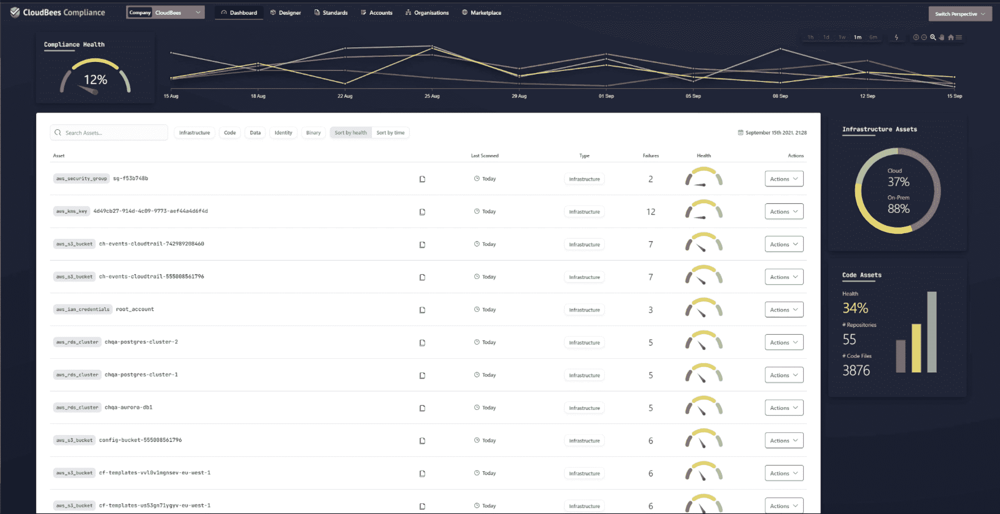

# CloudBees 获得神经印迹以向左移动顺应性

> 原文：<https://devops.com/cloudbees-acquires-neuralprints-to-shift-compliance-left/>

在今天的在线 [DevOps World 2021](https://www.devopsworld.com/) 大会上，CloudBees 透露，它已经收购了 Neuralprints，为 [CloudBees Compliance](https://www.businesswire.com/news/home/20210929005201/en/CloudBees-Brings-Continuous-Compliance-to-Enterprises) 提供核心技术，这是一个实时合规和风险分析平台，将于 2022 年第一季度推出。

与此同时，CloudBees】增强了与其同名的持续集成/持续交付(CI/CD)平台的功能管理功能，以提供对功能标志的更大可见性和控制，这些功能标志现在被广泛用于为应用程序添加新功能。

CloudBees 首席信息安全官(Prakash Sethuraman 表示，CloudBees 合规性将使 DevOps 团队能够持续执行合规性政策，作为更好地保护其软件供应链的努力的一部分。这些开发运维团队将能够在代码、二进制工件、数据、身份和基础设施环境中强制执行合规性，从而为开发人员和 IT 运营团队提供即时的可操作反馈，使问题在应用部署到生产环境之前就得到解决。

CloudBees 合规性基于由 Neuralprints 开发的开源和专有技术的混合，将通过内部 IT 环境以及软件即服务(SaaS)应用程序提供。Sethuraman 说，目标是使组织能够将合规性作为代码来管理，作为将更多应用程序安全责任进一步转移给开发运维团队的努力的一部分。

今天公布的一项对 500 名 C 级主管的调查发现，将近一半(45%)的人承认保护他们的软件供应链的计划已经完成了一半或不到一半。然而，95%的人声称他们的软件供应链是安全的(95%)，超过一半的人(55%)表示他们非常安全。

整整 93%的受访者表示，他们准备好应对勒索软件或对其供应链的网络攻击等问题。然而，近三分之二(64%)的人承认，如果他们的供应链受到攻击，他们不确定会首先求助于谁；58%的人承认，如果他们遭遇攻击，他们不知道他们的公司会怎么做。同样比例(64%)的受访者表示，如果他们确实遇到了问题，需要四天以上的时间来解决问题。

几乎所有 C 级高管(95%)都表示，与两年前相比，他们现在更多地考虑保护供应链，92%的人表示安全问题会影响他们的品牌。总共有 83%的人说安全问题导致他们的开发人员放下一切去审查代码，82%的人指出这导致组织花在创新上的时间更少。

从好的方面来看，95%的高管表示，会对容器图像进行高或关键漏洞检查，而同样数量的高管表示，自动化访问密钥会自动过期。共有 92%的受访者表示，他们的公司只接受用开发人员 GPG 密钥签名的提交，而 90%的受访者表示，在他们的组织中，对受信任注册中心的依赖是有限的，而 89%的受访者表示，对 CI/CD 工具的管理访问是受限的(89%)。

当然，高管们所相信的和组织内部实际发生的并不总是同一个东西。一系列引人注目的软件供应链违规事件导致许多组织重新审视他们的软件供应链。与此同时，拜登政府发布了一项行政命令，要求所有联邦机构进行类似的审查。

不管怎样，大多数组织将很快发现他们自己采用了更广泛的 [DevSecOps](https://devops.com/?s=DevSecOps) 最佳实践来确保软件供应链的完整性，不管他们认为他们的软件开发平台现在有多安全。