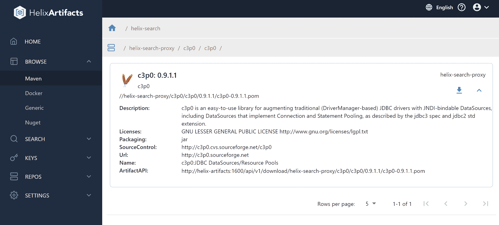

# Perforce 将工件包管理器与版本控制平台相结合

> 原文：<https://devops.com/perforce-melds-artifact-package-manager-with-version-control-platform/>

Perforce Software 在其产品组合中添加了一个通用包管理器，称为 [Helix Artifacts](https://www.perforce.com/press-releases/perforce-releases-new-artifact-manager) ，使其 Helix 核心版本控制平台的用户能够存储和跟踪源代码。

Perforce Software 的 Helix Core 数字资产管理产品经理 Gerhard Krüger 表示，目标是使使用 Helix Core 的 DevOps 团队能够访问软件包管理器，而不必退出 Helix Core。

他补充说，这种方法还提供了一种更安全和更具成本效益的方式来存储、消费和分发工件，这也有助于提高开发人员的生产率。Krüger 指出，在版本控制平台上管理工件的能力也意味着开发运维团队不需要设置额外的存储基础设施或配置单独的安全权限来分发软件包。

Helix Artifacts 是一个自托管的包管理器，作为 NuGet、Maven 或 Docker 等包的翻译器，使它们能够直接与 Helix Core 通信，并构建系统和集成开发环境(ide)。Perforce Software 声称，Helix Artifacts 是通过每服务器订阅模式提供的，其成本远低于竞争对手管理工件的方法。

大多数 DevOps 团队都试图在使用最佳工具构建应用程序和降低复杂性并最终降低成本的需求之间取得平衡。因此，任何时候一个工具成为 DevOps 团队使用的另一个平台的特性，都会有一个正在使用的过程的回顾。许多 DevOps 团队试图减少他们维护工具集成所花费的时间。

现在人们也更加关注软件供应链的安全性。每种新工具通常都会产生另一组需要保护的凭据，因为网络犯罪分子会在应用程序被部署到生产环境之前，继续积极尝试将恶意软件嵌入到应用程序中。目前还不清楚 DevOps 团队希望将工具链整合到什么程度，但鉴于这些不断上升的安全问题，安全团队开始质疑 DevOps 工具链攻击面为何如此之广只是时间问题。

与此同时，在整个企业中广泛采用 DevOps 最佳实践的组织数量继续稳步增长。在过去的十年中，大多数组织至少有一个应用程序开发团队采用 DevOps。然而，随着构建软件来推动数字业务转型计划的压力自新冠肺炎疫情的冲击以来稳步增加，应用 DevOps 最佳实践来加速应用程序开发的需求变得更加明显。因此，越来越多的组织希望在更少的平台上标准化他们的应用程序开发工作，以减少摩擦。

现在说自疫情开始以来应用程序的开发和部署速度是否真的提高了还为时过早。但是，有一点是肯定的，那就是大多数组织现在都在尝试以前所未有的速度发展。