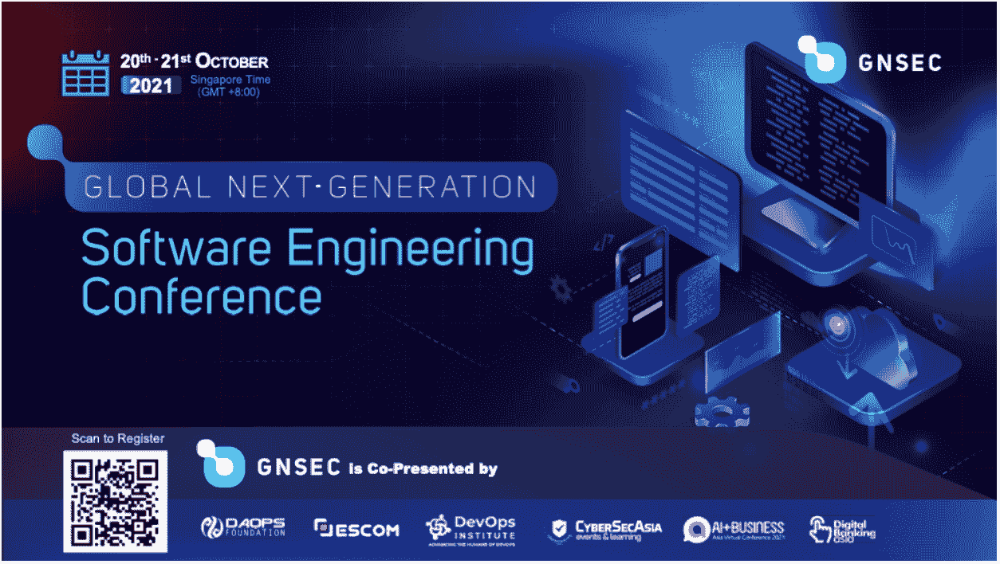
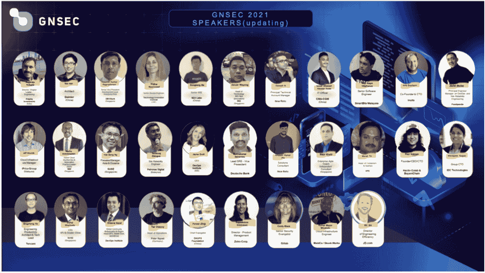
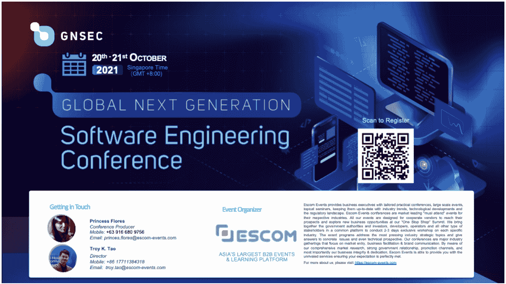

# 全球下一代软件工程会议

> 原文：<https://devops.com/global-next-generation-software-engineering-conference/>

GNGSEC 吹响了软件工程变革的号角！

疫情让 2020 年成为我们看到这十年中一些最令人兴奋的数字技术变得商业可行的一年，其他技术最终成为主流。软件是数字化转型的核心。在数字时代，我们生产软件的方法也需要数字化。在软件工程领域，人工智能、大数据、云计算和原生云的采用正在加速企业的数字化。

全球下一代软件工程大会(GNSEC)聚焦全方位的软件工程技术，致力于定义下一代软件工程的标准。该活动将聚集 1000 多名与会者，并且将通过虚拟体验进行现场直播，高级软件工程师、架构师和团队领导可以在此交流、学习和成长。来自不同背景的专家和开发人员将分享他们的前沿技术实践经验和案例。

本次活动的大多数与会者将来自东南亚地区(新加坡、泰国、印度尼西亚、菲律宾、马来西亚、越南)、印度和中国。由于目前的行程限制， **GNSEC 2021 将通过 Airmeet** 虚拟展示。它将为与会者提供虚拟展览，虚拟会议，同行网络会议，商业配对会议，虚拟讨论组。

全球下一代软件工程大会(GNSEC)由 DAOPS 基金会和 Escom Events 联合举办。该活动是数字创新系列活动的一部分，以人工智能、开发运维、网络安全和数字转型为特色。此前，该活动曾在上海、深圳、北京、加州和香港举办。

届时将有来自星展银行、ING、IBM、戴姆勒、腾讯、JD.COM、DevOps Institute、Gitlab、New Relic、SUSE 等 30 多位演讲嘉宾分享软件工程方面的思想、经验和案例研究。

在这里注册 [加入](https://qingflow.com/f/becdbef1) 事件与我们一起重建软件工程。