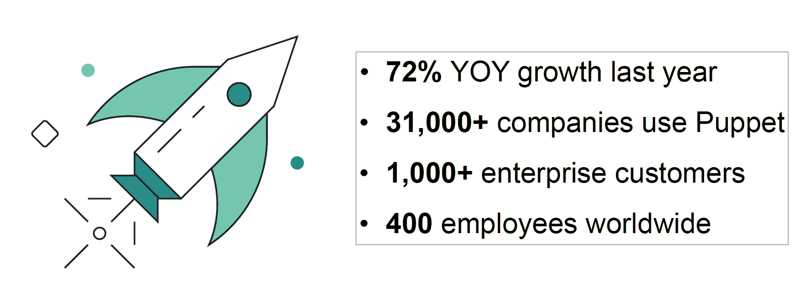
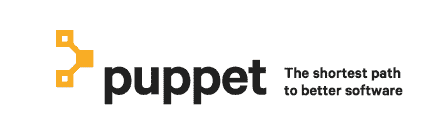
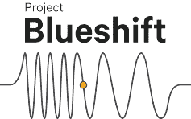

# 木偶和 DevOps 一样，继续成熟

> 原文：<https://devops.com/puppet-like-devops-continues-mature/>

在过去的几年中，我们看到 DevOps 运动不断成熟和发展。它已经超越了早期采用者和幻想阶段，成为市场的主流。因此，毫无疑问，DevOps 领域的一些领先解决方案也会同样成熟和发展。昨天，Puppet(以前的 Puppet Labs)发布了几项声明，作为更广泛信息的一部分，他们已经准备好、愿意并且能够在未来几年继续成为该领域的领导者。

昨天的傀儡公告有几个部分，让我们逐一看看:

**增长指标**——有点强制性的，Puppet 宣布他们继续享受快速增长。【T2

这里没有太多要补充的，数字说明了一切。

**[傀儡实验室现在只是傀儡](https://puppet.com/company/press-room/releases/puppet-ignites-era-of-constantly-modern-software)** 。在我与市场营销的 SVP 内森·罗林斯的交谈中，他说这是一个认识到市场已经在做什么的问题。不知道你听过多少人把公司称为傀儡实验室。我认识的大多数人都说木偶。那么为什么要把绳子推上山呢？从今以后，该公司将被简称为傀儡。

但是这里不仅仅是名字。罗林斯告诉我，随着新名字的出现，他们也经历了一次彻底的更名。新的标志，新的网站外观，新的宣传外观。这个新品牌试图给人以简单、稳定和成熟的印象。

 **新领导层**——公司聘请了软件/科技行业的资深领袖桑杰·米尔钱德尼(Sanjay Mirchandani)担任总裁，首席运营官。Mirchandani 曾在 VMware、EMC 和 Microsoft 担任高级领导职务。他的职责将包括市场运作，包括销售、营销、客户成功和全球扩张。据罗林斯告诉我，桑杰将领导公司的大部分日常运营。

不过，这并不是一个职业领袖取代创始人/首席执行官的案例。Puppet 的 Luke Kanies 仍担任首席执行官一职。Mirchandani 将解放 Kanies 去做他最擅长的事情。成为一个有远见的人，为 Puppet 规划路线，反过来也帮助塑造 DevOps 和软件交付市场。只有自信的创始人才能引入真正的专业人士来帮助经营企业，让你做自己最擅长的事情。许多人太没有安全感，不愿与一个“不像他们那样爱自己孩子”的新人分享管理权。卢克认识到这一举措对公司的长期利益是有益的，这值得称赞。

 [ **项目 Blueshift**–](https://puppet.com/company/press-room/releases/puppet-announces-blueshift-and-puppet-enterprise-2016-1-giving)很多人都在关注 blue shift 使用 Puppet 和 Docker、Kubernetes、Meseosphere、CoreOS 等容器技术的能力。虽然 Blueshift 在今天发布时确实关注了这一点，但实际上不止于此。Blueshift 实际上是 Puppet 社区和公司本身之间的合作，以确保 Puppet 始终能够帮助公司采用下一代基础设施技术。虽然今天这些下一代技术是与容器相关的，但我们的想法是将 Blueshift 发展成能够与新技术一起工作的东西。这是一个超过 2-3 年的长期项目，而不是着眼于从现在起 5-10 年后的前景。这是一个雄心勃勃的愿景。很难知道下一件大事是什么。但事实上，木偶甚至试图保持关注这是值得称赞的。

**[升级到 Puppet Enterprise 和 Puppet Orchestrator](https://puppet.com/company/press-room/releases/puppet-announces-blueshift-and-puppet-enterprise-2016-1-giving)**——混杂在所有消息中的是，Puppet 已经发布了其企业产品和去年发布的 Orchestrator 产品的升级。没有进入一个功能接一个功能的回顾(如果你喜欢，你可以阅读 PR 的链接)，Puppet 继续完善他们的企业产品，作为他们成熟的一部分。

**与 Splunk 和 HipChat 的集成**—随着 DevOps 的成熟，市场将希望它们的工具之间有更大的集成。Puppet 在这个方向上迈出了很好的一步，它发布了 Splunk 应用程序，允许您自动设置 Splunk 服务器，并提供对企业 DevOps 环境的更大可见性。

HipChat 集成允许您的 Puppet 编排管理显示在 HipChat GUI 中，并允许用户在 HipChat 中管理它。一个很好的好处是访问权限，它确保那些没有权限的人不能访问傀儡编排数据。

总的来说，这是 Puppet 的一大进步。公平地说，Chef 的人也一直在采取措施进一步完善他们的产品和组织。随着 DevOps 的不断发展，我相信我们会看到其他一些 DevOps 工具初创公司跟随这里的领导者，随着 DevOps 市场的成熟和发展。