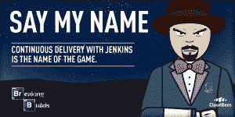
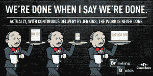

# 打破构建 II——管家做到了

> 原文：<https://devops.com/breaking-builds-ii-butler/>

作为《DevOps.com》杂志的主编，同时也为其他几家出版物撰稿，我看到了太多的竞赛、促销和其他营销活动(更不用说公关公司的宣传了)，但本周我发现了一个，我真的想与你分享。我在 CloudBees 的朋友们，Jenkins 公司又一次推出了他们的 Breaking Builds 推广活动。以防你不知道，它结合了两个截然不同的角色。詹金斯的管家和绝命毒师的沃尔特·怀特。正如 CloudBees [的首席执行官 Sacha Labourey 在他的博客文章](https://blog.cloudbees.com/2014/12/breaking-builds-ii-los-jenkins-hermanos.html)中所说，将这两者结合在一起“可能是你能得到的认知失调的最好例子之一”

CloudBees 的营销和工程团队已经想出了一系列横幅，上面有管家作为绝命角色的图形，尤其是水白色。然后他们想出了这些图片的标题，这些标题是对《绝命毒师》台词的模仿，同时也有一个持续传递的角度。你可以在这里看到他们的成果。如果你接受的话，你的任务就是拿起图片，想出一个比 CloudBees 团队更好的标题。然后你在推特上发布图片和说明，你就被录取了。

有几类字幕的奖项。这些类别是

*   **10 个突破性建筑图片中任何一个的最原始说明**+您的说明
*   **最幽默的标题**10 幅突破性建筑图片+你的标题
*   **转发量最多的 Twitter 帖子***10 张突破性建筑图片中的任何一张+你的标题**我们敢称之为 CI(持续互动)吗？*😉
*   **最受欢迎的 Twitter 帖子**10 张突破性建筑图片+你的标题
*   如果我们看到一个新兴的主题，我们还可能在比赛期间创建其他类别！

类别，奖品和完整的规则也可以在这里找到。

我个人最喜欢 CloudBees 制作的图片和说明是这两张:

 

所以，如果你是一个詹金斯和/或绝命毒师的粉丝，为什么不加入这个有趣的活动呢？试试看。我们还将在 DevOps.com 展示一些获奖横幅