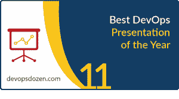

# 第三届年度 DevOps 十几名获奖者揭晓

> 原文：<https://devops.com/3rd-annual-devops-dozen-winners-announced/>

我们非常高兴地宣布第三届年度 DevOps 十二大奖的获奖者。从很多方面来说，今年是 DevOps 十二强的分水岭，因为挑选、投票和选择获胜者的过程更加精炼和成熟。在 12 个(毕竟有 12 个)类别中，每一个类别的获胜者都绝对应该得到奖励和认可。

非常感谢我们的全明星评委团:Jayne Groll，Robert Stroud，Helen Beal，George Hulme 和 Ericka Chickowski。我是决胜局的评委，只能在一个类别中投票。我还应该说，几乎所有的类别都非常紧凑。[每一位决赛选手](https://devops.com/devops-dozen-2017-finalists-announced/)都值得表扬！

这些奖项反映了 DevOps 社区所做的一些伟大工作。它们并不详尽；有很多很多有价值的公司、个人、项目和产品。但这是我们对 DevOps 精英中精英的看法。

话不多说，下面是 2017 年 DevOps 十几名获奖者:

# 最佳 DevOps 开源项目

 [Jenkins](https://jenkins.io/) 是 2017 年最佳 DevOps 开源项目的获胜者。Jenkins 最初创建于 2004 年，是“Hudson”的一个分支，是领先的开源自动化服务器之一。Jenkins 拥有一个可扩展的、基于插件的架构，使开发人员能够创建 1400 多个插件，以适应多种构建、测试和部署技术集成。2017 年，Jenkins 超过了 155，000 个活跃安装(这些活跃安装将使用情况报告给 Jenkins 项目-仅占总安装的一小部分)，以及大约 150 万用户，使其成为世界上部署最广泛的连续交付自动化服务器。了解更多:[https://jenkins.io/](https://jenkins.io/)

# 最佳 DevOps 商业解决方案

来自 ElectricCloud 的  [ElectricFlow](http://electric-cloud.com/products/electricflow/) 荣获 2017 年最佳 DevOps 商业解决方案奖。ElectricFlow 是一个企业级 DevOps  发布自动化平台，可简化多层应用的供应、构建和发布。管理环境和应用程序的共享、模型驱动的方法允许团队使用团队已经了解和喜爱的工具和堆栈，以高效、可预测和可审计的方式跨混合基础架构协调多个管道和发布。了解更多:[http://electric-cloud.com/products/electricflow/](http://electric-cloud.com/products/electricflow/)

# 最佳 DevOps 解决方案提供商执行官

  这个类别的冠军其实是 CEO [Sacha Labourey](https://www.cloudbees.com/team/sacha-labourey) 和 CTO [Kohsuke Kawaguchi](https://www.cloudbees.com/team/kohsuke-kawaguchi) 的 CloudBees 团队的 1/1a 参赛作品。Sacha 的  背景在 CloudBees 之前是 JBoss 的 CTO 和关键人物。KK 最初加入 Hudson 时是 Sun 的一名工程师，后来创建了 Jenkins。他们共同将 CloudBees 打造成了 DevOps 和 CI/CD 领域的强大力量。在与 Jenkins 社区密切合作的同时，他们也在 Jenkins 项目的持续发展和普及中发挥了重要作用。合在一起，他们是一个值得这个奖项的强大团队！

# 最佳 DevOps 解决方案提供商

 [CA Technologies](https://www.ca.com/us/why-ca/devops.html?intcmp=headernav)，目前包括 Automic、BlazeMeter、Runscope 和 Veracode，是 2017 年  最佳 DevOps 解决方案提供商的得主。从工具链的角度来看，CA Technologies 提供了最广泛的高度自动化解决方案，这些解决方案是构建和优化跨应用程序开发、交付和运营的集成工作流所必需的。在整个应用生命周期中(包括规划、开发、测试、发布和运营)，只有 CA Technologies 能够提供快速交付安全、优质应用所需的全面功能，并提供无与伦比的客户体验。

# 年度最具创新性的 DevOps 解决方案

2017 年最具创新性的 DevOps 解决方案由持续自动化领域的领导者 Chef 颁发给 [Habitat](https://www.habitat.sh/) 。Habitat 是一项位于 SaaS 的服务，它提供了简单、一致地打包应用程序的最快方式，以便在灵活的云原生架构(如由 Docker Swarm、Kubernetes 和 Cloud Foundry 组成的架构)中进行部署和管理，包括内部部署和云中部署。Habitat 让开发人员和运营团队能够完全控制容器化的应用程序生命周期。了解更多:[https://www.habitat.sh/](https://www.habitat.sh/)

# 最佳德沃普斯福音传道者

 [Derek Weeks](https://www.linkedin.com/in/derekeweeks/)Sonatype 的副总裁兼 DevOps 倡导者(All Day DevOps 的联合创始人)是 2017 年的顶级 DevOps 布道者。今年，DevOps 全天为全球 33，000 名专业人士提供了 100 场由 DevOps 从业者主持的免费在线  会议。自成立以来，该社区吸引、教育和支持了 40，000 多名 DevOps 专业人员。会议还引起了对 250 多个 DevOps 相关社区、meetup 团体和组织的关注，这些团体和组织正在帮助教育世界各地的从业者。2017 年，Derek 在美国和欧洲发表了 18 次与 DevSecOps 相关的主题演讲、会议演讲和 meetup 演示。在过去的一年中，他还制作了超过 75 个与 DevOps 相关的博客，涵盖了从持续交付到 DevSecOps、现代基础设施和文化转型等主题。这些博客不仅提供了第一手经验，还突出了来自世界各地不同公司的 40 多名 DevOps 实践者的工作。这些博客可以在 [Sonatype](https://blog.sonatype.com/author/derek-weeks) 、[全天开发者](https://www.alldaydevops.com/blog/author/derek-weeks)、[DevOps.com](https://devops.com/author/derek-e-weeks/)和 [Dzone](https://dzone.com/users/1245265/Weeks@sonatype.com.html) 看到。此外，Derek 在 2017 年支持了许多 DevOps 报告和调查，包括“[软件供应链状况报告](https://www.sonatype.com/2017-state-of-the-software-supply-chain-report)”和“ [2017 DevSecOps 社区调查](https://www.sonatype.com/2017survey)”，以揭示行业最佳实践和需要关注或改进的领域。

# 最佳 DevOps 转换

  CapitalOne 被评委选为 2017 年最佳 DevOps 转型。在过去的几年里，这个 20 岁的金融服务巨头  一直在改造自己，利用 DevOps 建立一个连续的软件交付周期。在最近于旧金山举行的 DevOps 企业峰会上，高级主管和高级工程研究员 Topo Pal 告诉挤满了人的房间，该公司的旅程符合其创业精神。帕尔说:“我们认为自己是一家初创公司，就像任何初创公司一样，我们有不同的 DNA。"例如，我们开发自己的软件."采用 DevOps 更好。该公司现在在公共云中做几乎所有的事情(包括后端处理)，重点是使用开源技术构建微服务。在过去三年中，Capital One 建立了自动化步骤，扩展了 DevOps，采用了开源和云，并开始衡量其成功，现在它将注意力转向了持续交付。了解更多信息:

*   [DevOps 在其核心](https://www.informationweek.com/devops/capital-one-devops-at-its-core/d/d-id/1330515)
*   [这就是我们推动 DevOps 的原因](https://medium.com/capitalonetech/this-is-why-we-push-for-devops-18b267e2e4cf)
*   [devo PS 成熟的四个阶段](https://www.forbes.com/sites/mikekavis/2017/11/17/the-four-stages-of-devops-maturity/#59ed36bc2f62)
*   【Capital One 如何成为领先的数字银行
*   案例研究:Capital One 投资于自动化软件开发管道的持续交付

# 最佳 DevOps 转型领导者

  保拉·付令超是 2017 年最佳 DevOps 转型领导者的获胜者。葆拉是 CSRA 公司的数字服务总监。葆拉  付令超拥有 20 多年的 IT 经验，过去 15 年一直在努力在联邦政府推行敏捷文化。她的第一个敏捷项目是在 2001 年；从那以后，她作为敏捷开发人员、技术主管、Scrum master 或敏捷教练领导了超过 15 个项目。她的团队已经帮助两家联邦机构将应用程序迁移到亚马逊 AWS GovCloud，并在此过程中完成了其他一些令人惊叹的 DevOps ninja 工作。Paula 还是 CSRA 企业捐赠集团寻找 STEM 慈善机构的执行负责人，并与编写代码的[女孩合作，带来了专注于缩小 IT 领域性别差距的暑期项目和课外俱乐部。她还参加了 2017 年 DevOps 论坛，共同撰写了一篇关于组织中的 DevOps 学习的论文，“](https://www.csra.com/media-room/article/csra-joins-forces-girls-who-code)[持续学习:建立一个 DevOps 启发的职业轨道](https://events.itrevolution.com/devops-resources/devops-careers)、”，并对今年论坛产生的其他论文主题进行了同行评审。Paula 曾在多个行业会议上公开发言，包括 [AllDayDevOps 2017、](https://www.youtube.com/watch?v=pxLtpvICUhU) Red Hat 政府研讨会和 [DevOps 企业峰会 2017](https://www.youtube.com/watch?v=19ylAan2uTM&list=PLvk9Yh_MWYuwO-lho8ibPJKSYemJQAS0e&index=26) 。

# 最佳新 DevOps 解决方案公司

[  nClouds](https://www.nclouds.com/) 是 DevOps 和云服务、产品和解决方案的提供商，专注于 AWS 上的现代基础设施，是 2017 年最佳新 DevOps 解决方案公司的获奖者。他们作为客户团队的延伸，构建和管理现代基础设施解决方案，更快地实现创新。nClouds 是经过认证的 AWS 高级咨询合作伙伴，拥有 250 多个 DevOps AWS 实施、500 多个部署的管道和 10，000 多个托管服务器。他们称他们的新 SaaS 产品 nOps 为 DevOps 速度的现代变革管理。nClouds 被 CIO review[“2017 年 20 家最具潜力的 DevOps 解决方案提供商”](https://www.nclouds.com/blog/nclouds-named-to-20-most-promising-devops-solution-providers-by-cioreview/)和[“2017 年 20 家最具潜力的 IT 服务管理提供商”](https://it-service-management.cioreview.com/vendor/2017/nclouds)。

# 最佳 DevOps 书/电子书

【IBM 的 Sanjeev Sharma 的《DevOps 领养剧本》获得 2017 年最佳 DevOps 图书奖。该书为 DevOps 提供了清晰的“如何做”  ，包括价值流图、如何引领文化转型以及将 DevOps 扩展到企业等主题。正如 Sanjeev 自己说的，这本书从他创建的最佳实践的幻灯片开始，以吸收他所学到的一切。

这本书不仅代表了 Sanjeev 多年来的学习成果，也代表了整个 IBM 多年来的学习成果，其中包括了他在此期间学习的一些 DevOps 领域的领军人物。Sanjeev 也忠于“剧本”范式，通篇引用板球、足球和其他运动。这是一本很好的读物，组织得很好。要了解更多信息，请听听这个 DevOps 聊天:Sanjeev Sharma 的“DevOps 领养行动手册”。

# 年度最佳 DevOps 演示

[DevOps:企业转型的新现实](https://www.youtube.com/watch?v=Pc38mvCTgfE)”在 IBM InterConnect 2017 上长达 45 分钟的主题演讲，获得了 2017 年最佳 devo PS 演讲奖。它的特点是基因金，约翰科马斯，NBC 环球和 IBM 的高管和杰出的工程师，包括大卫林德奎斯特，安吉尔迪亚兹，CJ 保罗和迈克尔埃尔德。你涉足 DevOps 吗？也许你已经运行了一个伟大的试点项目，或者有一个了不起的双披萨团队正在创新新的应用程序。你如何将他们的成功扩展到你的整个组织？答案在于文化、个人和技术转变的结合，将方法和云原生方法与成熟的自动化模式和现有的本地开发相结合。该演示包括最新 IBM 解决方案的客户案例和演示，以帮助公司转变其团队，并为大规模企业 IT 环境构建、部署和管理其应用。

# 年度最佳 DevOps.com 文章

[持续集成 vs .交付 vs .部署:有什么区别？克里斯·托兹的《T4》获得了 2017 年 DevOps.com 年度最佳文章](https://devops.com/continuous-integration-vs-delivery-vs-deployment-whats-difference/)  奖。Christopher Tozzi 报道技术和商业新闻已有近十年，专门研究开源、容器、大数据、网络和安全。他目前是 Fixate.io 和 Sweetcode.io 的高级编辑和 DevOps 分析师。

再次祝贺获奖者——你们的努力得到了应得的认可。

对于那些对明年的 DevOps 感兴趣的人来说，信息将在今年 7 月或 8 月发布。

— [Alan Shimel](https://devops.com/author/ashimmy/)