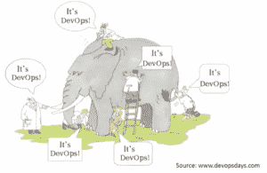
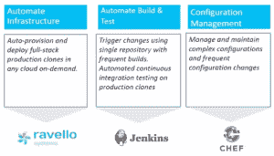

# 企业发展的 5 个秘密

> 原文：<https://devops.com/5-secrets-enterprise-devops/>

 围绕企业级开发运维的优点仍有很多争论，有人说开发运维对于高度可扩展的初创公司来说很棒，但对于企业来说不可行，还有人说开发运维对于公司的生存是必不可少的。当企业评估采用 DevOps 的潜在影响时，他们应该考虑一些关键点:

**1。企业开发运维采用:一次一点**

你如何确保你的开发者得到即时的反馈？怎么能在版本之间来回切换呢？您如何整合整个 CI/CD 渠道？虽然[CI/CD for dummy](http://www.ravellosystems.com/blog/continuous-integration-deployment-test-automation/)是一个很好的起点，但最大的问题是你会多快陷入细节的泥沼。无论您是参与美国宇航局的挑战，以发现所有小行星对人类的威胁并拯救地球，还是在企业中制定 DevOps 战略——首先要做的事情——定义问题并将其分解为可操作的块，这些块可以并行或顺序完成。

当企业试图应对 DevOps 挑战时，常见的情况是，许多人会对如何实现 DevOps 方法以及实现 devo PS 方法意味着什么有许多解释。项目很容易在最初的规划阶段停滞不前。应对这一挑战的唯一方法是将其分解为更小的工作流，例如，根据基础设施自动化、构建和测试自动化以及配置管理来定义工作流，并确定哪些技术最适合解决每个工作流中的特定挑战。所以，基本上，你怎么吃一头大象？一次一勺。

**2。死在没有按需云容量的水中**

有限的企业数据中心基础设施根本跟不上敏捷团队的步伐，敏捷团队需要能够通过点击按钮或 API 调用来启动多个并行环境，而不会收到“容量耗尽”的消息。当项目周期达到高峰时，这个问题变得更加重要，因为需要立即部署新的应用程序或更新。为了保持企业 IT 的灵活性，企业必须永远摆脱容量限制，包括计算和存储资源。毫无疑问，公共云非常适合——你必须能够按需使用 AWS 和谷歌云。在完全了解工作负载的突发性的情况下，完全在内部构建一个大规模的软件实验室是非常愚蠢的。如果您希望在 VMware 上生产，并在 AWS 中测试环境，您需要确保高保真环境，以便对测试结果有真正的信心。环境必须是完全相同的副本，即数据中心和云中相同的虚拟机和相同的网络。云为您提供了能力，但是您如何让临时测试环境与生产环境完全相同呢？今天，只需按一下按钮，就可以在云中克隆您的 it 基础架构。

**3。复杂多层环境的脚本化死亡**

持续集成和部署是提高有效性和效率的好方法。但是，在具有复杂网络元素的多层环境中，每次需要新的测试环境时，使用手动脚本来调配相关资源(多个虚拟机、网络、存储)、配置这些资源以及部署应用程序的所有组件的开销非常高。此外，在当今高度动态的环境中，脚本经常过时，增加了痛苦因素。为简单性和可扩展性而设计:易于重复的部署、能够快照和回滚到早期版本都是必须仔细考虑和满足的要求。例如，如果 Jenkins 可以使用一个 API 调用在云中启动整个环境的多个克隆，并行运行所有测试，在完成时自动释放资源，并在出现错误时对环境进行快照，会怎么样？简化自动化和针对复杂性进行设计是企业的一项关键要求。

**4。摧毁团队筒仓说起来容易做起来难**

 企业开发运维面临的最大挑战之一是让运营团队与开发团队完全融合，并能够在发生大量意外事件的情况下进行规划和执行。开发和运营团队的真正整合怎么强调都不为过。例如，运营团队必须是 SCRUM 过程的一部分。创建一个 DevOps 团队是一个开始，但是创建这个 DevOps 团队实际上并没有将开发和运营结合在一起。团队之间的障碍需要随着时间的推移而消除——不同的团队需要为了更大的共同愿景而合作。

**5。将基础设施作为代码来管理是可行的，并且完全值得付出努力**

以代码的形式实现基础设施的承诺不一定要被破坏。最小化交付周期(包括创建即时环境)变成了一个 API 调用的问题，几个小时变成了几分钟。各种各样的现代技术唾手可得，帮助您完成使命。我们今天看到的最常见的场景可能是现代初创公司，其 R&D 组织从一开始就以 DevOps 概念建立起来，但这并不意味着企业会错过公交车。采用现代 DevOps 方法的企业进展迅速，无需全盘更换整个基础架构。例如，德国电信 DevOps 总监 Ram Akuka 分享了他们的[企业 DevOps 之旅](http://www.ravellosystems.com/customer-case-studies/deutsche-telekom)，描述了他们如何使用 VMware、AWS、Chef、Jenkins 和 Ravello 建立完全集成的 CI/CD 渠道，以前所未有的速度加快了他们的软件交付周期。

***关于作者***

 拉韦洛系统公司产品营销总监 Shruti Bhat，该公司是 SaaS 业界领先的嵌套虚拟化和软件定义网络公司。在 Ravello 之前，Shruti 是 VMware 的一名虚拟化爱好者，负责管理软件定义的存储产品线。她拥有加州大学洛杉矶分校安德森分校的工商管理硕士学位和计算机科学工程学士学位，之前曾在 IBM 和惠普领导研发团队，并投身于初创企业。