# 如何透视和联接不断变化的时序数据

> 原文：<https://devops.com/how-to-pivot-and-join-time-series-data-in-flux/>

使用 [Flux](https://www.influxdata.com/products/flux/) 在 InfluxDB 中合并多个时间序列可能看起来是一项艰巨的任务。这篇深入的 Flux 教程将解释如何在 InfluxDB 中进行透视、时移和连接时间序列。

在本 InfluxDB 教程中，我们将向您展示如何使用连续生产步骤中捕获的工业数据创建多个时间序列的准确概览。要做到这一点，需要一个合适的连接机制，在将时间序列相对于时间对齐后，将它们组合成一个序列。

本教程基于我们在工业环境中用 [InfluxDB](https://influxdata.com) 在[factory . io](http://factry.io/)解决的真实案例。

一天中的每一秒钟，世界各地的生产场所都在产生数量惊人的[过程数据](https://devops.com/?s=process+data)。这些数据直接从现场生产线获取，并以过程参数的形式捕获。能够在整个生产过程中可靠地跟踪这些过程参数，对于持续改进制造操作至关重要。

工业过程参数被表示为并发时间序列。它们不一定以相似的速度提供数据点，也不总是随着时间的推移保持一致。在连续的生产步骤中获得所捕获的过程参数的可信概述可能是令人畏惧的。

## 解释时间序列数据

简而言之，时间序列数据代表按时间索引的许多不同的数据点。由于时间是我们世界中任何可观测事物的组成部分，时间序列数据无处不在。当缩小到生产环境时，捕获的过程参数被及时分发，以便与它之前或之后的过程数据相区别。

时间序列和关系数据之间有什么区别？与时间序列数据相比，关系数据包含通常由人工标识符引用的记录。这些标识符可以相互关联，从而形成关系方面。

## **Pivot 和 Join Flux 中的时序数据**

### **开始之前**

在生产线上，请注意，一个产品批次不能同时处于两个不同的生产步骤中。因此，在不同生产步骤中测量的时间序列自然是不一致的。因此，在将这些时间序列恰当地合并成一个序列之前，它们中的许多将需要随着时间的推移而移动，以获得正确的概览。

此外，检索存储在时序数据库中的数据通常是通过使用专用的查询语言 Flux 来完成的。

关于这一点有两点:

1.  在 Flux 中，一个 join 只能利用一个 inner join 机制将多个时间序列融为一体。由于内部连接只保留多个时间序列中共享时间戳的数据点，因此在处理未对齐的时间序列或以不同速率捕获的时间序列时，数据丢失是不可避免的。
2.  在大多数使用案例中，只需要连接从不同生产步骤的传感器中提取的时间序列。这是因为能够区分一个时间序列中的多个表。

因此，在同一生产步骤中逐表读入多个传感器生成的传感器数据，使我们能够捆绑传感器数据。通过将这些表“旋转”成一个表，就形成了一个时间序列。在与从另一个生产步骤捕获的传感器数据结合之前，时间序列被移位以相对于时间对齐。但是，请注意，这要求来自一个生产步骤的所有传感器数据(可能来自不同的传感器)以相同的方式汇总，忽略数据采集速率的任何差异。

## 用例:欢迎来到纸板工厂

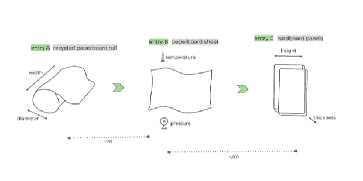

有一些最佳实践可用于旋转和连接连续生产步骤中不断变化的时间序列数据。在本例中，传感器数据是从一个复制的生产站点捕获的，该站点正在用回收纸板卷制造纸板面板。

纸板厂的生产过程包括三个不同的步骤，我们称之为 A、B 和 c。

*   在条目 A 中，生产从回收纸板卷开始；其宽度和直径由两个独立的传感器测量。
*   在条目 B 中，回收纸板卷被切割成纸板片，并在一定的温度和压力下加工成纸板。
*   在条目 C **，**中，纸板被切割成形。对于该条目，面板的高度和厚度是传感器数据中需要测量的关键要素。

就时间而言，第一张回收纸板卷到达入口 b 大约需要一分钟。此外，在纸板被加工和成形为纸板面板之前，大约需要两分钟。

请注意，在这个生产现场，假设生产线的速度随时间推移或多或少是固定的，这使得有可能移动在不同条目中捕获的时间序列，以便使它们保持一致。

## 使用 Flux 将多个时间序列合并为一个序列

这个用例的目标是为每个条目中捕获的所有传感器数据创建一个可信的概览。假设今天是 5 月 4 日下午 3:10 左右。概览应该反映生产现场过去十分钟的所有传感器数据。

幸运的是，我们意识到每个条目之间的传感器数据有几分钟的不一致。因此，我们应该在 3:00 到 3:10 之间获取最后一个条目(条目 C)的数据；从而试图将这些时间序列与来自条目 A 和条目 b 的时间序列对齐

把它想象成被传送到 5 月 4 日 3 点 10 分。此时，对于入口 A 中的回收纸板卷或入口 B 中的纸板，我们还没有入口 c 的传感器数据。这显然是因为该传感器数据将在几分钟后在生产线上捕获。

澄清这一点后，由供应商之一交付的回收纸板卷在用例中被称为 *材料批次* 。相比之下，由回收纸板卷制成的纸板被称为*材料子批次*。

在生产线的末端，由一个材料批次制造出一堆纸板。总结一下:在这个用例中，一个物料子批次永远不会在同一时间点出现在两个不同的条目中，这意味着我们需要在连续的条目上调整时间序列。

### 1.读入传感器数据

首先，我们从读入条目 a 的宽度传感器和直径传感器的传感器数据开始。通过读入同一“过滤器”中两个传感器的传感器数据*(图片:代码片段)*，我们将条目 a 的数据简化为一个时间序列。

这样，我们在一个时间序列中为每个传感器保存不同的表格，该时间序列由包含“_field”和“_measurement”的组关键字安排。通过将所有传感器数据从一个条目减少到一个包含多个表的时间序列，就有机会在以后将这些表转换成一个统一的表。

通过使用具有在 2:57 和 3:07 之间捕获的传感器数据的“范围”,从条目 A 获取相对于条目 C 的相应传感器数据。这通过使用“SHIFT_A”将条目 A 的时间范围向后移动三分钟来实现。因此，对于入口 C 处的纸板面板，入口 A 处的相应传感器数据在三分钟前被捕获。

实质上，我们将条目 A 的 2:57 和 3:07 之间的时间范围映射到条目 C 的 3:00 和 3:10 之间的时间范围，并因此映射到概览上。

请注意，对于' FROM_A '中时间戳和持续时间之间的操作，您需要将时间戳和持续时间都转换为无符号整数，以便在执行计算之前获得 ns 中的 Unix 时间戳。

*输入传感器数据–代码片段*

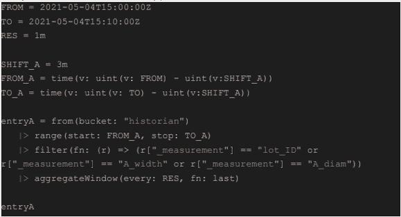

*输入传感器数据*

*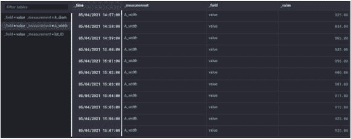*

## 规则和不规则时间序列

在大多数使用案例中，传感器数据将生成规则的时间序列(指标)，因为捕获数据点之间的时间段是固定的。然而，当处理不规则的时间序列(事件)或以不同速率生成的时间序列时，这些需要通过“聚合窗口”转换成规则的时间序列，以最终建立一个良好的概览。

在这个用例中，只有一个规则的时间序列。因此，保留每个一分钟时间窗口的“最后”数据点应该可以达到目的。在不规则时间序列的情况下，在固定时间窗口内取“平均值”将是更好的选择。

### **2。旋转时序数据**

在来自条目 A 的两个传感器的传感器数据被收集到一个具有多个表的时间序列中之后，我们现在需要将这些表旋转为一个。因此，每个表的组键需要保存相同的模式。

在这个用例中，时间序列中所有表的组键模式如下:“['_field '，' _measurement']”。为了确保所有表的组键模式都是相同的，我们可以在透视前使用“keep”来消除并非所有表中都存在的字段。

## **可能的交易破坏者**

请记住，为时序中的每个表保留相同模式的约束可能会成为使用透视的障碍。另一个限制在于无法透视多个值字段，尽管当从 InfluxDB 读取传感器数据时，通常只有一个值字段。

但是，在对 Flux 中的时间序列添加一些处理后，可能会出现一个额外的已处理值列，从而消除了再次使用透视的能力。

当对条目 A 的时间序列中的多个表执行透视时，对于持有共享时间戳的表行(行键:“_time”)，值字段(值列:“_value”)中的数据点将被吸收到由度量的名称确定的列中(列键:“_measurement”)。

在用例中，这意味着带有测量值“lot_ID”、“A_width”和“A_diam”的表将从“_value”字段中获取数据点，并将其放入统一表中的单独列中，这由其测量名称决定。

就性能而言，一个透视可能会因为要透视的时间序列中的表太多而受到影响，这对应于一个条目中活动传感器的数量。除此之外，pivot 中大量的组键模式也会造成损失。在具有 ns 精度时间戳的条目的时间序列中，每个表有相当多的行也很容易破坏数据透视表。

最后，一个小小的脚注说明了枢纽在不断变化中的作用。请记住，没有包含在透视表中的字段和标签不会被吸收到统一表中。此外，术语 pivot 在与它在关系数据库中的功能进行比较时似乎具有欺骗性。

*输入一个透视代码片段*

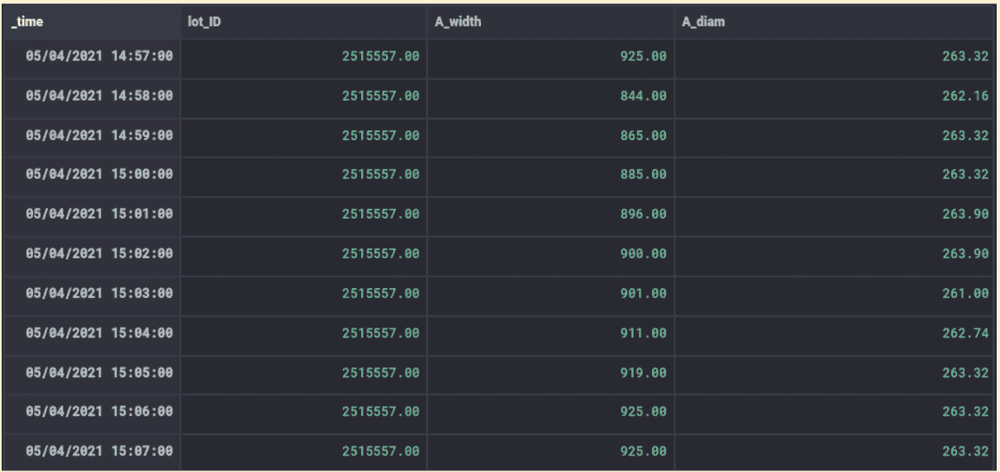

*录入一个班次*

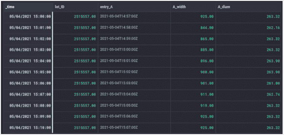

## **3。时间移位时序数据**

#### ***条目一***

在将条目 A 的传感器数据旋转到一个统一的表中后，通过在 _time 栏上执行向前三分钟的时间偏移，时间范围在 2:57 和 3:07 之间的条目 A 传感器数据与 15:00 和 15:10 之间的概览时间范围对齐。

为了保留条目 A 的原始时间戳，我们取统一表中 _time 列的一个，并将其作为子批次在条目 A 实际开始的时间，记为 entry_A 。

***条目 A 移位——代码片段***

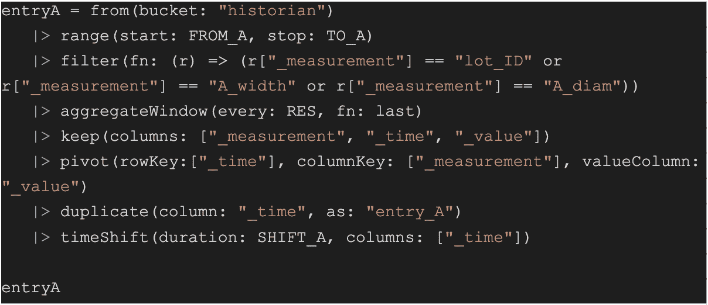

*录入一个班次——代码片段*

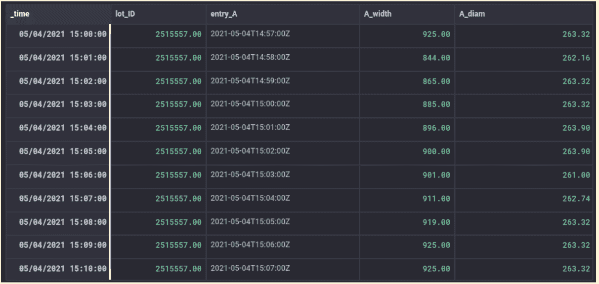

*录入一个班次*

## **条目 B & C**

用于读入条目 A 的传感器数据的相同过程适用于条目 B 和条目 c。虽然前者的传感器数据被移动两分钟以使其在 2:58 和 3:08 之间的时间范围与概观的时间范围对准，但是后者的传感器数据已经与概观同步。

*条目 B–代码片段*

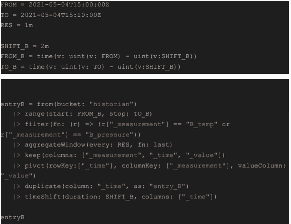

*条目 B*

*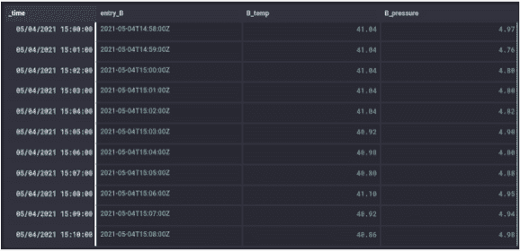*

*条目 C–代码片段*

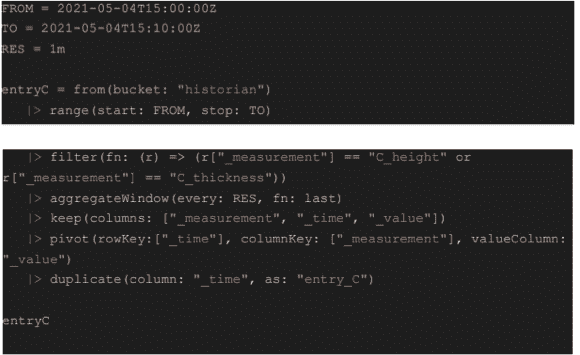

*条目 C*

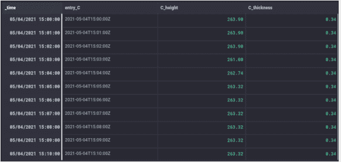

### **4a。加入时间序列**

在为每个条目旋转传感器数据之后，保存三个不同的时间序列，每个序列包含一个具有单独模式和多个值列的表；例如，条目 C 的“C_height”和“C_thickness”。要创建一个概览，必须将这三个时间序列连接在一起，以相对于时间并排显示不同传感器的数据点。由于不同条目的传感器数据之前已经通过读取每个条目的相应时间范围并跟随“时移”进行了对齐，因此现在可以在每个条目中存在的同步“_time”列上连接三个时间序列。

## **可能出现的问题**

由于三个时间序列表之间的模式不同，在将这三个表附加到一个新的时间序列后，尝试将这三个表转换为一个表时，会遇到很大的开销。除了增加多余的复杂性之外，所有时间序列的表都包含多个值列，这使得透视在这种情况下不可用。

一个合理的解决方案是在对齐的“_time”列上使用 Flux 提供的“join”。正如在 pivot and join 一节中所讨论的,“join”被表示为一种内部连接机制，只保留连接表之间共享时间戳的数据点。

在这个用例中，内部连接机制不会触发任何数据丢失，因为在透视之后只存在常规的和对齐的时间序列。但是，在不规则的时间序列(未对事件使用“聚集窗口”)、以不同速率捕获的时间序列或规则但未对齐的时间序列的情况下，数据点会在内部连接机制中丢失。

其次，Flux 中的“连接”只是让两个时间序列同时连接在一起，这限制了可能性。此外，从性能角度来看，与 Flux 中的专用函数(如 aggregateWindow)相比,“join”的优化程度要低得多。

### **4b。解决方案:外部连接**

为了解决由 Flux 提供的“连接”的问题，提出了一种外部连接机制，保留关于时间的多个连接的时间序列的表之间的共享和非共享时间戳的数据点。在将三个时间序列附加到包含一个表的单个新时间序列之后，外部连接机制在用适当的数据点填充行之前，将所有数据点按时间分组到“时间表”中。此外，在将时间表解组为一个概览表之前，提取每个时间表的单个完整行。

## **工会**

一旦对准的传感器数据可用于由一个表组成的每个条目的专用时间序列，三个时间序列通过“联合”被附加到保存一个表的单个新时间序列。“联合”是垂直摄取每个条目的传感器数据(图片:联合)，这意味着每个条目的表行放置在彼此之下，而结果表模式是三个时间序列的独立表模式的联合。通过这种方式，您可以在结果表中看到“数据点块”,这些数据点块引用了生产站点中每个条目的传感器数据。请注意,“联合”允许一次将两个以上的时间序列追加到一个新的时间序列中。

*联合–代码片段*

*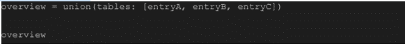 *

*工会*

**

## **时刻表**

单个时间序列表中所有三个条目的传感器数据由“_time”列分组，以便将时间表中不同条目的传感器数据分组在一起。“时间表”是指使用组密钥“_time”(图像时间表)生成的表格。即将到来的排序是在开始填充数据点之前对时间表底部的某个条目的行进行排序的基础。在这个用例中，通过以升序对‘entry _ C’列进行排序，源自条目 C 的行被定位在每个时间表的底部。事实上，不管是按升序还是降序对“条目 C”列进行排序，源自条目 A 或条目 B 的行的“条目 C”列中的空数据点在 Flux 中将总是位于顶部，因为它们持有空值。

*时间表–代码片段*

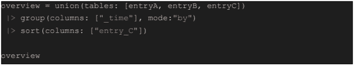

*时刻表*

## **填充**

向前移动，使用将“usePrevious”设置为“true”的“fill”将源自条目 A 和条目 B 的列的数据点复制到后续行中。因为数据点是从底部填充的，所以从条目 A 和条目 B 开始的行的相互顺序并不重要。请注意，在每个时间表的底部，从条目 C 开始的行现在是一个完整的行，包含所有三个条目的所有数据点(image: *fill* )。

*填充–代码片段*

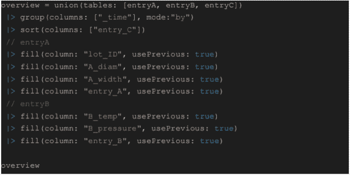

*填充*

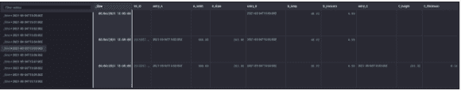

## **提取**

最后，通过使用‘n’被设置为‘1’的‘tail ’,仅提取每个时间表底部的完整行。通过使用不带任何参数的“group”来清空组键，将时间表解组到一个连接的表中。查看连接表(图片:*摘录*)，您将会看到，源自生产现场三个入口的所有传感器数据都被可视化为一个可信的概览，该概览与通过现场生产入口的子批次引起的时间行为有关。

*摘录–代码片段*

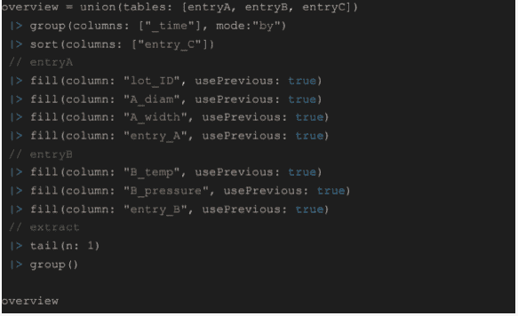

*提取*

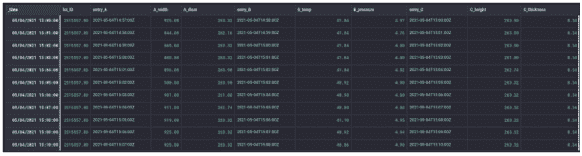

### **4c。未对齐传感器数据的外部连接机制**

为了说明外部连接机制，可以将生产站点中 3 个条目的相应时间范围内的未对齐传感器数据连接到一个概览中。与条目 c 相比，这可以通过删除条目 A 的三分钟“时移”和条目 B 的两分钟“时移”来安排

在这种情况下，条目 A 的传感器数据将保留其 2:57 和 3:07 之间的时间范围，而条目 B 将具有 2:58 和 3:08 之间的时间范围，之后是条目 c 的 3:00 和 3:10 之间的时间范围。结果是概览的总时间范围比请求的更宽(*图像:未移位传感器数据的外部连接*)。此外，对于 3:00 和 3:07 之间的时间范围内的所有三个条目，仅存在未对齐的传感器数据。

注意，对于顶行和底行，某个条目的不可用传感器数据被空值的摄取所替代，因为列中的数据点源自相应的条目。如前所述，当处理不规则时间序列或以不同速率捕获的时间序列时，相同的原则适用于外部连接。理想情况下，这种外部连接机制应该是 Flux 在执行“连接”时的默认行为。

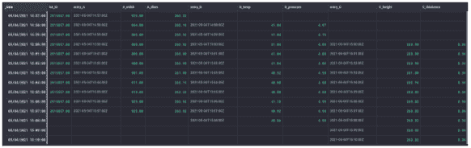

*未移位传感器数据上的外部连接*

## 结论

在连续生产步骤中，在生产现场创建捕获的传感器数据的可信概览时，请考虑以下四个要素:

1.  生产过程中采集传感器数据的步骤是理解一批产品在现场经过不同生产步骤时的时间行为的关键。
2.  传感器数据在生产中的捕获方式表明了使用特定时间窗口的紧迫性，以及您应该获取哪些数据点的选择/汇总。因此，传感器数据可以生成规则或不规则的时间序列，也可以以不同的速率获取。
3.  每个生产步骤的传感器数据被转换为一个时间序列，该时间序列为该生产步骤保存一个统一的传感器数据表。pivot 在统一每个生产步骤的传感器数据方面非常突出，因为在生产步骤中引用一个传感器的不同表在读入时通常持有相同的模式。
    *   其次，一般来说，每个传感器只有一个数据流，因此在生产步骤产生的时间序列中，每个表只有一个值字段。
    *   对来自多个生产步骤的多个时间序列执行外部连接，使您能够最终创建一个可信的概览。为了充分利用它，请确保在连接它们之前先对齐时间序列。