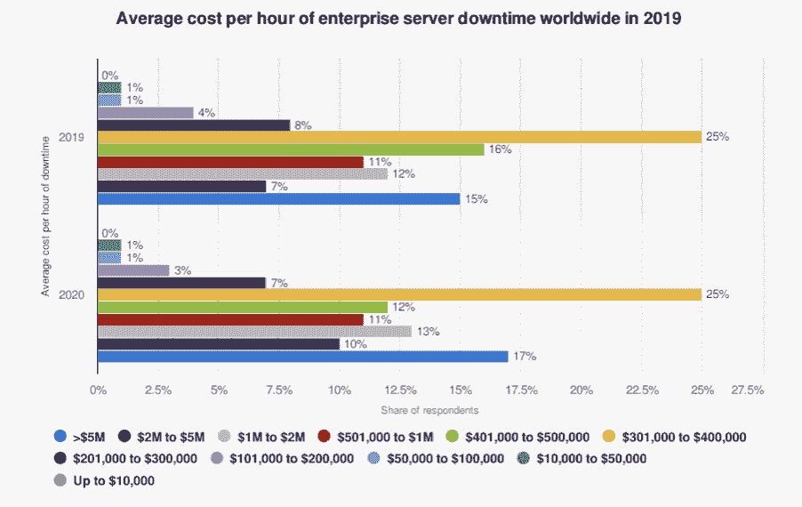

# 告别 SRE 深夜叫醒电话

> 原文：<https://devops.com/say-goodbye-to-late-night-sre-wake-up-calls/>

世界各地成千上万的 sre、随叫随到的工程师和 DevOps 专业人员最害怕的莫过于深夜事件警报。凌晨 2:00 的呼叫器嗡嗡声可能会引起 SREs 的恐慌，并给 IT 和 DevOps 团队留下一个相当大的烂摊子。但是，如果你有正确的自动化工具，事故响应不一定会引起恐慌。如果你想知道为什么像亚马逊、谷歌和 Zoom 这样的公司很少遭遇服务中断和停机，而其他公司却在努力实现类似的效率，你并不孤单。事实上，你已经理解了是什么让[事件响应](https://devops.com/?s=incident+response)自动化成为你工作流程中如此重要的组成部分。

毫无疑问，重新控制手动事件响应并安然入睡的最佳方式是实施强大的自动化事件响应解决方案。我们听到了来自全球 sre 的关于自动化事件响应的好处的故事。此外，我们自己也经历过(例如，来自思科这样的公司)。最后，我们学到了一两件关于利用自动化和集成来创造效率的事情。下面，我们将简要介绍如何利用自动化来修复有或没有人参与的问题，这是告别凌晨 2:00 叫醒电话的最佳方式。

## 事故响应概述

首先，一个惊人的事实:根据 Statista 的数据，2019 年，17%的全球企业在服务器停机时每小时损失超过 500 万美元。即使对于较小的公司，服务器停机的成本也是巨大的。继脸书最近停电的消息(一小时损失 1330 万美元；不算股价下跌的损失)，减少停机时间和降低这些成本的需要是显而易见的。

为了更快地解决问题，组织需要一个易于使用的工具，SREs 和 DevOps 团队可以实施该工具来排除故障并自动响应事件。首先，用户应该选择拖放系统。这种方法优于无头自动化工具，因为无头自动化工具经常会导致数据丢失和停机时间延长。

接下来，IT 组织需要采取自动化的下一步措施并实施最佳实践。我们可以从问“我们如何引入自动化？”并开始思考“当我这样做时，用例是什么？”成功的事件响应工具集将帮助客户应对这一挑战。自动化平台还应该允许用户通过一个连接器和动作库来微调工作流，这些连接器和动作足够全面，可以完成工作。理想情况下，您的云堆栈应该包括几项功能，如警报(如 PagerDuty)、监控(如 Datadog)和分析(如 Splunk)，同时与 Slack 和吉拉等协作工具集成。

## 有哪些典型的使用案例？

让我们更深入地了解事故响应人员和工程师经常遇到的三种使用情形。这些例子说明了为什么强大的自动化平台可以让小型企业像大型企业一样有效地实现自动化，并确保长期正常运行。

### 事件响应自动化

当凌晨 2 点事故响应警报响起时，所有人都在甲板上。为什么要依赖手动响应，因为手动响应往往会破坏正常运行时间 SLA，甚至会降低公司的声誉？自动化是在云中运营任何大规模服务的关键。

### 成本管理

长时间停机的成本并不仅限于支票簿。当没有拖放自动化的情况下发生事故时，长期的副作用会大大增加公司的损失。

### 管弦乐编曲

协调的自动化工具为任何规模的公司提供凭证管理、模板、行动手册和数据处理。它们也让用户能够根据自己的喜好管理服务。

## 想了解有关自动化事件响应的更多信息吗？

注册参加即将于美国东部时间 10 月 25 日星期一下午 3:00 举行的[DevOps.com 网络研讨会](https://devops.com/webinars/cloud-workload-automation-with-fylamynt-three-use-cases/)。我们希望您能加入我们，了解如何将自动化集成到您的工作流程中，并停止那些讨厌的凌晨 2:00 叫醒电话。