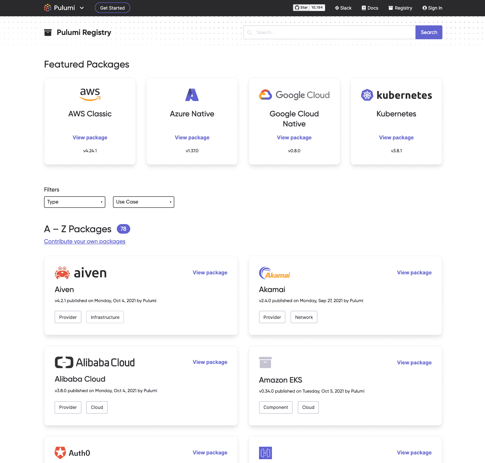

# Pulumi 添加注册表以共享安全 IaC 代码

> 原文：<https://devops.com/pulumi-adds-registry-to-share-secure-iac-code/>

Pulumi 本周在其产品组合中添加了一个公共注册表，这使得发现使用其工具管理基础设施代码(IaC)创建的包变得更加容易。

Pulumi 首席执行官 Joe Duffy 表示， [Pulumi Registry](https://www.businesswire.com/news/home/20211018005363/en/Pulumi-Ushers-in-the-Developer-first-Infrastructure-Era-With-New-Registry-Powering-Software-Sharing-and-Reuse-for-the-Modern-Cloud) 将使 DevOps 团队共享和重用已经过审查的 IaC 工具变得更加简单，而不是总是要求每个开发团队每次都要编写新代码来以编程方式提供基础设施。Pulumi 包以软件开发包(SDK)、代码示例和操作指南的形式提供了现代云参考架构。

安全性成为主要云问题的主要原因之一是开发人员经常错误配置基础架构。注册表提供了一种减少这些配置错误的方法，使开发人员更容易重用用 TypeScript/JavaScript、Python、Go 和。NET，它们已经存储在 npm 之类的存储库中。

除了各大云服务提供商，还有针对 Auth0、CloudFlare、Confluent Cloud、Datadog、DigitalOcean、Docker、GitHub、Kong、MinIO、MongoDB Atlas、PagerDuty、Snowflake、Spot by NetApp 等的 Pulumi 提供商包。

除了在无服务器计算框架上部署应用程序之外，还有用于在 Kubernetes 和其他相关平台的实例上部署容器应用程序的 Pulumi 组件包。

达菲说，除了提供他们配置的“黄金图像”之外，注册表还减少了开发人员、IT 运营团队和网络安全专业人员之间经常存在的整体摩擦。

Duffy 指出，最新的 Pulumi 产品是以可重复和可靠的方式民主化云计算的持续努力的一部分。例如，Pulumi 刚刚[增加了对一组 AWS 云控制](https://digitalanarchist.com/videos/featured-guests/aws-cloud-control-apis-pulumi)应用程序编程接口(API)的支持，减少了开发人员必须掌握的 API 数量。API 越多，开发者出错的可能性就越大。

IT 团队应该预料到，其他云服务提供商也会类似地简化他们提供给开发人员的 API，作为使他们的服务更易访问和更安全的努力的一部分。与此同时，Pulumi 提供的框架为开发人员和内部 IT 运营团队提供了一种在更高抽象层次上调用那些低级 API 的方法。

目前还不清楚有多少开发人员经常使用 IaC 工具，但是随着部署在云中的工作负载数量稳步增加，使用这些工具的开发人员的比例也在增加。虽然这种转变对开发人员的生产力来说是一个巨大的好处，但它也带来了额外的安全风险，许多组织意识不到这一点时已经太晚了。

真正解决该问题的唯一方法是组织采用 DevSecOps 最佳实践，这需要 DevOps 和安全团队之间一定程度的协作，这种协作仍然相对较少。然而，随着所提供工具的不断改进，与实现该目标相关的技术挑战也在不断减少。下一个大问题，一如既往，是将 IT 组织中所有不同的文化结合起来，以实际实现这些工具，并定义一套适用于所有相关人员的最佳实践。