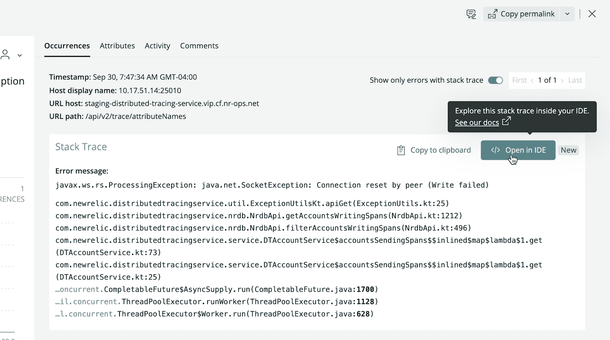

# 新遗迹获得码流以缩小可观测性差距

> 原文：<https://devops.com/new-relic-acquires-codestream-to-close-observability-gap/>

新遗迹今天透露，它已经收购了代码流，作为让开发者更容易获得 T2 可观测性数据的努力的一部分。

集团副总裁(GVP)兼 New Relic 总经理 Buddy Brewer 表示，New Relic CodeStream 使通过 New Relic One 平台收集的应用遥测数据可在集成开发环境(IDE)中直接使用，现在包括 Microsoft VS 代码。此外，还有与微软团队和 GitHub 库的集成。

他指出，目标是缩小开发人员和 IT 运营团队之间的可观察性差距，这种差距源于开发人员对生产环境缺乏可见性。

最后，New Relic 还宣布了面向开发者的 New Relic One 核心用户定价选项。从每月 49 美元起，开发人员可以获得一系列核心功能，如代码流集成、错误收件箱、日志、GraphQL 应用程序编程接口(API)以及在 New Relic One 上构建和运行定制应用程序的能力。

CodeStream 联合创始人兼首席执行官彼得·佩扎里斯(Peter Pezaris)现在是 GVP 和 New Relic 战略和开发工具总经理，他表示，成为 New Relic 的一部分将更容易弥合大多数开发人员和 it 运营团队之间的分歧，让开发人员更容易看到他们的代码在生产环境中实际上是如何执行的。他补充说，这种能力将消除在笔记本电脑上运行良好的代码在生产环境中执行不佳的情况。

开发人员还可以通过与各种开发人员和通信工具的集成，直接从他们的 IDE 添加内联代码注释、触发拉请求、请求反馈和跟踪问题。开发人员还可以从 New Relic One 切换到 IDE，只需点击一下鼠标，就可以在他们编写的代码环境中导航、分类和修复生产错误。

New Relic 最初是免费提供 New Relic 码流，不需要信用卡，预览期延长至 2022 年 1 月 12 日。之后，一旦达到免费等级限制，一些更高级的功能将需要付费用户许可。同样，IT 团队也可以注册一个免费的 New Relic One 帐户，而无需输入信用卡来装备他们的应用程序。

随着生产环境中管理应用程序的责任继续向左转移，Pezaris 表示，为开发人员提供他们在生产环境中优化代码所需的工具至关重要。

目前还不清楚到底有多少应用程序的责任转移到了开发者身上；每个组织都不一样。佩扎里斯指出，许多人只是试图通过提供更多来自 New Relic 的“结缔组织”，尽可能减少开发人员和他们的 IT 运营团队之间的摩擦，否则 IT 团队将不得不自己编写。

弥合开发人员和 It 运营团队之间的可观察性差距可能需要一些时间。大多数 IT 运营团队仍然在考虑可观察性提供了什么，而现有的 IT 监控工具却没有。监控的核心是关注预定义的指标，以确定特定平台或应用程序何时在预期范围内运行。例如，被跟踪的度量通常集中在资源利用上。相比之下，可观察性将指标、日志和跟踪(一种特殊的日志记录形式)结合起来，以一种更简单的方式检测应用程序，从而解决问题，而不必仅仅依赖于一组有限的预定义指标。

至少在理论上，这种级别的可观察性应该最终减少 IT 运营团队需要解决的事件总数，方法是在问题变成实际中断之前很久就发现问题。