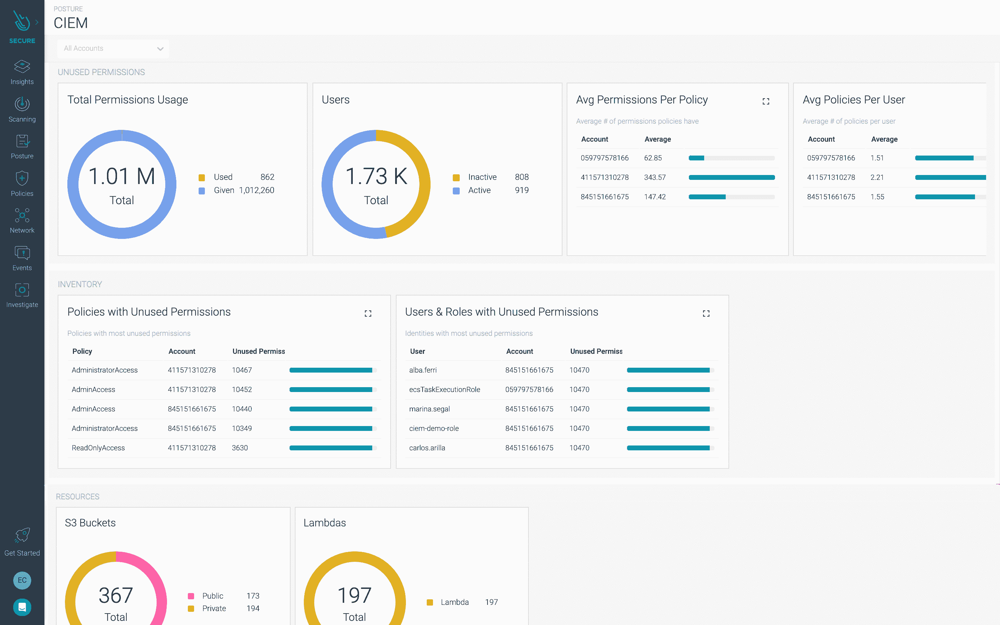

# Sysdig 为 DevSecOps 平台添加了云访问控制

> 原文：<https://devops.com/sysdig-adds-cloud-access-controls-to-devsecops-platform/>

Sysdig 今天宣布，它将在其安全的 DevOps 平台上添加一项[云基础设施授权管理](https://sysdig.com/press-releases/sysdig-addresses-risk-of-excessive-permissions-with-cloud-infrastructure-entitlements-management/) (CIEM)功能，作为在更大的网络安全零信任方法背景下更好地执行[最低权限访问](https://devops.com/?s=least+privilege)的努力的一部分。

Sysdig 产品营销副总裁 Nick Fisher 表示，该公司用于保护云服务的核心 DevSecOps 平台的这一新增功能将防止组织无意中向个人提供过多权限，导致网络犯罪分子在这些个人的凭据被泄露时获得对应用程序和系统的广泛访问。

Sysdig 威胁小组最近的一份报告发现，由于过于宽松的策略，近 80%的用户拥有过多的权限。同样，Gartner 预测，到 2023 年，75%的安全故障将由身份、访问和权限管理不当造成，高于去年的 50%。

费希尔说，Sysdig 的 CIEM 产品使网络安全和 IT 运营团队能够在安装后两分钟内解决跨多个云的问题。Sysdig 平台实现了这一目标，它使模板成为一套基础设施即代码(IaC)工具，使开发运维团队能够将安全性集成到他们现有的工作流中。

CIEM 还简化了访问控制审核，使发现组织中谁有权访问云基础架构服务变得更加容易。作为该功能的一部分，Sysdig 还提供现成的合规性策略和对报告的访问，这些报告可以按需生成，以显示所有云权限更改的详细审计跟踪。

最后，Fisher 指出，只要有人被拒绝访问云资源，CIEM 就会发出警报。该功能为网络安全团队提供了一个机会，让他们可以审查可能需要授予哪些权限，或者是否有不良行为者试图危害云环境。

组织遇到的大多数云安全问题都可以追溯到开发人员错误配置了一个云资源，从而允许网络犯罪分子访问，例如，一个保持打开的端口。CIEM 扩展了 Sysdig 平台，因此，除了扫描漏洞和错误配置之外，它还可以检测和响应跨部署在云环境中的容器和虚拟机的攻击。

在某种程度上，由于最近软件供应链的高调违规，随着应用程序在这些平台上的部署率稳步上升，人们越来越关注云安全。虽然云平台本身从根本上来说是安全的，但大多数组织面临的挑战是，他们拥有不成熟的流程来保护云中运行的工作负载。

当然，能够限制对这些云资源的访问只是实现一组 DevSecOps 最佳实践以确保所使用的云平台的完整性的第一步。不幸的是，太多的开发人员仍然倾向于假设云服务提供商代表他们采取措施保护工作负载。事实上，云服务提供商采用了一种共同责任模式，从他们的角度来看，这种模式将他们的网络安全责任限制在他们提供的核心基础设施上。由负责这些平台上运行的工作负载的 DevOps 团队来决定如何保护该 It 环境的其余部分。