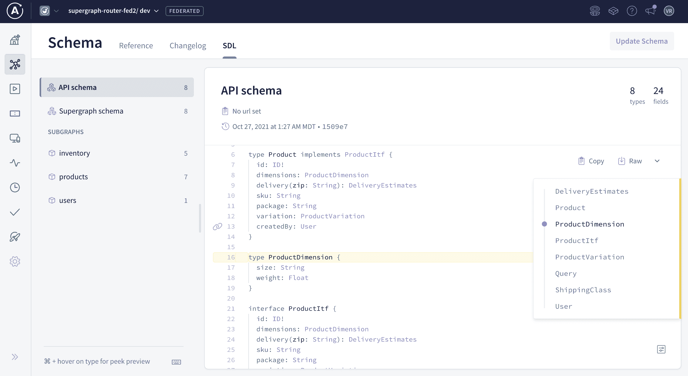

# Apollo GraphQL 提供对 API 的更多控制

> 原文：<https://devops.com/apollo-graphql-to-provide-more-control-over-apis/>

Apollo GraphQL 今天预览了其联邦平台的更新，该平台用于跟踪和管理基于 GraphQL 查询语言的应用程序编程接口(API)，以使组织能够更多地控制 API 的审查和最终批准。

Apollo 创始人兼首席技术官 Matt DeBergalis 表示,[Federation 2 平台的 alpha 版](https://www.businesswire.com/news/home/20211103005214/en/Apollo-GraphQL-Introduces-Federation-2-to-Get-More-Organizations-to-the-Graph)提供了基于 GraphQL 的分布式 API 的统一视图，因此它们可以更容易地进行管理。

联合是基于一个由 Apollo GraphQL 创建的统一图形，最初是为了提供更多的可见性，以了解基于 GraphQL 的 API 在一个组织中是如何使用的。DeBergalis 指出，这种能力使得增加开发团队之间的协作变得更加简单，这些开发团队通常独立地构建 API。

他指出，最新版本的联邦还增加了一个共享所有权模型，使团队能够在较小的团队之间发展统一的图形。

总的来说，DeBergalis 指出，联合减少了开发人员创建冗余 API 的机会，因为他们可以更容易地发现现有的 API。然后，他们可以按原样使用这些 API，也可以修改它们以适应他们的需求，因为他们越来越多地使用诸如 Apollo GraphQL Studio 之类的工具来构建应用程序，而不是从头开始自己构建每项功能。

总的来说，Apollo GraphQL 声称 Federation 目前每周被下载超过 100 万次，超过 30%的财富 500 强公司如网飞、PayPal、Zillow、沃尔玛、Peloton 和 Priceline 已经在使用它的工具。

该公司现在还在弹性许可证 2.0 下提供 Federation 及其工具组合的其余部分，该许可证提供了使用、复制、分发、提供和准备软件衍生作品的权利，但阻止组织提供托管服务、规避许可证密钥功能或删除/模糊受许可证密钥保护的功能，或删除或模糊任何许可、版权或其他通知。

GraphQL 最初是由脸书创建的，作为 REST APIs 的替代方案，它正在受到越来越多的关注，因为它让开发人员能够更好地控制如何使用一组查询功能通过 API 访问数据。当构建需要特定类别访问大量数据的数字业务流程时，这种能力尤其具有吸引力。事实上，DeBergalis 指出，在许多情况下，正是一组丰富的 API 的存在，使组织能够构建数字流程，这些流程将组织以前拥有的各种孤立的流程连接起来。

大多数 IT 团队不会在一夜之间用基于 GraphQL 的 API 替换 REST APIs。然而，很快就会有足够多的基于 GraphQL 的 API 对应用程序的构建和部署产生重大影响。在未来的许多年里，许多应用程序可能会通过 REST 和基于 GraphQL 的 API 调用外部服务。

与此同时，随着诸如联邦这样的工具使得开发团队更加高效，应用程序的构建速度应该会大大提高。随着生产环境中部署了更多的应用程序，许多开发运维团队即将面临的挑战是管理大量的部署和相关的应用程序更新。