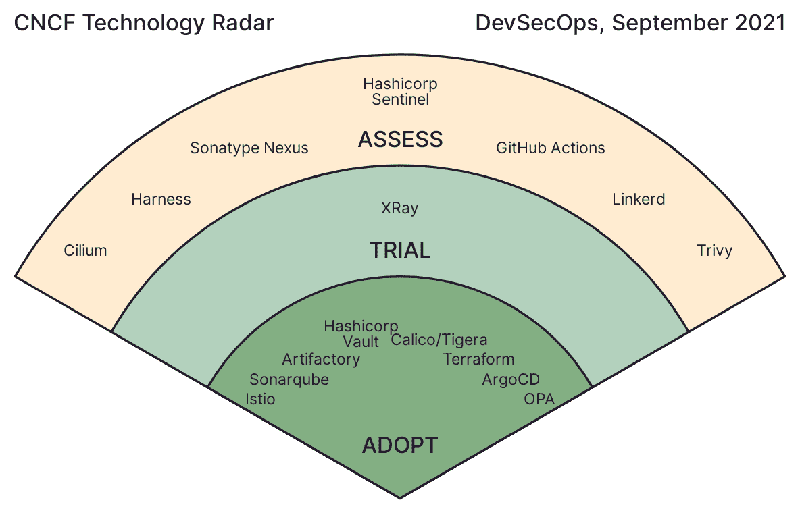
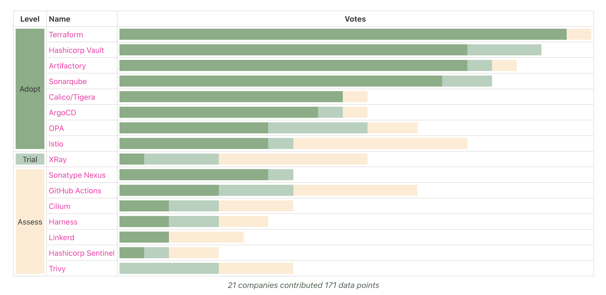

# DevSecOps Tech Radar 强调多样化的工具采用

> 原文：<https://devops.com/devsecops-tech-radar-highlights-diverse-tooling-adoption/>

DevSecOps 技术雷达展示了云原生群体对 DevSecOps 工具的看法。回顾一下，[技术雷达](https://radar.cncf.io/how-it-works)是云原生计算基金会(CNCF)的一份定期报告，该基金会是一个新兴的开源项目主机，正在成为云原生架构的关键基础。

就像以前的[雷达](https://containerjournal.com/features/cncf-radar-highlights-kubernetes-multi-cluster-preferences/)一样，DevSecOps 技术雷达是利用来自 CNCF 最终用户社区的反馈组装而成的，该社区是一个由超过 155 个组织组成的团体，他们使用云原生技术来构建和分发他们的服务，涵盖初创公司和企业。Radar 报告根据技术的积极使用和成熟度，将流行的工具组织成采用、试用和/或评估状态。

“采用”意味着这些工具是稳定的，强烈推荐在生产系统中使用。

“试用”意味着用户使用这些工具取得了一些成功，建议其他人考虑使用它们。

“评估”意味着这些是有前途的工具，有利于解决特定的需求。

那么，为什么 DevSecOps 被选为这个雷达的主题呢？根据 Radar 团队的说法，选择 DevSecOps 是因为它与当前的开发重点高度相关。“我们意识到，我们在 CI/CD 中使用的超过一半的工具实际上是面向安全的，”安联 Direct 开发运营总监塞尔吉乌·佩蒂安说。这超越了 devo PS——“这绝对是大写的‘秒’，”他说。

Discover Financial Services 的云架构总监 Keith Nielsen 表示:“我们一半以上的时间都在讨论安全设计。金融服务业尤其必须找到创新的方法来平衡上市速度和安全性。尼尔森还提到了这一领域的快速变化，这要求公司不断重新评估其安全态势。

[https://www.youtube.com/embed/UxooaG1WWRg](https://www.youtube.com/embed/UxooaG1WWRg)

## DevSecOps 雷达结果

那么，CNCF 最终用户社区将流行的 DevSecOps 工具放在哪里呢？雷达最终将 16 种工具分为三个不同的等级:

*   **采用** : Istio、Sonarqube、Artifactory、Hashicorp Vault、Calico/Tigera、Terraform、ArgoCD、OPA。
*   **试炼**:x 光。
*   **评估**:纤毛、Harness、SonaType Nexus、Hashicorp Sentinel、GitHub Actions、Linkerd 和 Trivy。

上述结果基于 35 种工具的最终用户的 252 次投票，大多数受访者来自多个行业的大公司。

在这些工具中，Terraform 获得了最多的“采纳”投票。这项技术通过声明性的配置文件来帮助实现基础设施即代码(IaC ),这对 DevSecOps 自动化非常重要。并列第二的是 Hashicorp Vault 和 Artifactory，这表明安全方面的秘密管理、访问控制和持续更新是迫切的需求。

雷达上的其他开源工具提供了令人印象深刻的统一安全控制的方法。例如， [OPA](https://containerjournal.com/features/introduction-to-open-policy-agent-opa/) 是一个应用策略的通用层，它有助于跨应用程序统一分散的授权。或者，[服务网格选项](https://containerjournal.com/features/6-cncf-service-mesh-tools/)，如 [Linkerd](https://containerjournal.com/features/cncf-announces-linkerd-graduation/) 和 [Istio](https://containerjournal.com/features/will-istio-or-linkerd-dominate-service-mesh/) 围绕应用程序放置一个 sidecar 代理，以集中管理大型微服务生态系统的访问控制、可观察性和联网。这样的项目是可编程的，以适应 DevSecOps 管道。

## 分析

总的来说，雷达团队对如今使用如此多的安全工具感到有些惊讶。一些工具在同一个舞台上竞争，这使得寻找合适的工具变得非常困难。“产品的数量有点惊人……我们看到的是不同公司高度分散的战略，”尼尔森解释说，他预计功能上会有更多整合。

在评估了 DevSecOps 工具环境之后，Radar 团队将他们的核心发现组织成三个主要的要点:

**可用性以牺牲安全性为代价**。安全特性是必要的，但是它们经常以可用性为代价。 [DevSecOps](https://devops.com/?s=DevSecOps) Radar 团队发现大多数工具的开发者体验都很差。许多不同的工具必须缝合在一起，以实现一个真正的自动化管道，这是很麻烦的。“工具正在变得越来越好，但仍然没有一个有凝聚力的，规范的方式来开发云，”尼尔森说。

**安全领域的变化速度很快**。主要的云提供商继续快速发布新服务，这导致了新工具的爆炸式增长。与此同时，公司内部的创新速度也在加快，带来了独特的安全需求。综合来看，这意味着安全格局在不断变化。尼尔森说:“安全工具试图跟上服务以及你如何托管和运行它们。“我们绝对没有想到会在安全领域看到这么多新人，”佩蒂安表示同意。尽管 DevSecOps 如今被宠坏了，但“有选择总是更好，”他补充道。

**微分段很重要，但也带来了巨大的挑战**。许多伟大的工具使公司能够改善他们如何细分流量，如 Linkerd 和 Istio 这样的服务网格工具。然而，实施云原生微分段会与老牌公司的传统实施发生冲突。尼尔森说，在 API 网关、服务网格、边缘防火墙和 Kubernetes 联合防火墙功能之间，DevSecOps 有许多复杂的问题要处理。

## DevSecOps 技术雷达:回顾

近年来，云原生技术越来越重视解决安全难题。公司继续根据云原生战略、新漏洞和新的合规性要求重新评估其安全方法。DevSecOps 被证明是一个有用的，如果不是必需的，实践来维护安全*和*快速软件交付。

随着新的安全工具和独特方法如此频繁地出现，很容易出现“分析瘫痪”然而，DevSecOps 必须从某个地方开始。对于那些相信 CNCF 技术雷达观点的人来说，你现在有了一些关于从哪里开始的有用见解。