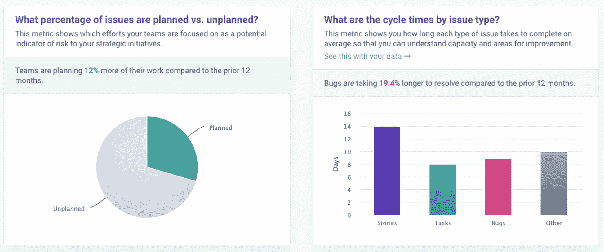

# Allstacks 增加了免费仪表板来跟踪软件开发基准

> 原文：<https://devops.com/allstacks-adds-free-dashboard-to-track-software-dev-benchmarks/>

价值流智能平台提供商 Allstacks 今天添加了一个免费的实时仪表板，其中填充了匿名数据，DevOps 团队可以使用这些数据来衡量自己的进展。

Allstacks 联合创始人兼首席执行官 Hersh Tapadia 表示，该公司正在提供这些数据，以使 DevOps 团队更容易发现他们软件开发过程中的瓶颈。

作为这项工作的一部分，控制面板包括针对以下内容的预配置基准:

基准测试团队每周写多少天代码？对于基准测试团队来说，计划的问题与未计划的问题的百分比是多少？
对于基准测试团队，每个问题类型的周期时间是多少？
基准公司生产什么类型的代码？
基准客户的平均提交规模是多少？

Allstacks 承诺在仪表板上公开 12 个月的数据，并表示将持续更新这些数据。然而，Allstacks 的客户也可以访问五年的数据来比较历史趋势。

Tapadia 表示，Allstacks 计划为仪表板添加额外的基准，可以通过大多数 DevOps 工具现在例行提供的各种应用程序编程接口(API)收集数据。他说，总体目标是增加软件开发过程的透明度。

Allstacks 的价值流智能平台使用机器学习算法和人工智能(AI)模型来识别存在无法实现交付目标风险的项目。然后，这些数据被用来分析那些错过的截止日期可能对各种业务目标产生的影响。

[价值流管理](https://www.vsmconsortium.org/)平台自动获取通过 DevOps 流程收集的技术指标，并将其与业务领导定义的一组关键绩效指标([KPI](https://devops.com/?s=KPIs))进行匹配。许多组织仍然面临的挑战是确保他们有适当的工具来收集适当的技术指标，然后定义对业务真正重要的 KPI。一旦收集了这些指标并建立了 KPI，组织就能够对他们收集的大量 DevOps 数据应用高级分析。

价值流管理的概念可以追溯到精益制造方法，这种方法要求对制造过程的每一步进行持续测量。随着软件开发从一门手艺发展成为使用 DevOps 最佳实践的高度自动化的过程，随着组织意识到他们对软件的依赖程度，对错过软件开发最后期限对业务的影响进行监控的价值的欣赏也在增长。

Tapadia 指出，结果是，更多的组织意识到他们的业务目标和开发过程之间存在明显的脱节。企业领导特别渴望了解软件开发项目的延迟会如何影响未来的收入预测。价值流管理平台不是主要由 IT 领导用来跟踪软件开发项目的一套工具，而是使其他利益相关者跟踪跨越多个软件开发项目的 KPI 成为可能。然后，当遇到不同的瓶颈时，就如何在不同的项目之间重新分配资源做出明智的决策变得更加容易。

组织在他们的软件开发过程中实现这种水平的透明度可能还需要一段时间，但是随着软件继续“吞噬世界”，价值流管理成为每个组织的一套必需的 DevOps 工具只是时间问题。