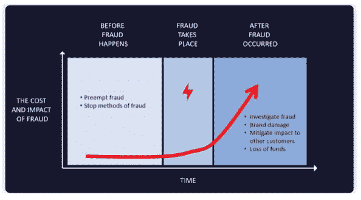

# 借助自动化和 DevSecOps 阻止移动欺诈

> 原文：<https://devops.com/stopping-mobile-fraud-with-automation-and-devsecops/>

手机欺诈是一个价值数十亿美元的问题，而且只会越来越严重。一项研究表明，仅手机点击欺诈 [【新冠肺炎】](https://www.clickcease.com/assets/pdf/fraud_during_covid.pdf) 的前几个月就上升了 64%。事实上，在疫情期间，大约五分之一的移动广告点击是欺诈性的。这只是手机诈骗的一种形式。

武器化的僵尸网络、移动恶意软件、移动特洛伊木马和移动欺骗引擎以及动态检测工具滥用(欺诈者通过移动设备欺骗公司和消费者的方法)在数量和规模上都在不断扩大。

从历史上看，组织一直通过监控和数据分析来对抗欺诈。随着交易和数据的到来， [analytics](https://devops.com/?s=analytics) 和 AI 开始区分合法事件和欺诈事件。这些系统需要培训和大量数据才能熟练识别欺诈，它们可以变得非常准确。但是，欺诈者总是在改变他们的策略来逃避这些系统，正如我们许多人所经历的那样，误报仍然是一个大问题。如果你去过足够多的海外旅行，很可能你的银行账户或信用卡已经被冻结，直到你可以打电话给你的金融机构，让他们知道你的购买是真实的。

现有移动欺诈防范解决方案的另一个挑战是，它们被设计为首先保护网络和网络资源。因此，尽管欺诈正在发生，欺诈防范系统也在不断学习，但移动终端用户仍然会受到影响。此外，当识别出不良行为，并且系统实施了反欺诈保护时，这些实施点通常会阻止网络流量。这保护了网络，但消费者和他们的移动应用程序仍然面临风险。一旦欺诈者破坏了移动应用程序，他们可能会通过其他途径进行攻击，即使一个网络被关闭。例如，如果消费者无意中将 EventBot 下载并启动到他们的移动设备上，认为这是一个合法的应用程序，它可能会危及多个银行应用程序的安全。如果一家银行在检测到欺诈后关闭其网络，EventBot 可能会在设备上有其他机会。

如图所示，一旦欺诈发生，对品牌、客户和底线的损害立即开始。即使它被发现并停止，它已经造成的伤害也无法挽回。移动应用发行商和开发者需要从源头上阻止移动欺诈，这意味着在 DevSecOps 框架内的应用内部实施移动欺诈预防。通过阻止用于通过移动应用实施欺诈的技术方法，组织可以在欺诈到达网络级别之前阻止欺诈，从而防止客户和组织受到欺诈。

### **为什么传统的安全方法在移动应用中不起作用**

为了实现对欺诈的多层防御，移动应用程序应该包括应用程序屏蔽、防篡改、代码混淆、数据加密(包括字符串、资源、首选项)、越狱/寻根预防和中间人预防(如证书锁定或证书验证)。当然，有商业 SDK 和第三方库可以提供这些功能，但有一些限制。但是这些方法通常仍然需要大量的开发工作，并且引入了额外的框架或编程语言依赖性和不兼容性。

它们没有解决在移动应用程序中实施欺诈防范的根本问题——太昂贵和耗时。  问题的根源在于现代敏捷组织中开发、发布和更新移动应用的方式。开发运维依赖于动态、自动化、敏捷、集成、迭代和持续的流程。移动应用程序的安全性传统上非常不同:静态，手动，逐行编码。这种实现手动安全性的方式在敏捷交付模型中是行不通的。

DevSecOps 的承诺是内置的安全性，作为发布过程的基础部分交付，其中安全性被设计到生命周期的每个阶段的过程中。安全模型可以原子地、迭代地和动态地交付和发展，以便适应应用程序。

欺诈防范的未来在于移动应用程序，但要实现这一点，行业需要应用人工智能和 ML，在敏捷、快速和迭代的应用程序生命周期和发布流程中，按时将欺诈防范和安全实施自动化到移动应用程序中。