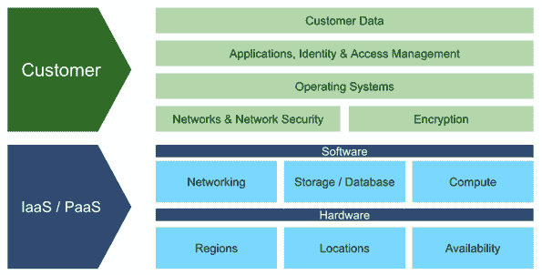

# 掌握共同责任模式

> 原文：<https://devops.com/mastering-the-shared-responsibility-model/>

众所周知，云原生应用程序开发正呈指数级增长，Amazon、Microsoft 和 Google 等提供商提供的敏捷开发、IaaS 和 PaaS 支持创新，其速度之快让安全性难以跟上。

全球化的疫情和随之而来的远程工作任务加速了这一趋势。随着分布式工作和敏捷应用程序开发的这种变化，带来了更大的安全性考虑——以及更高程度的业务风险。云中的安全性是一项共同的责任，但是太多的组织发现很难完全理解他们在应用程序安全性中的角色。有许多保护[云原生](https://devops.com/?s=cloud-native)应用的要素不能被委派。作为基于风险的应用程序安全计划的一部分，它们需要得到仔细的关注，该计划贯穿于整个应用程序开发生命周期中从设计到开发的各个阶段。

借助适当的可见性、基于风险的思维和自动化，云原生应用能够比以往更加安全，同时实现更快的开发和交付。但是要达到这一点，组织需要理解他们的责任。

云基础设施的安全性和合规性是确保应用程序和数据在云中部署和运行的必要条件。但是那些应用程序中有什么呢？应用程序由开发人员、开发人员、产品经理、安全倡导者和其他角色构建的应用程序/基础架构代码行和开源库组成。

我们如何知道组成应用程序的组件得到了有效的保护？仅仅依靠安全的云态势为时已晚，也不够。在开发生命周期的早期降低风险将极大地降低成本和业务风险。一些消息来源 [估计，在早期生产中修复风险的成本影响](https://www.isixsigma.com/industries/software-it/defect-prevention-reducing-costs-and-enhancing-quality/) 是设计阶段发现的风险的四到五倍，是维护阶段发现的风险的 100 倍。

现代应用通过安全云基础设施的复杂“管道”连接到我们的设备接口。正如我们需要干净和安全的水来将物理管道传输到我们的家中，我们需要我们的应用程序在传输云服务时保持安全和高质量。

## IaaS/PaaS 共享责任模型

在这个云原生世界中，考虑安全性的最佳方式是使用共享责任模型，IaaS 客户只负责位于基础架构之上的应用程序的某些安全元素。

在传统的共享责任模式中，IaaS 供应商负责网络、数据库和计算引擎等基础架构元素的配置、管理和安全，此外还负责物理安全、冗余等。但是他们的每个客户都要对除此之外的所有东西的安全性和隐私负责，从设计到代码到部署。

*传统的 IaaS/PaaS 共享责任模式*

## 共同责任模式的客户方

这种模式缺少的是软件设计、代码风险以及 CI/CD 安全性和完整性，而这些领域是最困难、最耗时的，并且需要经过深思熟虑的全面应用安全计划。

借助新的应用安全方法，组织可以更好地了解其云原生应用的风险，并在部署到云之前，在设计或编码阶段自动执行大量风险补救活动。这需要对整个 SDLC 中的 AppSec 采取一种宽泛但有关联的观点，而攻击的现代性质要求对 SDLC 有一个完整的观点，以了解最具影响力的业务风险在哪里。

组织必须评估 [风险的全貌](https://apiiro.com/code-risk-is-multi-dimensional/)—从设计到代码再到云:

1.  **可见性—** 了解您的风险始于通过实时资产清单、应用和基础架构代码行为、开发人员知识、第三方安全警报、敏感数据和业务影响来了解您的安全和合规性风险。
2.  **通过设计确保安全—** 在编写或提交任何代码之前，您需要确保在设计阶段就解决了安全问题。
3.  **变更管理—** 组织需要关注开发过程早期的风险，并基于业务影响。对应用程序和基础设施的重大更改应该仔细评估，而其他更改可以更快地批准或忽略，从而加快产品交付。
4.  **CI/CD 安全性和完整性—** 作为一个持续运行、高度可信和敏感的流程，CI/CD 经常被忽视。最近发生的许多攻击通过将攻击者的代码嵌入本机代码提交或其他自动 CI/CD 过程，利用了开发周期的这一致命弱点。组织应确保 CI/CD 操作是安全的，并进行完整性和安全性检查。
5.  **应用&基础设施风险组合—** 为了正确保护您的应用，您必须在一个平台中关联您的应用和基础设施的风险。
6.  **自动化—** 还必须采用自动化来限制人为错误导致的错误，确保策略实施的一致性，并提高开发人员流程的速度。组织必须小心管理这个过程，因为自动化还会引入一类新的问题，例如竞争条件、不合时宜的触发、边缘情况的不完整状态验证等。

## 基础设施代码(IaC)

由于云管理员现在拥有的权力，IaaS 和 PaaS 中的人为风险因素已经发生了变化。管理员不再需要花费数月时间购买、配置和部署服务器，而是可以使用 GitOps 而不是 ClickOps，通过基础架构即代码(IaC ),在创纪录的时间内启动 Kubernetes 集群或 S3 存储桶，加载客户数据并通过相关的身份和访问管理(IAM)策略将其公开到互联网。

IaC 的兴起使我们能够像对待任何应用程序代码变化一样，来观察、评估和响应基础设施的变化。组织必须应用相同的治理规则和自动化来审查基础架构中的变更，然后再投入生产，同时对云错误配置进行实时分析。

主要的挑战是上下文！当今市场上的所有 IaC 工具都将安全错误配置视为单一维度(例如，S3 桶丢失加密；云数据库缺少用于传入连接的 SSL，等等。)这就产生了很多嘈杂的警报。云基础架构和在其上运行的应用程序的风险有着内在的联系，将这些点联系起来并了解变化的真实风险比接受表面上的警报更难！

当保护云中的应用程序时，不要依赖传统的工具和流程。当今的技术支持新的方法，帮助您以全新的方式了解和补救风险，并使云原生应用程序比以往更加安全。