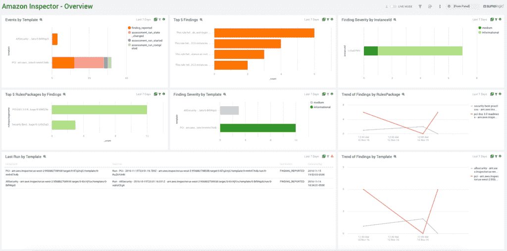

# Sumo 逻辑将可观测性扩展到 AWS Lambda

> 原文：<https://devops.com/sumo-logic-extends-observability-reach-to-aws-lambda/>

在本周举行的 [AWS re:Invent](https://reinvent.awsevents.com/) 大会上，Sumo Logic 宣布，除了收集日志数据、指标和跟踪，它现在还可以[从亚马逊网络服务(AWS)提供的 Lambda 无服务器计算服务](https://www.sumologic.com/press-release/sumo-logic-drives-unified-observability-with-expanded-tracing-visibility-into-aws-lambda/)中收集遥测数据。

除了收集遥测数据，Sumo Logic 还透露，托管在 AWS 云上的 Sumo Logic 连续智能平台现在可以分析 AWS Lambda 服务上使用的功能在交易期间如何执行。

通过与 AWS CloudWatch 和 AWS CloudTrail 监控服务的集成，这些数据还可以与 Sumo Logic 跟踪的其他 AWS 服务的性能相关联。

Sumo Logic 的首席安全官 George Gerchow 表示，该公司正在广泛使用在云本地计算基金会(CNCF)的支持下创建的 OpenTelemetry 代理软件，以使 it 环境的仪器化更简单。他补充说，这些数据不仅用于提高应用程序的性能，还用于发现指示安全漏洞的异常情况。

作为这一持续安全努力的一部分，Sumo Logic 本周还增加了 [Sumo Logic AWS 快速启动集成，用于快速访问安全和合规性见解](https://www.sumologic.com/press-release/sumo-logic-unifies-intelligence-framework-to-accelerate-discovery-and-response-to-security-threats/)，以及对 Amazon Inspector 的支持，这是一种由 AWS 提供的漏洞管理服务。

AWS 本周提名 [Sumo Logic 为其年度独立软件供应商(ISV)合作伙伴](https://www.sumologic.com/press-release/sumo-logic-named-isv-partner-of-the-year-by-aws/)。这两家公司有着长期的合作关系，始于 10 多年前 Sumo Logic 决定在 AWS 云上建立一个监控平台。

随着 IT 监控工具继续发展成为[可观察性](https://devops.com/?s=observability)平台，Gerchow 表示，在问题导致重大破坏之前，利用机器学习算法和开源代理软件来识别问题的根本原因变得更加容易。

如今，大多数 IT 团队仍然依赖于传统的监控工具，这些工具仅采用一组预定义的指标来识别特定平台或应用程序何时在预期范围内运行。例如，被跟踪的度量通常集中在资源利用上。相比之下，可观察性将度量、日志和跟踪(一种专门的日志记录形式)结合起来，以一种更简单的方式来检测应用程序，从而解决问题。

当然，这种或那种形式的可观察性一直是 DevOps 最佳实践的核心原则。最初，DevOps 团队将持续监控作为主动管理应用环境的最有效方式。但是，发现问题的根本原因仍然需要几天(有时甚至几周)的时间。可观察性平台承诺使管理 it 环境变得更加容易，即使这些环境的整体复杂性不断增加。

尚不清楚 It 组织将以何种速度过渡到可观察性平台。然而，it 组织通常只需要一次重大停机就可以开始寻找更好的工具来管理他们的 IT 环境。随着这些 IT 环境变得越来越复杂，出现重大中断的可能性比以往任何时候都高。挑战和机遇是找到一种更广泛地检测应用程序的方法；期望可观测性平台能够分析遥测数据，以减少导致服务中断的问题数量。