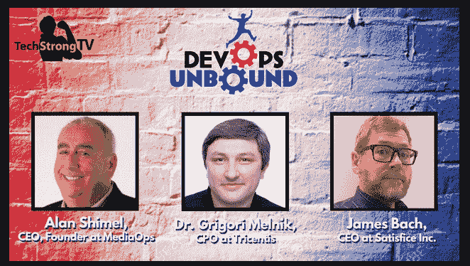

# EP 1:测试简史

> 原文：<https://devops.com/devops-unbound-ep-1-a-brief-history-of-testing/>

DevOps 的姐妹网站 Digital Anarchist 推出了一个双周视频系列和一个关于 DevOps、自动化、CI/CD 和测试的每月圆桌会议。我们以所有这些领域的领导者为特色，探索软件交付和 IT 团队每天面临的挑战和问题。我们如何更快、更智能、更优质地前进？ [DevOps 未绑定](https://digitalanarchist.com/videos/devops-unbound)！

视频紧接在下面，后面是我们对话的文字记录。尽情享受吧！

[https://player.vimeo.com/video/445207081](https://player.vimeo.com/video/445207081)

## 副本

艾伦·希梅尔:大家好。欢迎收看《解放的德沃普斯》第一集。我是你们的主持人，艾伦·希梅尔，和我们一起收看《解放的德沃普斯》的第一集，我很自豪也很高兴向你们介绍詹姆斯·巴赫和格里戈里·梅尔尼克。格里戈里，詹姆斯，欢迎来到自由的德沃普斯。

格里戈里·梅尔尼克:大家好。

**Shimel:** 在我们开始之前，让我给你们每个人一个机会介绍一下你们自己，你们的背景，你们的职位等等，这样我们的观众就知道一点，如果他们还不知道的话，你们两个是谁。那么，格里高利，你已经是我们节目的嘉宾了，所以如果你不介意的话，我要请詹姆斯先来。詹姆斯。自我介绍一下。去吧。

詹姆斯·巴赫:我叫詹姆斯·巴赫。我是一名咨询软件测试人员。我从高中辍学后，十几岁就开始做开发人员。我是你见过的最骄傲的高中辍学生。我后来写了一本关于高中辍学和我独特的自我教育方法的书，但当苹果电脑公司聘用我担任测试经理时，我的大好机会来了，当时，我是苹果电脑公司研发部门最年轻的经理。

这是我引以为豪的事情。我爱上了测试，并决定投身于测试事业。我学习了测试的认识论，测试的数学，测试的社会学。我有点痴迷于测试。

退一步说。

**Bach:** 我和几个合著者写了一本关于这个的书，名为“[在软件测试中吸取的教训](https://www.amazon.com/Lessons-Learned-Software-Testing-Context-Driven/dp/0471081124)”。现在我教书和做顾问。

**希梅尔:**优秀。你知道吗，不管你是不是高中辍学生，你都做得非常好，所以恭喜你，不要说这是我们年轻观众必须效仿的榜样。当然，詹姆斯长大了

巴赫:我儿子做得比我好。他没上过高中，所以我-

**Shimel:** 真的？

巴赫:他已经超越了我。

绝对的。非常好。格里戈里？你为什么不告诉他们一点关于你自己的事呢？

**梅尔尼克:**确定。我是 Grigori Melnik，是 Tricentis 的首席产品官，致力于打造未来的测试工具，未来的测试工具。之前，我想我花了将近 25 年的时间专注于开发人员受众并构建各种平台，微软、Splunk 和 MongoDB，你知道，从开发人员的角度来说，我总是有点痴迷于客户，确保无论我们专注于什么，都有助于提高生产率并减轻我们目标受众中开发人员的一些痛苦。

虽然我特别自豪的一些事情，我在微软的团队实际上是第一个为 Windows Azure(现在的 Microsoft Azure)构建第一个自动伸缩的团队，但也专注于实现横切组件的通用模式和实践，这些组件代表了后来将成为。NET 框架。

因此，再次，大量的工作识别这些模式，捕捉它们，将它们具体化，测试它们，然后帮助推动它们的使用。说到测试，我第一次发现它是在我在学术界的时候，当时我在大学做研究和教学，这非常有趣，因为测试主要是通过正式方法组的视角来看待的。它并没有真正被看作是一种发现的智力活动，一种探索或体验的智力活动。

事实上，在那段时间里，我遇到了来自环境驱动测试学校的一群测试人员，包括 James，从那以后我们就一直保持着联系，甚至在我离开测试更多地进入开发人员的世界，现在又回到测试的时候，我不得不告诉你，我觉得，当机会来临时，我觉得测试的世界， 至少从学科本身如何发展的角度来看，在过去的十年里会比我离开一段时间后发现的发展得更远。

所以我现在的任务是重新点燃整个学科，把它放在一个更高的位置上，给它更多的视角和权力，让它变得更平。所以，是的。

**希梅尔:**优秀。所以，谢谢你们两位，先生们。我是 Alan Shimel，我是主编，MediaOps 的首席执行官，DevOps.com，Container Journal，Security Boulevard，TechStrong TV 等的幕后人员。在我们进入今天的议程之前，今天的重点是测试。不仅仅是测试。它实际上是关于 DevOps 的一种解放，让我们自由，能够跃过高楼并进入太空，某种程度上解放我们自己的重力，无论你想要什么。这是速度的问题。是关于加速度的。对吗？它在很多方面都与自动化有关。

每一集——我们将每隔一周做一次，如果你愿意，每一集都将聚焦于这种无拘无束的自然的特定方面。今天是测试。然后每月一次，我们还将与大约六到八位具有格里戈里和詹姆斯地位的人举行圆桌会议，我们将向公众开放，供现场观众提问和讨论。所以我真的很期待。DevOps Unbound 由我们在 Tricentis 的朋友赞助，我们为此向他们表示感谢，现在我们开始吧。

所以，格里戈里，我想开始——显然，你和詹姆斯选择了非常不同的道路——你们两人在生活和事业上都非常成功。所以这正好说明，剥猫皮的方法不止一种。对吗？

但是，让我们看一看——看，我可能比你们两个都大，虽然我确定不是那么大，但是让我们看看历史，你们今天坐在这里的历史背景，以及相对于整个测试行业，整个测试，你想称它为专业，行业协会，无论你想叫它什么，对，这是如何多年来演变的，让我们在时间框架内放置一些背景。詹姆斯，当你第一次去苹果公司的时候，你没有说你老了，那是什么样的——那有多长时间？

**巴赫:**嗯，我老了。

我也是。

巴赫:但是你更老了，这很好。很高兴再次成为房间里的年轻人。

**Shimel:** 嗯嗯。我无法告诉你这让我感觉有多好，但请继续。

**巴赫:**第一次，1987 年，1987 年 5 月 21 日是我第一次以测试者的身份专业测试某样东西的日子。在那之前，我在做视频游戏开发，我做过非正式的测试，我讨厌测试，因为测试妨碍了我的产品运输。所以，我不喜欢测试，直到它成为我的工作，然后我意识到我非常适合测试，因为我喜欢抱怨。我更感兴趣的是发现事物不工作的原因，而不是找出如何让它们工作。

Shimel: 真有意思。你知道，我的背景是网络，当时我们称之为信息安全，在信息安全，大多数人进入它，因为他们喜欢打破东西。对吗？是啊。同样的事情。格里戈里，这个时间框架和其他的事情，和你自己的经历有什么关系？

梅尔尼克:所以我喜欢实际建造东西。_____ 你们这些破坏东西的家伙。我偶尔会打破一些东西，实际上这也说明了这一点，我想大多数开发人员都很乐观，他们认为自己写的东西是完美的，总是低估我们放进去的错误代码的数量。

但对我来说，如果我想起我第一天实际上作为一名工程师工作的时候，实际上，那是 1990 年 9 月，我想是 5 月，所以在詹姆斯之后的几年，那时，我实际上正在为一台 PC 编写一个 C-library，将数据从大型机转换成可视化格式，我必须处理 Fortran 的各种怪癖和 80 个字符的限制，以及星号，你知道，用于带来——线的延续，各种令人兴奋的东西。但是回到开始，为了确保我不会走得太远，我们实际上在很长很长的时间里没有——再次，如果你愿意，我给你我的角度来测试。

我们实际上并没有把测试作为一种活动，一种追求卓越的行为来专门思考。这只是你正在做的一些事情，然后在某个时候，你听说并了解到哦，等等，看，有一个 QA 部门，显然，对不对？他们通常被视为守门人或某种警察。对吗？

然后，如果我再想想，我曾经更深入地研究和学习测试，因为，你知道，我可能是少数几个在我的博士论文标题中有测试的人之一。但是，我记得回过头来想，“但是这是从哪里来的？”对吗？实际上软件工程是从哪里来的？“对不对？当然，这是会议的历史，你知道，在 _____ _____ 之后，那时计算机科学的中坚分子，甚至不是计算机科学，数学系，因为那时是软件工程师学科和后来的调试协会在做所有的编程，对吗？

这是一个臭名昭著的故事，讲的是如何在哈佛大学的科学实验室里发现蛾子，你知道,“窃听”一词就是由此产生的。我几乎是这样想的——在早期，它与这个调试时代有很大关系。对吗？后来，演示能力的时代，软件与堆栈或需求相匹配的事实，我认为人们至少关注了十年，有些人会认为这种情况仍在继续。

Shimel: 那是什么年代？

梅尔尼克:嗯？

你指的是哪个十年？

**梅尔尼克:**调试或者说调试

你说的是 70 年代吗？你说的是 60 年代吗？你说的是 50 年代吗？

梅尔尼克:我说的是 50 后和 60 后。我所说的 50 年代和 60 年代几乎是调试我所认为的方式的时代。然后，在那之后，更像是 70 年代和 80 年代的时代，你更专注于匹配规格和演示，并且软件实际上会批准它。这就是这个非常非常非常关注正式方法的地方，甚至试图从数学上证明软件按照规范工作。

在那之后，我觉得下一个时代是打破的时代，或者，你知道，一些可能仍在继续的东西。再说一次，我觉得所有这些元素都存在于今天的测试行业中，但在后来的几年里，过去的 20 年里，我一直在学习，在一旁观察，让自己融入其中。如果可以的话，我喜欢称之为启蒙时代。我知道我太自负了，但这是我认为更多测试的地方，就像詹姆斯和其他成员在测试学校制定的那样，你知道，为决策者照亮道路，不一定是为开发者，也可能是为开发者，但有人在一天结束时决定生产的东西是否可以接受，或者是否足够好可以发货。是不是，你知道，那里有什么相关的风险，并作为决策者告诉我所有这些不同的因素，然后让我来做决定。

所以测试员不是警察。他们不是质量门。他们什么都不是。这实际上取决于委托所有这些工作的涉众，以及最终决定发布某些东西、将某些东西投入生产的人。

巴赫:我想提供一些这方面的历史笔记。

请吧。

巴赫:好的，首先，你知道第一本关于软件测试的书是什么吗，第一本已知的书？给你的格里高里一个小测验？

梅尔尼克:是迈尔斯的书吗？

**巴赫:**是在那之前。这是比尔·赫策尔于 1972 年提出的*程序测试方法*。这本书是关于一个会议的报告，一个测试会议，是教堂山会议，发生在 1972 年。这似乎是测试中的一个历史性分水岭。在那之前，我能找到的关于软件测试的第一章是我的老师 Jerry Weinberg 在 1961 年写的，他当时 25 岁。这是关于测试的精彩篇章。

令我着迷的是，与他们在 1972 年谈论测试相比，温伯格在 1961 年谈论测试有多么不同，尽管在 1972 年的书《回到温伯格》中有一处提到，赞扬了温伯格对测试的态度。“读起来很有趣，因为这本书在 1961 年出版，书名是《计算机编程基础》,其中关于测试的一章是杰瑞写的,”他告诉记者,“虽然这本书是与赫伯特·利兹和杰瑞·温伯格合写的，但是关于测试的一章是杰瑞写的。”。

Jerry 谈到测试是一种想象，而不是自动化，是一种怀疑和批判，是一个根本没有算法的过程。他在他的章节中发展了这个美丽的故事，关于一个程序员确信他找到了最后一个错误，然后发现他错了。然后他又为此增加了一张支票。

然后他确信现在他找到了最后一个错误，然后他看到了其他错误。Jerry 的结论是，看，这只是，我们在研究复杂的系统，这总是会像这样。现在，Jerry 在 1958 年参与了第一个有专门测试团队的项目。

他之所以知道，是因为在 1961 年，IBM 召开了一次全世界所有计算机程序员的会议，显然有 400 人参加，Jerry 说他的团队参加了那次会议。他当时在 IBM，他说每个人都认为他们疯了，因为他们有一群专门的测试人员，而其他人都没有。

他们都只是在测试自己的东西。所以这看起来像是有一个专门的测试团队的想法，然后在 1972 年，他们谈论测试的方式都是关于测试用例，自动化，形式，我认为这开启了工厂，测试工厂的时代。我们可以有技术，我们可以有程序，让你不依赖人类的思维。

所以这违背了杰里·温伯格所宣扬的，不仅是在 1961 年，而且在他的整个职业生涯中，我在 1989 年左右成为了杰里的学生，在 90 年代中期上了他所有的课，他成了我的导师。这就是为什么我是杰里·温伯格的忠实追随者，因为他总是把人放在一切的中心。但是，测试——当我加入测试时，所有的测试教科书都是关于你必须如何定义测试用例，如果可能的话，自动化它们。

我觉得这是个愚蠢的想法。我认为，好吧，问题是有太多的东西需要定义，我们已经被所有这些文件和所有这些代码束缚住了，而不是不受束缚。因此，如果你想不受束缚，我们必须找到一种方法来调节它。我们必须找到一种方法来与我们的工具互动，这样我们就不会被它们束缚太多。在 90 年代，将我们从瀑布世界和沉重的文档世界中解放出来的强烈愿望创造了敏捷，但它也创造了软件测试的上下文驱动学派，这是一种人文主义的软件测试方法。

那是在 90 年代中期，我们开始创造它。然后 DevOps 和敏捷继续接管世界，除了在我看来敏捷在很多地方已经失去了它的人文主义基础，它变成了工具，工具，工具。因此，如果我们真的要谈论无绑定，DevOps 无绑定，在我看来，我们必须明确我们正在解除绑定的是什么。我希望这意味着人们被解放了，使用 DevOps 作为工具，而不是——

**Shimel:** 但不仅仅是工具。对不起我不是故意插嘴的。但不仅仅是——你知道吗，詹姆斯，我们不想犯敏捷所犯的同样的错误。你刚才说，敏捷的一个问题是我们从人文主义转向了工具，对，太依赖工具了。让我们不要在 DevOps 犯同样的错误。我想这也是我一直倡导的，我们不能失去 DevOps 中的人类。

实际上，我想听你多说一点，艾伦，如果你愿意多说一点的话。

Shimel: 我不害羞。我会给你我的两分钱。听着，我创办了 Devops.com。我负责这个地方。我在这方面做了很多工作，已经做了七八年了。我认为这是存在的——我不想说敏捷失败了，因为敏捷远非失败。但是现在已经依赖于工具，并且可能被过度处理了。当我们想到像 ITIL 和 ITSM 对德沃普斯这样的事情时，比方说，对，我们进去了——我们倾向于指责 ITIL。对不起，ITSM，太多的流程，太重，太多的东西，整个改变管理的事情。

但是那里有好的东西。没有什么是全坏和全好的。世界不是黑白分明的。它是灰色的。对吗？所以有些东西我们从 ITIL 拿了出来，有些东西和 ITSM 的东西我们放进了 DevOps。Btu DevOps，对我来说，无论如何，这只是我的拙见，从根本上讲是关于人、团队和文化，而不是工具——有很多工具我们可以使用，在工具中有重叠，对于任何给定的工作，什么是最好的工具。

我们可能会为此争论不休，但事实上，DevOps 正在确保开发人员、运营人员、测试人员和安全人员能够更好地沟通，更好地合作，更快地完成工作。我们通过在组合中添加自动化之类的东西来做到这一点。但是仅仅为了自动化而自动化是不够的。对吗？为了实现自动化，是的，有时你必须使用工具来让自动化工作。我明白了。但是，如果我们失去了 DevOps 的核心是关于人类的基本方面，我认为我们所有人——我们失去了 DevOps，我不认为自己像你们任何一个人一样有成就，但是我——

巴赫:我仍然爱你，艾伦。我喜欢你刚才说的话。我认为这是——如果你能坚持你刚才所说的原则和感觉，我们可以用工具做任何事情，我们会没事的。我们会没事的。如果我们互相交谈，如果我们互相关心，我不断看到人们失去这一点，当然，任何技术和任何方法，当它被社会病态地应用时，都会变成滥用。因此，我们只是——我们中那些能够、应该做的人——应该尽我们所能让它不被滥用，让我们保持对话。然后我觉得 DevOps 可以是一件很美好的事情。

绝对的。很抱歉让我们失望了。去吧，格里高里。

不，艾伦，听到你说的话非常令人鼓舞，我也非常相信人类思维的伟大，但在我看来，在我们行业的这种历史中，钟摆一直在来回摆动，对吗？还记得对 case 工具的迷恋吗，你知道，回到 80 年代和 90 年代，然后后来，有一场软件工厂的大运动，就像这个术语实际上是软件因素，其中的想法是，你可以在某个高层次上抽象出来，然后循环，y，工具会为你生成所有的代码和所有的东西，并使其高度可维护，所有这些，当然也失败了。

但我认为出于某种原因，这种渴望——想出某种助推器。所以我不知道，这是一种让人类能够处理固有的复杂问题的方法，而今天除了人脑之外，没有更好的机制来处理这些问题。所以，你知道，计算机编写计算机代码的整个愿景，我的意思是，这是在人工智能的第一个时代承诺的，不是今天，但我说的是六十年代，对，七十年代都是-

是的，是的，我的意思是斯皮尔伯格拍电影。

梅尔尼克:然后它就消失了。对吗？同样的事情，你知道，让计算机完全提出测试策略，关于自动测试的想法，完全自动，我认为是-我认为这是空想，至少如果你想到这些工具今天和未来很长很长一段时间内能够做什么。我认为人仍将是这项活动的中心，同时，所有的工具都很棒，因为工具给了你额外的能力和额外的方法，也许可以自动化最基本、最，你知道，最无聊的工作元素，让你真正腾出时间来思考新理论、新假设、新模型、新方法——

巴赫:但是你必须考虑不同种类的工具。比如，你有没有注意到像程序员 IDE 这样的工具。当我使用一个程序员的 IDE 时，我不会感到被压迫。我觉得被赋予了力量。我感觉我骑在魔毯上，上面还装了激光炮。我感觉棒极了。但是当我使用大多数测试工具时，我感到压抑，好像我只有几件可能做的事情，如果我有的话

希梅尔:就像你被阉割了一样。

Bach: 这超出了测试工具设计者认为我可能想为测试做的事情，那么我就不能这么做。当我遇到像黄瓜这样的东西时，这就是我的感觉，黄瓜是非常受限制的，小黄瓜语言也是非常受限制的。它阻止了我进行想象的飞行。然而，当我使用程序员为程序员创造的工具时，毫不奇怪，程序员为程序员创造了工具，让他们感到强大和自由，能够做各种各样的美妙事情。我想给测试带来程序员已经享受到的自由感。这是我们在 Tricentis 进行的转型工作的一部分。

希梅尔:是啊。我喜欢这样。

平心而论，并不是所有的程序员工具都那么自由。他们中的一些人也觉得你在穿着紧身衣工作，但总的来说，至少有一些例子，有一些工具的例子被广泛接受，被广泛采用，它们支持并促进你的工作能力，而不限制你。那是肯定的。

你知道，詹姆斯提到的那件事，这实际上是我们在 Tricentis 内部推动的新举措，你知道，关于提及未来测试工具的全新平台，我们正在构建类似于 ide 的东西，我们实际上不称之为 IDE，我们在谈论 ITE，集成测试环境，在那里实际上是人类，人类测试者在 ITE 的非常非常中心， 所有这些片段、实用程序和服务，以及围绕着人类测试人员的一切，围绕着设法以某种方式支持个人的人类，无论他的思路、探索路线、测试执行路线可能导致什么情况。 好吗？

所以，是的，我们设想这是一种超级可配置的变形工具，就像变色龙风格一样。我们依赖于上下文和环境，ITE 的不同功能，集成测试环境将代表他们自己，然后人类将实际选择这是否是他们真正想要利用的东西，而不是再次被迫进入特定类型的模型或一种测试方法。我不认为——我们不认为实际上有人尝试过这种水平的东西，特别是在测试工具领域。这就是为什么我们对这个项目如此热情和充满激情。不是吗，詹姆斯？

巴赫:是的。我也不认为任何人能够轻易复制 is，因为他们实际上与我们竞争的唯一方式是雇佣热爱测试的人，测试工具公司讨厌这样做，因为测试人员是麻烦制造者。我真的还是不能——我很难理解格里戈里真的知道他雇佣我做了什么，因为我是一个持续的牛虻。

**梅尔尼克:** *【笑】*

坦率地说，我一直在抱怨世界上和 Tricentis 的测试工具的状态，我希望事情从根本上变得更好，但这意味着我们必须从根本上改变我们对测试人员的看法。这可能会让我们进入测试的角色，但是对我来说，测试人员是一个难题解决者，一个问题发现者。我不是按按钮的人，也不是验证者。我不核实事情。工具可以验证事情。我不想证明某件事有效，因为我不能证明任何事有效。我能做的是收集证据，然后以批判的心态从证据中做出推论。

当然，许多工具正在收集我正在测试的产品和那些可以自动化的产品的事实，所以我们正在收集这些事实。我们可以说，“我们得到了这个输出，我们期望得到这个输出，所以很明显，就我们目前所知，这里没有问题。”但是测试人员会在此基础上形成一种批判性的心态，说，“但是我们怎么知道，我们怎么能欺骗自己呢？”

所以我把这种心态带到 Tricentis，到目前为止，我真的很惊讶他们竟然非常欢迎我，但多年来，我一直试图帮助其他工具公司解决这个问题，基本上，你知道我得到什么样的反应吗？他们基本上说，“嗯，我们的客户只是想要只按一堆按钮的自动化，我们并不真正关心测试设计。我们并不真正关心授权给测试人员。所以这不会帮助我们赚钱，詹姆斯，所以我们真的没有兴趣支持你一直谈论的熟练测试人员。”所以特里森蒂斯有着另一种我认为难以匹敌的眼光。

Shimel: 还有一点你不能提前酿酒。对吗？我认为正确，我认为你需要正确的宏观条件，像 DevOps 这样的事情已经带来了整个进展，我们已经回到了 50 年代和 60 年代，一直到现在。

当然，我们今天生活的世界可能是一个——我想是这样的，无论如何，我们更愿意接受这样的想法，“是的，我们可以自动化一些东西。我们可以——我们不需要人类来按按钮。对吗？我们有工具可以为我们按下按钮，但我们需要人类来做空白。我们需要人类来做这些事情，所以我们需要在让我们自动化应该自动化的事情的背景下，让他们能够做这些事情。但是我们仍然需要那些人在那里。

你知道，当我长大的时候，就像你们一样，对，世界上唯一使用工具的动物是人类。那不是——那是我在学校学到的，对，那是我们和动物的区别，其中之一，对，是我们使用工具的能力。后来，我们发现黑猩猩使用工具，其他猴子也使用工具，我们仍然对此没有意见，因为它们是灵长类动物。现在我们发现鸟类使用工具，对，来敲碎坚果之类的东西。

所以工具的使用本身并不意味着一个人的智慧或更高的存在。我们需要——所以对我来说，这是终极案例。对吗？不是我们用什么工具的问题。这是关于我们如何使用我们的大脑。我认为这与我们今天在测试中所看到的是恰当的。是的，我们可以想出工具，但它创造了一个环境，让人们思考，使用他们的大脑并应用它，我认为这最终会给我们带来最高的回报，如果你愿意的话。对吗？

巴赫:你刚才说的很有意思，你在暗示我们如何走到今天这一步的历史很重要，我们必须有一套特定的历史背景和技术背景，才能实现下一个飞跃。我认为有一件事是千真万确的，那就是我们现在作为一个行业已经有了几十年的经验，几十年来一直试图把人从工程中剔除，但我们做不到。我记得，也许你知道，在 80 年代的 Byte 杂志上有这些关于 case 工具的广告，所有的营销人员可以定义你的产品，你不再需要开发人员，因为它会自动生成所有的代码。

我记得我坐在苹果电脑前查看 case 工具，那些发给我的广告，心想，我能不能买一些这样的工具，用它们来帮助测试？结果是，不。你不能。这一切都是炒作，什么都没有。所以我耸耸肩。所以很多——甚至在今天，现在我们有了人工智能，人工智能是新的案例工具，人工智能将为你做所有这些事情。后来发现人工智能是有偏见的、种族主义的和困惑的，如果你把小猫的耳朵放在鲸鱼身上，它会说，“那是只小猫。”

是的。它只不过是机器学习的 ML，但是你知道，是的，我们一直——你知道，在我成年的大部分时间里，我们一直在追逐这条白鲸，同时，如果它是一个国家，地球上发展最快的国家是开发者。大约有 4000 万人，估计每年增长 20%左右。所以我认为是时候停止追逐那条白鲸，转而赋予人们更多权利了。

巴赫:要做到这一点，我建议给程序员或者开发人员下一个定义。我使用的定义是，开发人员是站在机器世界和人类世界之间的门户。开发者的目的是在人的世界里胜任工作，然后在机器的世界里胜任工作。

如果你没有那个人站在门口，那么你就没有人类世界和机器世界之间的联系。你只是让人们向科技之神祈祷，希望好事发生。因此，无论技术变得多么复杂，无论我们有多少人工智能，我们仍然需要在人类的世界中胜任工作，开发者将永远生活在这个门槛上。测试人员也需要生活在那里，而不是被自动化所淹没。

梅尔尼克:是的。

**Shimel:** 你们知道吗，伙计们，我们快没时间了，但这也带来了一些我认为我们可能会在这个节目中谈到的东西，但我们没时间了，那就是这种种姓制度，如果你愿意，开发人员的种姓制度比测试人员的种姓制度更高，测试人员比测试人员更高，我们今天称之为 SRE，运营人员或诸如此类的人。我认为我们也需要对开发人员进行检查，当我们要求开发人员进行安全和测试时，他比测试人员更好吗？有区别吗？但是我想我们会把这个留到下一个节目，如果你们想回来的话，我们可以稍微探讨一下。

Melnik: _____ 回来了，但是我断然拒绝这种等级制度，我也不喜欢这种观念，你知道，当人们说，“嘿，但是工具和其他东西真的会对低技能测试人员有帮助。”这是另一个得到 _____ _____ 的概念

巴赫:不，我们拒绝。

**梅尔尼克:**太烦人了，你知道，无论是开发、测试还是任何其他方面，你知道，数据科学建模、UX 设计，这是一门学科，它需要专门的努力来研究、完善、思考人们如何工作，它需要智慧。这才是最重要的。你知道，使用一些非常强大的工具并不能给你关闭大脑的许可，我很高兴回到节目中来谈论不同的职业字母和进步，因为这将再次花费我们更长的时间

Shimel:那完全是另外一个节目。

巴赫:有很多事情要做

Shimel: _____ 并大声说出来。

**巴赫:**说说吧。但我想指出的是，这整个问题已经在另一个领域得到了深入的研究，在科学社会学领域。例如，在物理学中，理论家属于较高的等级，而实验家属于较低的等级。所以如果你是一名工程师，你属于较低的种姓，他们已经研究过这个。这些人是怎么合作的？他们是如何给彼此分配声望的？这是人类努力的许多领域中的一个众所周知的现象。

**梅尔尼克:**数学也是一样，理论数学和应用数学，理论数学似乎总是认为他们是上帝，他们创造了一些东西，需要几个世纪才能让世界真正欣赏，然后你们就在应用数学中解决今天的问题。

**Shimel:** 正是。伙计们，我们没时间了，但我要拿着这个，我要让你们俩都遵守。我们会回来——不是在下一个节目中，因为我想我们已经安排好了，但在接下来的一个节目中，我们会让你们两个回来，或者这可能会成为我们一个月后的第一次圆桌会议的一部分，届时我们也会向观众开放。但是现在，格里高里，詹姆斯，谢谢你们。是

谢谢你，艾伦。

詹姆斯，谢谢你。

先生们，这是我的荣幸。这是艾伦·希梅尔。你刚刚看了第一部《解放的德沃普斯》。我们将在两周后带着新的小组、新的话题回来，敬请关注。再次感谢 Tricentis 的赞助，感谢您的观看。拜拜。