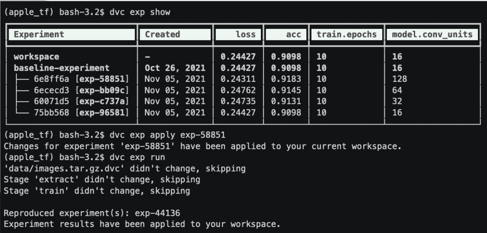

# 迭代将实验版本添加到 MLOps 平台

> 原文：<https://devops.com/iterative-adds-experiment-versioning-to-mlops-platform/>

Iterative today [向开源平台添加了一个实验版本功能](https://www.globenewswire.com/news-release/2021/12/07/2347269/0/en/Open-Source-MLOps-Tool-DVC-Adds-First-of-its-Kind-Experiment-Versioning.html)，用于使用 GitOps 工作流管理机器学习操作(MLOps)。

迭代首席执行官德米特里·彼得罗夫(Dmitry Petrov)表示，最新版本的数据版本控制(DVC)平台使大规模保存、比较和再现机器学习(ML)实验变得更加简单，而不需要组织建立额外的存储库来跟踪它们。他说，相反，组织可以将这些实验与其他软件工件一起存储在 Git 存储库中。

他指出，因此，IT 团队将不再需要使用电子表格或笔记本工具(如 Jupyter)来跟踪实验。Petrov 补充说，为使用 DevOps 工作流构建的应用程序构建人工智能模型的组织也将发现更容易遵守各种现有和即将到来的合规性要求。

DVC 平台利用类似 Git 的接口，使组织能够跨 [MLOps](https://devops.com/?s=MLOps) 工作流跟踪数据集、模型和管道的多个版本。这种能力正在得到扩展，以便更容易管理数据科学团队在构建人工智能模型期间创建的实验。

迭代是关于如何最好地将人工智能模型融入应用程序的新辩论的前沿。数据科学团队使用的平台提供商正在为独立的存储库提供案例，以跟踪用于构建人工智能模型的工件。另一方面，Iterative 主张使用 AI 模型构建框架，该框架使用与存储和共享任何其他类型的软件工件相同的 Git 存储库。Petrov 指出，Iterative 的论点是，实际上，人工智能模型只是另一种类型的软件制品。

除了通过减少所需平台的数量来降低构建人工智能模型的总成本之外，基于 Git 的方法还使 DevOps 和数据科学团队的合作更加简单，因为 DevOps 团队将更清楚地了解最终需要将哪些人工智能模型整合到应用程序中。

人工智能模型和应用程序的发展完全趋同可能还需要一段时间。如今，数据科学团队通常已经使用各种图形工具定义了自己的工作流流程。然而，随着几乎每个应用程序都将在某种程度上注入机器学习和深度学习算法变得越来越明显，弥合 DevOps 和数据科学团队之间当前鸿沟的需求将变得更加迫切。

与此同时，DevOps 团队应该假设更多的人工智能模型不仅在路上，而且这些模型需要不断更新。每个人工智能模型都是基于一组假设构建的；然而，随着越来越多的数据变得可用，人工智能模型会随着时间的推移而发生漂移，导致准确性下降。组织甚至可能决定需要替换整个人工智能模型，因为做出假设的业务条件不再有效。无论如何，人工智能模型的更新和调整很可能很快成为另一个通过 DevOps 工作流管理的连续过程。