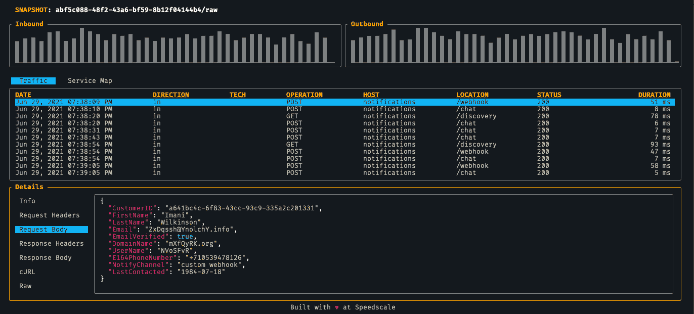

# Speedscale 提供免费的 API 可观察性工具

> 原文：<https://devops.com/speedscale-makes-free-api-observability-tool-available/>

Speedscale 今天宣布，它正在为开发者提供其用于应用编程接口(API)的 [observability](https://devops.com/?s=observability) 工具的免费版本。

Speedscale 首席执行官肯·阿伦斯(Ken Ahrens)表示，目标是让更多的开发人员接触到该公司的 API 测试工具，这些工具可以在他们的本地机器上通过命令行界面(CLI)进行访问。它被称为 [Speedscale CLI](https://www.einnews.com/pr_news/558387338/speedscale-launches-free-visibility-testing-app-for-api-calls) ，旨在使个人开发者能够检查、检测和映射本地应用程序或容器上的 API 调用，而不必通过软件即服务(SaaS)模型订阅该公司当前的 API 测试平台。

Ahrens 指出，这种方法可以减少开发运维团队在生产环境中部署应用程序后可能遇到的中断次数。

Speedscale CLI 功能包括服务映射，使开发人员能够自动检测和映射可能中断的外部依赖关系，用于记录和跟踪 API 调用的流量查看器，以及显示代码更改如何影响性能的延迟检测工具。在即将到来的更新中，Speedscale 还计划包括负载生成功能，使开发人员能够在本地运行测试。Ahrens 说，总的目标是使 IT 组织能够将管理 API 的更多责任转移给创建它们的开发人员。

当然，Speedscale 也希望，随着越来越多的开发人员接触到其 API 的 observability 平台，需要在其现有工作流中管理和维护生产环境中的 API 的开发运维团队对其 SaaS 平台的需求将会增加。Ahrens 指出，Speedscale 公开了自己的一套 API 来实现这种集成。

在其核心，Speedscale SaaS 平台旨在使 DevOps 团队能够重放 API 和外部模拟服务之间的调用，从而更容易诊断问题。

总的来说，[如今人们更加关注 API，这要归功于依赖 API 来集成流程的数字业务转型计划](https://devops.com/digital-business-transformation-driving-more-api-adoption/)。组织面临的挑战是许多 API 是由独立的开发团队构建的。在某些情况下，组织会发现自己部署了冗余的 API。其他组织将创建 API，随着时间的推移，当创建它们的开发人员离开组织时，这些 API 就会被遗忘或休眠。这些“僵尸 API”通常会带来安全风险，因为网络犯罪分子现在会定期扫描 IT 环境中无人值守的 API，通过这些 API 他们可以在无人察觉的情况下泄露数据。

无论如何，API 的管理正在成为许多组织中的一个独特的学科，因为他们开始重视它们所带来的 IT 灵活性。当内部和外部调用后端服务的 API 调用相对简单时，替换后端服务就简单多了。挑战在于[基于 API 构建和维护基于微服务的应用比构建单一应用](https://digitalanarchist.com/videos/featured-guests/microservices-based-applications-speedscale)更加复杂。当然，降低复杂性的第一步是为所有相关人员提供对应用程序环境的更多可见性。