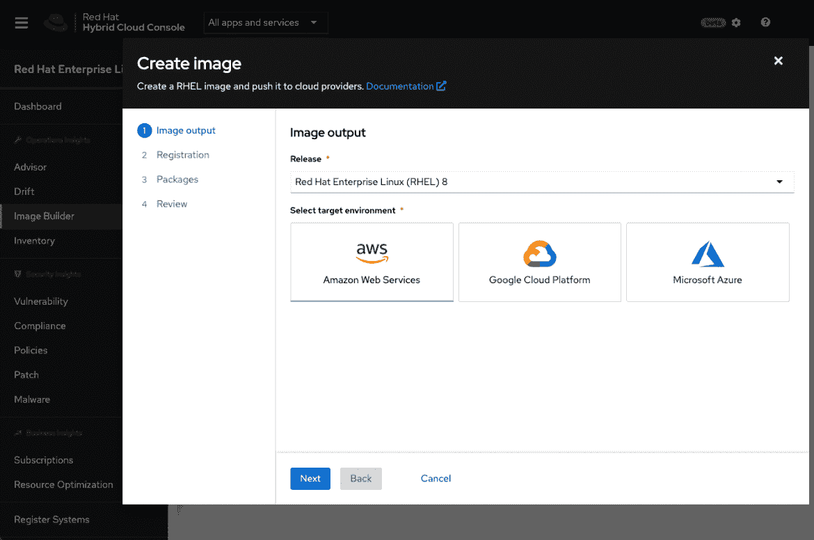

# 红帽增加定制 RHEL 图片的服务

> 原文：<https://devops.com/red-hat-adds-service-to-customize-rhel-images/>

Red Hat 本周宣布了一项 [Image Builder](https://www.redhat.com/en/blog/introducing-hosted-beta-experience-red-hat-enterprise-linux-image-builder) 服务的公开测试版，该服务简化了构建 Red Hat Enterprise Linux (RHEL)操作系统定制实例的过程。

Red Hat RHEL 产品管理总监 Scott Herold 表示，Image Builder 服务使 IT 团队能够为每个目标部署环境定义一个仅包含所需 RHEL 代码的“黄金”模板。最初，Image Builder 被配置为默认为 Amazon EC2、Microsoft Azure 和 Google Cloud Platform (GCP)云服务构建一个最小的、推荐的 RHEL 服务器映像。

该服务的未来更新将增加对 VMware vSphere 平台以及物理服务器的可下载映像和安装介质、自定义文件系统布局和 9.0、8.5、8.4 和 7.9 版本的支持。该服务本身是通过 Red Hat 混合云控制台访问的，该控制台目前正处于测试阶段。

Herold 表示，构建或安装操作系统通常是一个缓慢、乏味且容易出错的过程，需要针对每个平台以略有不同的方式手动执行。每个物理服务器或边缘计算平台需要不同的配置和工作流。因此，犯错误的几率很高；Herold 指出，Image Builder 可以大大降低出错的可能性，因为不需要猜测。

Herold 指出，IT 团队还可以选择在这些构建中包含来自 Red Hat 的附加内容，以进一步简化部署流程。这些图像可以自动注册到 Red Hat，以确保将来收到更新。

Herold 补充说，定制这些图像的能力也有助于减少需要保护的代码库的整体大小。他指出，在一系列引人注目的安全漏洞之后，人们越来越关注[软件供应链，许多 IT 团队正在重新审视他们的软件部署流程。](https://devops.com/log4j-its-all-about-the-supply-chain-baby/)

最后，Herold 说，无论 IT 团队在哪里部署 Red Hat 管理的开源软件，他们都将向 IT 团队提供更类似云的体验。他补充说，目标是尽可能减少摩擦，以便 IT 团队可以更轻松地管理大规模基础设施。

不管怎样，整个软件部署过程正在变得更加自动化。历史上使大规模部署和管理 it 平台变得困难重重的许多苦差事都可以追溯到组织在内部 IT 环境中运行数量少得多的应用程序时创建的手动流程。随着 it 团队越来越多地在云和网络边缘部署更多应用程序，越来越明显的是，手动传统流程将无法扩展，尤其是在雇佣和留住 IT 人员已经很困难的情况下。

尚不清楚 It 团队使用自动化开发运维流程实现软件部署流程现代化的速度有多快。单纯的惰性往往是一种需要克服的强大力量；然而，大多数 IT 专业人员可以很容易地找到更有吸引力的事情来利用他们的时间，而不涉及使用手动定制操作系统映像。