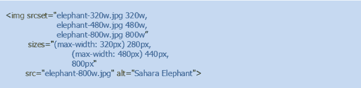
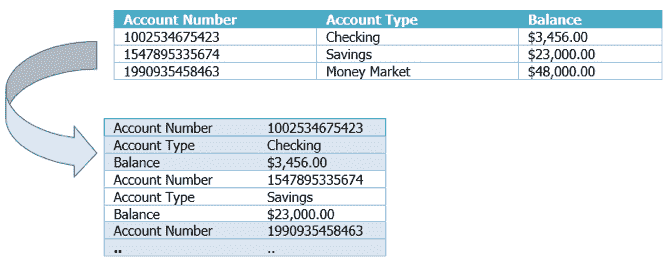

# 2021 年最佳——如何扩展您的网站以在移动设备上运行

> 原文：<https://devops.com/how-to-scale-your-website-to-perform-on-mobile-devices/>

随着 2021 年的临近，我们 DevOps.com 想要突出今年最受欢迎的文章。以下是我们 2021 年最佳系列的第六部。

我们大部分时间都在移动设备上上网，因为这些设备非常方便易用。绝大多数移动设备用户使用这些设备进行在线购物和支付水电费。Forrester 最近的一项研究“数字业务的当务之急”显示，在三个月的时间里，43%的美国银行客户使用手机进行网上银行交易。

通过移动设备进行的在线商业交易量逐年增长显著，这促使企业开始意识到要建立在计算机和智能移动设备上看起来、感觉起来、功能上和表现上完全相同的网站和电子商务网站。然而，大多数时候，在智能手机上浏览网站的体验和在电脑上浏览是不一样的。跨不同平台的这种不同行为的根本原因应该被理解为能够开发跨不同设备有效/平滑扩展的网站。

网页通常由以下一个或多个组件组成:页眉和页脚、主要内容(文本)、图像、表单、视频和表格。设备在屏幕尺寸(长 x 宽)、屏幕分辨率(像素密度)、计算能力(CPU 和内存)和操作系统(iOS、Android、Windows 等)方面有所不同。).这些差异对跨不同设备的 web 组件(如图像、视频和文本)的整体性能和呈现有很大影响。另一个需要注意的要点是，大多数移动用户并不总是连接到高速网络；因此，应该仔细设计网页，以便它们也能在低带宽连接上有效地工作。

## **移动平台网站最棘手的问题**

存在与网站跨设备的性能和可扩展性相关的各种问题，我们现在将讨论一些重要的问题，如下所述:

*   **网站不能自动适应不同的屏幕尺寸。**有些网站设计为可变屏幕尺寸，但其元素可能不会自动缩放。这将导致网站自动调整自己以适应不同的屏幕尺寸，但是里面的元素在较小的设备上可能看起来非常大。有些网站的设计可能无法适应不同的屏幕尺寸，导致此类网站的元素在屏幕较小的设备上看起来非常小。
*   面向移动设备的内容过多的网站。一些网站加载了太多内容，只是为了在桌面上打开时填满空白空间。没有意识到移动用户的网站通常属于这一类。这些网站需要更多的时间和带宽来加载，如果页面不是为移动设备设计的，那么部分内容甚至可能不会出现在设备上。
*   加载图像时间过长的网站。如果在设计阶段没有对图像进行优化，包含过多图像或大量图像文件的网站可能需要很长时间才能加载。
*   表格中的数据看起来非常复杂，加载时间太长。许多网站以表格形式呈现数据(例如比较竞争产品、不同旅游预订网站的机票价格、航班时刻表等。)，而在移动设备上，这些表格看起来太复杂，难以理解和/或加载时间太长。
*   托管在某些设备上无法播放的视频的网站。并非所有移动设备都支持所有视频格式。有时，网站托管的媒体需要许可证或 Adobe Flash 以及一些移动设备可能不支持的其他特定播放器。这导致用户的挫折感和网站的整体体验不佳。

## **设计您的网站以适应不同的设备**

所有移动设备上的网站经常遇到的问题都可以通过考虑这些问题的适当设计来解决。最值得推荐的实践是“*移动优先*”方法。当在屏幕尺寸、带宽等限制下工作时。集中于内容的正确数量和质量的需要应该是高度优先的。[移动优先的](https://www.uxpin.com/studio/blog/a-hands-on-guide-to-mobile-first-design/)方法将内容作为主要目标，旨在为最小的设备设计，以确保它们只有最基本的功能。它首先解决了移动设备的设计挑战，然后更容易地逐步增强其他大型设备的设计。

这里有一些最佳实践，在设计打算在不同设备上伸缩的网站时可以考虑。

**适应任何屏幕尺寸:**至少，网页需要缩放以适应任何移动设备的屏幕尺寸。如今，移动设备的屏幕分辨率非常高。移动设备上的像素密度远高于桌面屏幕。因此，以与设备无关的像素来设置页面格式以匹配移动屏幕的宽度是很重要的。HTML 文档的<头>中包含的“meta viewport”标签解决了这个需求。

如上所示的 meta viewport 值有助于格式化整个 HTML 页面并呈现内容以匹配任何屏幕大小。

**“内容为王”:**网页设计师必须记住，内容应该决定他们网站的设计，而不是相反。有太多元素的网站，如表格、表格、图表等。当他们需要在移动设备上扩展时，变得很有挑战性。开发者最终会对移动用户隐藏内容，结果，网站的桌面版本和移动版本变得不一致。设计的目标应该是关注核心结构和内容，而不是在网站上加入装饰元素。正如“移动优先”方法所建议的，设计师应该确保桌面和移动用户使用单一版本的内容。因此，网站设计者应该仔细考虑、制作和优化内容，使其不仅能满足商业目标，还能吸引移动用户。手机版没有出现的内容，在桌面版可能甚至不需要出现。

**响应图像**。设计应考虑在信号强度较低的区域工作的小型手持设备。大型照片和复杂图形不适合在这种条件下运行的移动设备。设计师需要确保网站中使用的图像针对不同尺寸的视窗和像素密度进行了优化。推荐的方法是使用[分辨率切换](https://developer.mozilla.org/en-US/docs/Learn/HTML/Multimedia_and_embedding/Responsive_images)，通过它可以指示浏览器根据设备的屏幕尺寸选择和使用合适尺寸的图像文件。根据分辨率切换图像是通过使用两个属性完成的:srcset 和 sizes。有了这些属性(包含在下面的代码片段中)，浏览器将使用设备宽度来选择大小列表中提供的最合适的媒体条件，根据该条件选择槽大小，并加载 srcset 中引用的与所选槽大小最匹配的图像。

例如，如果具有 320px 视窗的设备加载页面，则大小列表中的媒体条件(最大宽度:320px)将为真，因此将选择相应的 280px 槽。srcset(elephant-320w.jpg)中列出的第一个图像的宽度与此宽度最接近，不支持分辨率切换的 slot 浏览器会将 src 属性中列出的图像显示为默认图像。这种方法不仅为您的设备视窗选择正确的图像，还可以防止加载不必要的大图像，这些图像会消耗大量带宽。

**响应式表格:**世界正变得高度数据驱动。将关键和时间敏感的数据带到人们的手持设备上，为最终用户的决策提供了很大的权力和自由。面临的挑战是以一种易于加载到移动设备和阅读的方式向用户呈现数据。大多数情况下，数据需要以表格的形式呈现，但是当数据表变得太大而笨拙时，在小屏幕的移动设备上解释它们会令人沮丧。屏幕可能比表格的宽度窄得多，迫使用户不得不缩小屏幕以适应屏幕上的表格，从而使文本显得非常小。同样，屏幕可能比表格的宽度宽得多，迫使用户放大来查看数据，这需要不断的垂直和水平滚动。有几种方法可以构建[响应表](https://css-tricks.com/responsive-data-tables/)，其中最重要的将在下面提到:

该表不会被视为表，因为列将被转置为行。每列的大小将与屏幕一样宽，以避免水平滚动的需要。通过使用适当的颜色，(1 行数据)每一行数据可以相互区分。在这种情况下，对于每个“单元格”，应该使用 CSS 生成的内容(:before)来应用标签，以便可以清楚地识别每条数据。

第二种方法是根据屏幕宽度以两种形式显示数据:1 .在窄屏幕和 2。在更宽的屏幕上完成表格。如果移动用户希望单击图表来查看完整的表格，那么可以使用(a)中讨论的方法以表格形式显示数据。

第三种方法是在一个窄屏幕上显示一个迷你图形来指示一个表的存在，用户点击它将允许该表展开并显示。

**始终播放的视频:**通常情况下[视频](https://developers.google.com/web/fundamentals/media/video)如果移动设备不支持视频文件的格式，或者需要专用的视频播放器来播放视频内容，那么这些文件就无法在移动设备上播放。推荐的方法是对视频和动画使用标准的 HTML5 标签。HTML5 中的 video 元素可以用来在你的网站上加载、解码和播放视频。强烈建议制作多种格式的视频以适应不同的移动平台。适当地调整视频的大小也很重要，这样它们就可以在容器中播放。

下面的例子展示了的用法，其中标签让开发人员指定几种不同类型的视频格式(由 type 元素表示),供浏览器选择。在这种方法中，向正确格式的转换发生在客户端，只向服务器发出一个请求。这减少了网络延迟，并让浏览器选择最合适的视频格式，而不必先下载视频来检查其格式。

video 元素的 videoWidth 和 videoHeight 属性有助于识别视频的编码大小。可以使用 JavaScript 或 CSS 控制视频尺寸。最大宽度:100%有助于调整视频大小以适应屏幕。CSS 媒体查询可用于根据视口尺寸设置大小。还有几个 JavaScript 库和插件可以用来维护视频的长宽比和大小。

## **全面考虑…**

随着移动用户数量的指数级增长，人们经常使用智能手机和平板电脑进行网上冲浪和商业交易。网上商务正在成为世界范围内一些企业的主要商务渠道。因此，对于企业来说，开发在移动设备上运行和扩展良好的网站以增强移动用户体验并在台式计算机和大型显示器上反映网站的功能和性能是非常重要的。

“移动优先”的方法有助于网站设计者创建在小型移动设备上运行良好的网站。网站设计者需要小心决定满足业务需求的适当内容，同时考虑设备的技术限制，如屏幕尺寸、处理器速度、内存和操作条件(如网络信号强度差)。应注意确保移动设备上显示的图片、视频和数据具有响应性。设计师还需要对断点、触摸目标等敏感。

一个设计良好的网站，在小型设备上运行和扩展良好，总是可以逐步增强，以在更大的设备上运行。

最初发布于 2018 年。

— [斯里达尔·阿斯瓦特纳·拉亚南](https://devops.com/author/sridhar-asvathanarayanan/)