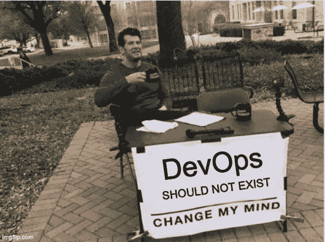
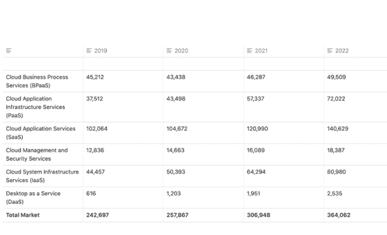

# 2021 年最佳——为什么 DevOps 将不复存在

> 原文：<https://devops.com/why-devops-will-cease-to-exist/>

随着 2021 年的临近，我们 DevOps.com 想要突出今年最受欢迎的文章。以下是我们 2021 年最佳系列的第十二期。

现在我觉得没有必要解释为什么 DevOps 作为一种方法论存在，因为它被广泛理解和接受。

但是 DevOps 工程师存在的原因不是为了确保其同名方法的成功，也不是，如果我们诚实地说，这种实践正在演变成一种对未来发展可行的角色。相反，它正处于被淘汰的边缘。

令人惊讶的是，在许多情况下，拥有一名 DevOps 工程师实际上可以让你离 DevOps 方法目标更远，而不是更近。

### 如何成为一名 DevOps 工程师？

我最近才偶然发现高科技学院的 DevOps 课程。

在它成为一个实际的研究领域之前，我很确定没有人是以 DevOps 的身份踏入软件开发世界的。

我个人开始是一名 NOC 工程师，后来成为一名 Linux 管理员——培养了对云和自动化的热情。几年后，我开始了我的第一个 DevOps 职位。其他人的旅程甚至更长，从帮助台支持角色开始，管理组织的 PC、打印机和网络。

事实是，选择软件开发职业的人的起点正是从那里开始的:开发软件。

通常，他们要么去学院或大学，要么在线或通过训练营学习开发，在那里几乎不教 Linux、网络、虚拟化、高可用性和可伸缩性。当然，一些杰出的高级开发人员成为了基础设施专家，但就我个人而言，我会把这些人称为架构师，而不是 DevOps 工程师。这可能是为什么几乎每个组织都需要有人承担 DevOps 工程师的责任的原因。

### **末日的征兆**

云解决方案的数量每年都在稳步增长，云服务成为消费业务服务的主要方法。 [Gartner 估计，从 2020 年到 2022 年，](https://www.notion.so/Why-Will-DevOps-Cease-to-Exist-4428213a44e44fdd96c8e243edda957a) 云服务业务收入将增长 40%。

“软件即服务(SaaS)仍然是最大的细分市场，预计到 2020 年将增长到 1047 亿美元(见下表)。从内部许可软件到基于订阅的 SaaS 模式的持续转变， [根据公司](https://www.notion.so/Why-Will-DevOps-Cease-to-Exist-4428213a44e44fdd96c8e243edda957a) 的说法。

### **全球公共云服务收入预测(百万美元)**

每年都会推出新的 PaaS、SaaS 和 IaaS 产品，以使其他应用程序的开发和维护变得更加轻松。

见鬼，一些 SaaS 的产品甚至让它变得没有必要，像 WIX、Shopify 和 Auth0 这样的平台，导致开发这类应用程序所需的开发人员减少了。最重要的是，已经有一些产品几乎完全运行在无服务器服务上。最近，无存储这个词被创造出来，并开始到处流行。

与此同时，开发者的数量每年都在增加。根据 Statista 的数据，2018 年至 2019 年间，开发者数量增长了近一百万。因此，虽然开发人员的数量在增长，但他们的大部分职责正在被自动化。

这逐渐为开发人员腾出了更多时间来处理 DevOps 挑战，这些挑战也正在由 Coralogix、Datadog、JFrog、CircleCI、Gitlab 等服务自动化。

一些公司，如[【Monday.com】](http://monday.com/)，已经承认让一个单独的团队或一个人负责应用程序的所有操作和维护并不是最佳选择，让开发人员从头到尾负责他们的应用程序堆栈更好。

虽然我一开始说没有必要解释为什么 DevOps 作为一种方法存在，但有时人们会忘记 DevOps 是作为一种打破开发和运营之间的孤岛的方式而发展的。但是，许多组织没有意识到让一个单独的团队负责所有运营和维护的讽刺意味，这违背了初衷。

希望随着这种趋势的发展，大学和编码课程将认识到这些问题是软件开发中的核心挑战，并将这些主题和原则纳入他们的课程中。

### 我眼中的未来

这可能是我一厢情愿的想法，但我相信在未来的某个时候，我们会达到一个点，所有的开发人员都需要理解和实践 DevOps。了解运行应用程序的成本、Kubernetes 如何确保应用程序始终可用且具有弹性，以及如何构建更具可扩展性和更安全的应用程序堆栈的开发人员将会更好地完成他们的工作，并对他们的公司更有价值。反之亦然；如果 DevOps [工程师](https://devops.com/?s=engineer)在开发中发挥积极作用，并且真正了解应用程序堆栈及其团队的困难和需求，他们将能够构建更好的 CI/CD 管道、更好的监控解决方案和云架构。

即使我错了——我也希望我错了——我会说，如果你是一名 DevOps 工程师或任何类型的技术负责人，宣传 DevOps 是每个开发人员工作的一部分这一理念对你最有利。

了解如何支持他们自己的环境、在专用网络上运行内部服务以及了解他们可用的解决方案的开发人员将更好地完成他们的工作，使公司能够让自动化流程完成他们的工作，并将人才集中在最需要的地方，以充分利用我们的技能。令人欣慰的是，这个优秀的标准正变得越来越容易达到；还有(我敢说吗？)或许，在不久的将来，DevOps 将不再是一个角色，而是一项服务，等待着最终不可避免的自动化。

读到这里，你可能会认为我是一个自我厌恶的 DevOps 工程师，希望成为一名开发人员。没有什么比这更偏离事实了。开发运营是我的领域，我相信这里充满了才华横溢的人，我很自豪地称他们为同事和朋友。然而，归根结底，我们需要现实一点。既然工作的“操作”部分大部分是自动化的，我们必须将我们的技能集中在“开发”部分。