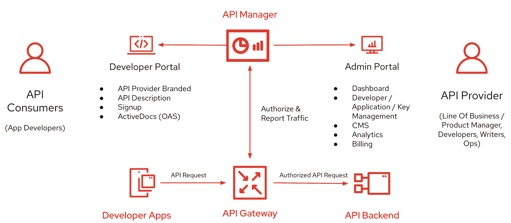
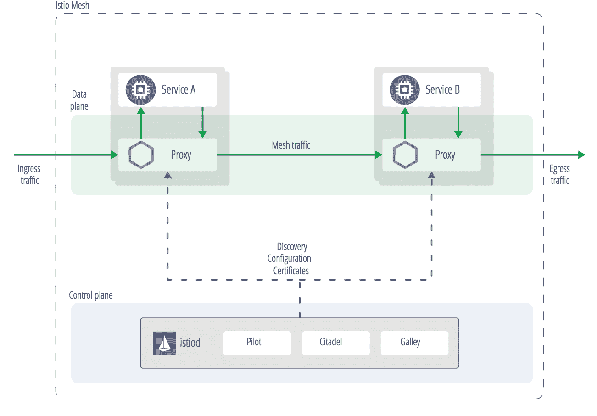

# API 管理和服务网格有什么不同？

> 原文：<https://devops.com/how-are-api-management-and-service-mesh-different/>

API 和微服务的使用正在增加—[F5 最近的一项研究](https://devops.com/api-sprawl-a-looming-threat-to-digital-economy/)估计该行业的 API 总数接近 2 亿个。随着组织扩大对 API 和微服务的使用，他们不可避免地需要某种形式的服务管理架构。实现这一点主要有两个主要的设计选项:API 管理系统或服务网格。

API 管理和[服务网格](//containerjournal.com/editorial-calendar/best-of-2021/when-is-service-mesh-worth-it/)之间的关键区别可以用四个基本方向来描述。面向外部开发人员的 REST 服务通常采用 API 管理，称为南北流量。另一方面，微服务的内部套件更常用服务网格来帮助控制横向或东西向通信。两者之间有更多的细微差别，我们将在下面介绍，但这本质上是它们在实践中的应用方式。

然而，随着企业数字应用程序集合的扩大，以及对跨公司业务领域的访问开始看起来和感觉上更像是消费第三方 SaaS，这种二元关系正在变得模糊不清。此外，有人建议，通过正确的控制，[服务网格可以像 API 管理一样迎合外部用户](https://containerjournal.com/editorial-calendar/best-of-2021/when-is-service-mesh-worth-it/)。此外，服务网格和 API 管理是互补的— [它们可以在同一个组织中共存，甚至可以部署在同一个项目中](https://devops.com/when-to-use-api-management-and-service-mesh-together/)。

我最近和 Red Hat 的产品总监 Mark Cheshire 聊起了 API 管理和服务网格的出现。根据 Cheshire 的说法，这两种方法实现了相似的目标，但进化却非常不同。下面，我们将重温这两种范式出现的原因，并对它们进行比较和对比。在另一篇文章中，我们将考虑何时最好将两者整合。

## 什么是 API 管理？

API 管理最常与南北交通联系在一起。通过向外界公开您的 API，您可以让其他开发人员将其连接到他们的系统，并像构建块一样利用您的数据和功能。

API 管理是随着 web APIs 的兴起而出现的。API 管理是一个广泛的概念，包括向外界公开 API 端点所需的许多功能。这可以包括认证、授权、请求路由、文档、速率限制、监控、记录、货币化和生命周期管理。一个关键的目标是让开发人员更容易集成。在架构上，API 管理遵循网关模式。消费者向网关发出请求，然后网关执行到底层服务的路由。

Cheshire 解释说，对于 API 来说，最大的催化剂是 Web 2.0 的出现。许多初创公司开始使用 RESTful APIs 来连接他们的 web 属性和合作伙伴生态系统。公司还发现 REST APIs 是比 SOAP 和 SOA 更直接的集成方法。他们也看到了易用性的好处，并在其内部基础设施中采用了 API 优先的设计。

截至 2021 年，超过 [70%的 API 是为内部使用而构建的](https://nordicapis.com/rapidapi-report-finds-partner-facing-apis-on-the-rise/)。那么，这些服务都需要 API 管理吗？看情况。Cheshire 解释说:“如果你进行外部交流，你需要 API 管理。但是，他说，对于企业内部的服务来说，这是一个灰色区域，尽管域间流量通常可以从 API 管理中受益。

A diagram of API management capabilities, from 3scale

### 强项

*   可以实现南北交通
*   保护应用程序的边界
*   旨在缓解外部开发人员的消耗
*   货币化潜力、订阅计划
*   通常是即插即用；更易于支持
*   市场上的许多解决方案
*   开发者体验和文档
*   分析和报告

### 弱点

*   可能比服务网重
*   更少的开源选项；供应商锁定
*   在比较解决方案时出现分析瘫痪

## 什么是服务网格？

[服务网格](https://containerjournal.com/editorial-calendar/best-of-2021/when-is-service-mesh-worth-it/)通常与控制内部服务之间的东西向通信有关。像 [Linkerd](https://containerjournal.com/features/cncf-announces-linkerd-graduation/) 、 [Istio](https://containerjournal.com/topics/container-management/istio-1-3-whats-new-whats-coming/) 和[库马](https://containerjournal.com/topics/container-networking/introducing-kuma-the-service-mesh-from-kong/)这样的服务网格使得从单个控制平面跨许多微服务重新实现类似的逻辑变得更加容易，例如联网、可观察性、流量管理、安全策略和路由。

服务网格的诞生是为了应对与 API 管理略有不同的挑战。“从整体服务到微服务的转变都是关于东西向流量的，”Cheshire 说。公司发现创新单一应用程序的速度较慢，因此将它们分解成通过 API 通信的微服务。但是这些微服务都需要相似的操作能力，为每个服务一遍又一遍地重复是很麻烦的。

“对于一个被吹成微服务的单片应用程序，你可能甚至不需要服务网格，”Cheshire 说。"然而，当您有数百或数千个时，应用服务网格就变得至关重要了."

Istio service mesh architecture

在架构上，服务网格通常分为数据平面和控制平面。服务网格部署了一个 sidecar 代理，它位于每个单独的服务旁边。例如，Istio 利用了[特使代理](https://containerjournal.com/topics/container-management/cncf-elevates-envoy-service-proxy-project/)。其他网格像 [Linkerd](https://containerjournal.com/features/buoyant-adds-support-for-zero-trust-policies-to-linkerd/) 使用他们自己的代理。

### 强项

*   非常适合微服务架构范例
*   适用于交通路由；提高弹性
*   NIST 推荐的实现[零信任](https://containerjournal.com/features/zero-trust-architecture-zta-to-secure-a-nation/)的架构
*   许多[开源选项](https://techbeacon.com/app-dev-testing/9-open-source-service-meshes-compared)
*   适合大型微服务部署

### 弱点

*   需要更多的实践方法
*   可能需要支持更多维护
*   单个服务不需要
*   需要过滤器链附件，用于南北能力

## 比较 API 管理和服务网格

API 管理主要是将 API 外部化给合作伙伴。当您这样做时，维护与消费者的契约对于满足 SLA 更为重要。因此，API 管理通常提供生命周期管理能力，比如版本控制。即使您只公开一个 API，API 管理也是必要的，因为这个服务需要被充分地记录和保护。也就是说，这些租户也可能与在一个组织内重用软件的开发人员有关——在处理[内部 API](https://nordicapis.com/tips-for-internal-api-first-approaches/)时，采用产品思维是有道理的。

另一方面，服务网格更适合控制内部网络。微服务很少单独部署；通常，多个微服务组成一个应用程序。而且，在一个组织中，可能有更多的人出于独特的目的而存在。因此，服务网格有助于保持整个大型解耦微服务网络的一致性。服务网格也是一个快速增长的领域，正在经历新的开发和生产使用的爆炸式增长。云本地计算基金会(CNCF) [的一份报告](https://www.cncf.io/wp-content/uploads/2020/11/CNCF_Survey_Report_2020.pdf)发现，仅在 2020 年，服务网格的使用量就增长了 50%。

从另一个角度来比较，首席执行官威廉·摩根·布里登描述了 API 管理更多地是关于业务逻辑，而服务网格处理集群内的操作:

> “API 网关通常处理入口问题，而不是集群内问题，并且通常处理一定量的业务逻辑，例如‘用户 X 每天只允许发出 30 个请求’。相比之下，像 Linkerd 这样的服务网格关注的是运营问题(例如，检测这些调用并报告它们的成功率；保护这些 pod 之间的通信)并有目的地避免业务和操作逻辑的混合；并专注于集群上服务之间的通信。”

尽管服务网格和 API 管理实现的目标略有不同，但这两个层都使得重用基于 web 的服务变得更加容易。而且，它们当然可以结合使用。例如，您可以使用服务网格构建 API 优先的微服务，同时使用 API 管理来公开某些域。在另一篇文章中，我们将考虑何时最好集成这两种技术。