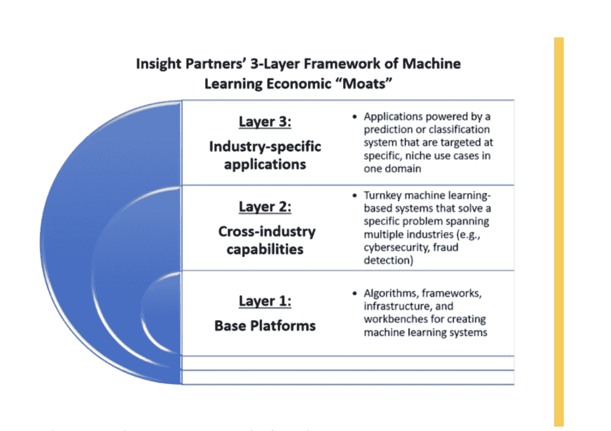
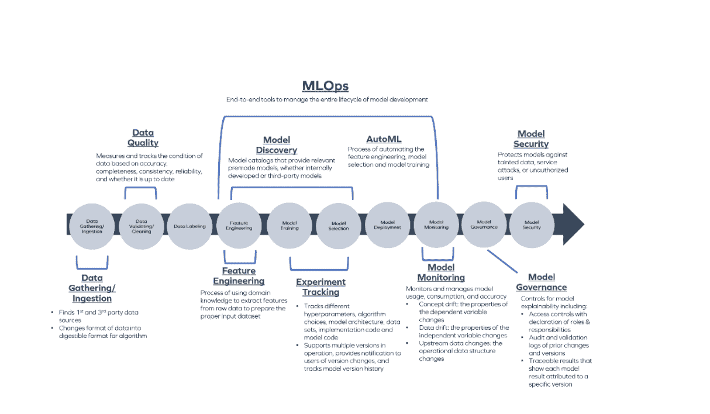
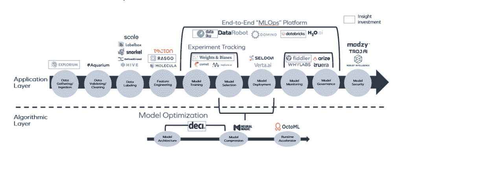

# 投资人工智能:MLOps 如何推动企业人工智能取得成功

> 原文：<https://devops.com/investing-in-artificial-intelligence-how-mlops-drives-enterprise-ai-wins/>

*Insight Partners 在 2021 年度过了辉煌的一年，拥有超过*[*【500 亿美元的资本承诺，跨越 200 多项投资*](https://www.insightpartners.com/blog/looking-back-at-2021/) *。虽然我们投资于各行各业的创始人，但这一系列文章重点概述了我们在 2022 年特别兴奋的四个垂直领域***:人工智能(AI)、金融科技、网络安全和健康科技。**

*人工智能仍然是一个超级热门的类别 有很好的理由:它有潜力改变几乎每个行业和商业。*

 *在 Insight，我们一直看好人工智能的许多用例。在过去的一年里，我们投资了来自荷兰的图像识别软件[【screen point Medical】](https://screenpoint-medical.com/screenpoint-medical-raises-28m-in-its-series-c-funding-with-insight-partners/)[【coverah Health】](https://www.insightpartners.com/about-us/news-press/covera-health-raises-25m-in-series-c-financing-to-fuel-growth-of-its-healthcare-quality-analytics-platform/)【提供质量分析平台以减少放射学中的医疗错误】[【CARTO】](https://www.insightpartners.com/about-us/news-press/carto-raises-61m-to-accelerate-cloud-native-spatial-analytics-in-the-enterprise/)帮助公司使用和理解空间分析 [层流](https://www.insightpartners.com/about-us/news-press/israeli-data-security-startup-laminar-emerges-from-stealth-with-32-million-series-a/)

2021 年，Insight 总共投资了 49 家不同的公司，涉及广泛的人工智能和机器学习用例，比上一年增长了 172%。

展望 2022 年，我们预计人工智能工具将继续占据主导地位。我们看到生态系统分为三个主要类别:

*   **第一层——基础平台公司:** 算法；框架；用于创建 ML 系统的基础设施和工作台

*   **第二层——跨行业能力公司:** 基于机器学习的交钥匙系统，解决跨多个行业的具体问题(如网络安全)

*   **第三层——特定行业的公司:** 由预测或分类系统驱动的应用程序，以一个领域中特定的利基用例为目标

公司和投资者将会发现跨越所有三个层面的有价值的人工智能/人工智能软件。在 Insight，我们最初专注于第二层和第三层。我们投资初创公司创建强大的 ML 系统来解决特定的问题，或者是纵向的(像 [信用承销公司 Zest AI](https://www.insightpartners.com/about-us/news-press/zest-ai-secures-investment-from-insight-partners-to-accelerate-adoption-of-fairer-and-more-transparent-credit-underwriting-software-across-enterprise-grade-lending-operations/) )或者是横向的(像 [网络安全公司 SentinelOne](https://www.insightpartners.com/portfolio/sentinelone) )。我们认为经济护城河在第一层是最难建造的；部分是因为强大的开源生态系统，也因为大型公共云供应商以低价提供了许多这样的工具。

*Insight Partners 的机器学习公司三层框架*

然而，这一年来，我们意识到我们遗漏了一块拼图。虽然对跨行业功能和特定行业应用的市场需求总是存在，但 2021 告诉我们，随着公司首次尝试将人工智能产品化，基础平台也将变得越来越重要。

毕竟，越来越多的公司正在推进人工智能项目，试图引导商业决策，节省时间和金钱。根据最近的一项调查，多达 90%的企业要么正在积极运行人工智能项目，要么计划在未来 12 个月内这样做。

但是这里有个问题:大多数 [这些项目都会失败](https://www.gartner.com/en/newsroom/press-releases/2018-02-13-gartner-says-nearly-half-of-cios-are-planning-to-deploy-artificial-intelligence) 。

原因有很多，包括缺乏足够的数据或黑箱模型会得出难以理解的结果。不管原因是什么，如果高失败率导致企业犹豫不决，不愿推进未来的人工智能项目，就会伤害生态系统。

因此，Insight 对人工智能工具的一个分支感到特别兴奋，它可以显著增加公司成功实现项目目标的可能性:机器学习操作，或 MLOps。

MLOps 工具可以帮助收集、管理和标记数据，试验和测试模型选择，同时在生产中部署多个模型，并防止模型和数据漂移和攻击，从而从头到尾改善机器学习管道。

整体而言，目标是通过机器学习生命周期改善数据科学家、数据工程师和业务分析师之间的沟通和协作，类似于 DevOps 工具如何帮助改善软件开发生命周期中的沟通。 机器学习是一个不断反馈循环的迭代过程，需要持续监控，这使得管理这一过程的 MLOps 工具变得更加关键。

*MLOps 管道的一些关键领域概述*

虽然每个推出人工智能项目的公司都可以从 MLOps 中受益，但他们需要的工具类型将取决于他们的需求、资源和战略。

公司应该问自己:我们的数据科学团队有多成熟？我们希望我们的模型有多关键？我们的数据源是结构化的还是非结构化的？我们想要开源的、商业的还是自主开发的工具？

这些问题的答案将为公司指出最适合其特定挑战的特定 MLops 工具。

例如，一些平台——如 Dataiku 或 data robot——是具有广泛功能的端到端产品，通常更易于使用，因此鼓励跨工作职能的工人进行模型创建和实验，而不管技术知识如何。这些所谓的“公民数据科学家”可以促进数据科学专家较少的公司的分析工作流，并创造巨大的价值，但也存在对部署的模型没有很好理解或控制的风险。这些类型的工具最适合那些希望使用机器学习来推动业务洞察和分析的公司，而不是作为其核心业务功能的一部分。

然而，如果一家公司拥有一支复杂的数据科学团队，它可能会倾向于特定的单点解决方案，或者 Insight 所谓的同类最佳 [MLOps](https://devops.com/?s=MLOps) 解决方案。虽然这些产品需要更多的技术知识来维护和部署，但它们允许系统中有更多的控制、深度和复杂性。一家初创公司给出了一个恰当的类比，即使用平台而不是同类最佳的解决方案，就像驾驶自动驾驶汽车而不是手动挡汽车。

管道的每个部分都有多个 MLOps 工具，我们看到一个世界，每个工具都有足够的市场空间来支持它成为一家大公司。

在 Insight，我们在 2021 年学习并投资了许多我们认为是同类最佳的 MLOps 工具，这些工具由高度满意的客户反馈、清晰的市场发展势头和备受尊敬且知识渊博的团队决定。这种观点导致我们投资了 Explorium、Rasgo、Weights&bias、Deci、Run AI、Fiddler、Tonic、Dataiku 和 Databricks，以及其他几家尚未宣布的公司。

*Insight Partners 的 MLOps 市场地图*

虽然 Insight 预计 MLOps 将在新的一年继续成为人工智能成功的重要驱动力，但我们也预计将在 2022 年看到其他几个趋势的形成:

*   首先，我们将看到两条机器学习管道的出现，一条用于结构化数据，一条用于非结构化数据。 图像、视频和音频等非结构化数据源需要特定的数据仓库、数据管理、管道和模型管理工具来最大限度地提高生产率和准确性。考虑到这两种数据类型之间的细微差别和复杂性，我们希望看到更多的 MLOps 工具转向拥有它们各自的类别。
*   **随着企业规模从几十个型号扩大到几百个甚至上千个型号，我们期待 AI 产业化程度的提高。**这将导致位于机器学习管道之上的编排层的兴起，以帮助管理所有不同的工具。这些层将跨 ML 管道中的多种工具集成，无论是开源的、商业的还是自主开发的，并提供一个集成的环境(或所谓的“单一窗口”)，以更好地跟踪和管理 ML 管道。编排层将帮助企业获得对管道的更多控制，同时仍然支持一流的工具。
*   **Insight 认为我们正处于从以模型为中心向以数据为中心转变的转折点。** 在以模型为中心的方法中，你问如何改变模型的代码来提高系统的性能，而在以数据为中心的模型中，你问如何改变数据来提高系统性能。我们预计 2022 年最成功的工具将专注于支持以数据为中心的运动所产生的新任务、工作流和工作。
*   **我们还将看到一种新的 MLOps 工具，专注于弥合各企业之间日益增长的人工智能技能短缺和差距** 。这些工具将致力于提高模型生产过程的效率，降低 ML 开发的门槛。
*   **最后，随着从实验到全面生产部署模型的转变，我们期望看到整体企业采用 ML 的显著增加。** 去年，我们看到许多企业组建了人工智能研究团队，并聘请数据科学家进行机器学习实验。2022 年，我们相信这些企业将开始实现其人工智能项目的全部能力，并推动巨大的商业价值。 这种企业采用率的增长还将受到 [边缘设备](http://resources.insightpartners.com/iot-edge-computing-report/p/1) 的爆炸式增长的推动，这将带来新的 ML 采用用例。

作为积极的机器学习和人工智能投资者，我们很高兴能够继续关注市场并支持新进入者，这必将是又一个充满活力和令人兴奋的一年。

* * *

*[乔治·马修](https://devops.com/author/george-mathew/)、[隆内·贾菲](https://devops.com/author/lonne-jaffe/)和[索菲·贝沙尔](https://devops.com/author/sophie-beshar/)共同创作了这首曲子。**