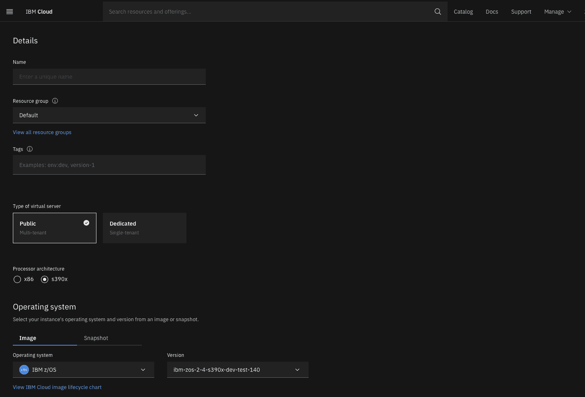

# IBM 将大型机应用程序测试转移到云端

> 原文：<https://devops.com/ibm-shifts-mainframe-app-testing-to-the-cloud/>

IBM 本周透露，它已经增加了在 IBM Cloud 上为 z/OS 大型机应用程序建立测试环境的能力。

此外，在 3 月 15 日，IBM 将提供一个 IBM Z 和云现代化堆栈，通过使用一组在 Kubernetes 环境中运行的云原生 DevOps 工具添加应用程序编程接口(API ),简化大型机应用程序的现代化。

IBM Z Hybrid Cloud 副总裁 Tarun Chopra 表示，基于 IBM Cloud 的 IBM Z as-a-service for development and test 消除了将大型机容量专用于应用程序测试环境的需求。相反，大型机应用程序测试现在可以在 IBM 云中进行，他补充道。

目前作为一个封闭的实验性产品，IBM 计划在今年下半年让面向 z/OS 的 IBM Wazi as-a-Service (Wazi aaS)正式上市。该产品将使 DevOps 团队能够在 IBM Cloud 上运行的安全私有空间上自助供应 z/OS 虚拟服务器的实例。

Chopra 补充说，这种混合方法意味着应用程序测试不再中断大型机上生产环境中运行的任务关键型应用程序。他说，访问 z/OS 开发和测试环境所需的总时间将从几天或几周减少到六分钟或更少。

与此同时，通过一组安全的 API 让其他应用程序更容易访问大型机应用程序，使其现代化变得更加容易。今天，许多组织通过复制大型机环境中已经存在的功能来增加他们的技术债务，仅仅是因为那些功能不容易被开发人员访问。Chopra 指出，IBM Z 和云现代化堆栈使大型机应用程序的现代化变得更加简单，以推动数字化业务转型计划，而不会增加组织需要服务的总体技术债务。

虽然多年来许多工作负载已经从大型机中迁移出来或者干脆退役了，但是今天在 z/OS 上运行的应用程序仍然是组织运行的最关键的任务。IBM 商业价值研究所最近的一项研究发现，71%的受访者表示，基于大型机的应用程序仍然是他们业务战略的核心。五分之四的受访者还指出，他们也需要对这些应用程序进行现代化。

现代化大型机应用程序比迁移它们要简单得多。挑战在于，构建、部署、维护和保护这样做所需的所有 API 意味着大量的工作。IBM 表示，它致力于简化大型机应用程序现代化过程。

无论如何，大型机应用程序正在成为更大的分布式计算环境的一部分。由于大型机提供了独特的事务处理能力，大多数已经投资大型机应用程序的组织继续在内部环境中运行它们。已经迁移到云的大型机应用程序通常比在本机运行时运行得更慢。作为更大的 IT 战略的一部分，将大型机应用程序迁移到云中仍然是有意义的。然而，与通过广域网(WAN)访问的所有其他应用程序一样，总要考虑性能权衡。