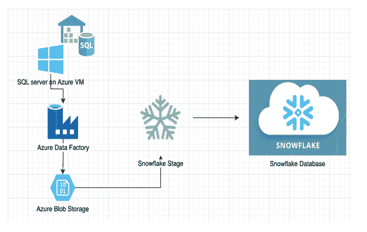
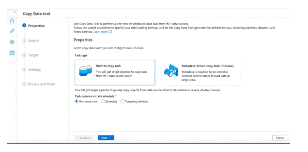
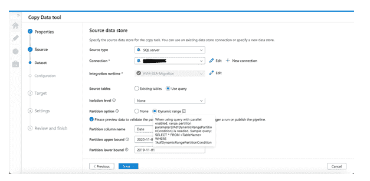
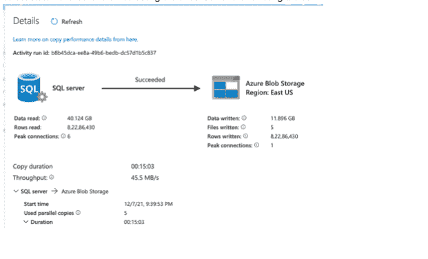
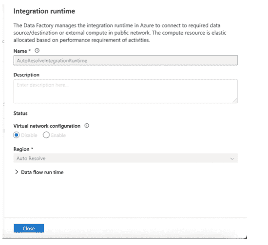

# AWS 上从 Microsoft Azure 到雪花的数据库迁移:第 1 部分

> 原文：<https://devops.com/database-migration-from-microsoft-azure-to-snowflake-on-aws-part-1/>

技术进步增加了对快速部署增强型基础设施的需求。[公共云](https://devops.com/?s=public+cloud)提供商不断升级他们的政策和基础设施，以满足不断增长的业务需求。这种竞争使企业能够选择最适合特定治理和成本效益需求的云提供商。

在这篇博客中，我们讨论将数据库从 Azure VM 上的 SQL Server 迁移到 AWS 上的 Snowflake。

## 理解问题

微软 Azure 是面向微软托管的数据中心的云计算产品，而雪花是基于云的数据仓库解决方案，基于各种公共云提供商提供软件即服务(SaaS)。

在这个场景中，我们需要将 SQL Server 数据库迁移到 Snowflake。还需要将迁移的数据放入雪花中，其中数据库名称有多个模式，数据的形式精确而正确。

虽然 Azure 支持从各种来源和云获取数据，但它不支持直接出口到其他云提供商。第一个挑战是找到一个可行的解决方案，将出口迁移到基于 AWS 的雪花。

## 我们对待移民的方式

根据 [雪花文档](https://docs.snowflake.com/en/user-guide/data-load-azure-create-stage.html) ，雪花有一个阶段特性可以解决上述问题。本质上，它是存储需要接收的数据文件的路径，类似于 SMB Samba 挂载的概念。使用雪花 Stage 允许它加载 Azure Blob 存储，之后雪花可以读取和接收平面文件中的数据。下一步是将数据从 SQL Server 移动到 Azure Blob 存储。

## 迁移过程

**迁移过程由以下步骤组成:**

*   按照 Azure SQL 数据库复制雪花中的数据库模式

*   设置 Azure 数据工厂管道，在 Blob 存储上创建 parquet snappy 格式的平面文件。
    *   在雪花中使用拼花文件进行数据压缩和快速数据加载

*   在雪花中创建文件格式
    *   创建或替换文件格式<file_format_name>type = ' parquet '；</file_format_name>

*   在雪花中创建舞台
    *   创建或替换阶段<stage_name></stage_name>
    *   URL = '<azure blob="" file="" path="">'</azure>
    *   凭据=(azure_sas_token= <token>)</token>
    *   file _ format =<file_format_name>；</file_format_name>

*   验证文件是否被转移
    *   list @<stage_name>；</stage_name>

*   最后，从阶段  加载数据到雪花表

(注意，所有拼花数据都存储在一个单独的列中($1))

复制到 TEST1

从(选择

$1:CustomerID::varchar，

$1:NameStyle:name::varchar，

$1:Title:city.bag::variant，

$1:FirstName::varchar，

$1:MiddleName::varchar，

$1:LastName::varchar，

$1:后缀::varchar，

$1:CompanyName::varchar，

$1:销售人员::varchar，

$1:EmailAddress::varchar，

$1:Phone:name::varchar，

$1:PasswordHash::varchar，

$1:PasswordSalt::varchar，

$1:rowguid:name::varchar,

$1:ModifiedDate::datetime

from @<stage_name>)；</stage_name>

让我们来分解这个过程中每一步的细节。

### 1.利用 Azure 数据工厂

Azure 的数据工厂是一个基于 GUI 的工具，它促进了端到端的 ETL 解决方案，并为构建管道提供了一步一步的指导。它具有源(SQL server)、目标(Blob 存储)和用于调整管道性能的必要设置。这些产品使其成为满足该迁移项目定制需求的完美解决方案，即在将数据导出到 Blob 存储之前对其进行处理。数据工厂无缝地解决了这个问题，这将在本博客的后面部分详细介绍。

### 2.调整数据工厂管道的性能

这种迁移的棘手之处在于，尽管管道很容易构建，但充分利用其潜力并获得最佳性能却是一项挑战。

有数万亿字节的数据需要从 SQL 导出到 Blob，如果不进行调优，这些数据可能需要数周才能完成传输。经过充分的概念验证后，发现数据工厂可以支持从源读取数据的动态范围。

假设有一个 800 GB 的 XYZ 表。按照上面提到的方法，需要数据工厂将大量数据移动到 Blobs 中。使用传统方法，默认情况下，GUI 将数据串行写入 Blob，这样会比较慢。

现在，如果我们看一下带有“日期”列的 XYZ 表，800 GB 的数据可以根据月份或年份划分成小的集合。这意味着每个分区不直接依赖于其他数据分区，可以并行写入。这将更快、更节省资源。

这可以通过使用动态范围过滤器来实现，该过滤器只能通过编写 select 语句而不是选中现有表的复选框来应用。

### 3.使用拼花锉

导出的数据需要存储在平面文件中，同时保持完整性和压缩性。CSV 是第一选择，但是在 POC 期间，在写入文件、维护损坏数据的空格和换行符时面临许多挑战。数据工厂提供了 Parquet 格式的文件，该文件具有很高的压缩率(75%)，并且还保持了数据的完整性。Parquet 经过优化，可以批量处理复杂数据，因此适合这个项目。从上图可以看出，  40GB 的数据被压缩到了 11GB。

### 4.集成运行时

为了让数据工厂工作，它需要更多的计算能力，这可以通过以下方式实现:

*   **自动解析集成运行时**

顾名思义，计算资源由微软数据中心管理和组装，成本是按单位计算的。这些资源的区域是根据可用性自动决定的。运行数据工厂管道时，默认情况下会选中此选项。

*   **自托管集成运行时**

这个运行时使用已经存在的资源。例如，自托管 IR 允许在机器上下载所需资源的客户端程序，创建服务并将其与数据工厂耦合。

### 4.设置自承载集成运行时

这是最好的选择，因为 SQL server 已经托管在一个独立的 Azure VM 上，这提供了使用连接到它的全部资源的自由。它包括以下步骤:

****1。设置自托管 IR****

*   **要让 Azure 数据工厂与 Azure VM 一起工作，需要设置 Azure 数据工厂集成运行时

    *   在 Azure Data Factory 中，选择“管理”，然后选择“集成运行时”
    *   选择“+新建”，然后选择“Azure，自托管”，
    *   接下来，选择“网络环境->自托管”
    *   接下来，给自托管 IR 起一个合适的名称
    *   创建 IR 后，将显示身份验证密钥。复制这些钥匙** 
*   **现在，根据最后一个屏幕，提供了一个链接来下载 Microsoft Integration Runtime

    ### 2。在数据工厂中创建链接服务** 

*   **进入数据工厂

    *   选择“管理”，然后选择“链接服务”
    *   选择 SQL server 作为服务类型，并给它一个合适的名称
    *   现在，在“通过集成运行时连接”下，选择创建的自托管 IR
    *   输入服务器名称。请务必注意，服务器名称应该与成功连接 SQL server 时使用的名称相同
    *   输入凭证并测试连接** 

**在下一篇博客中，我们将探讨迁移过程中遇到的一些挑战、节约成本的措施以及我们的数据验证方法。**