# SQL Server MDF 到 NDF 分发

> 原文：<https://devops.com/sql-server-mdf-to-ndf-distribution/>

您的数据库中有大量的 MDF 文件吗？您是否注意到这些数据文件的 [SQL Server](https://devops.com/?s=SQL+Server) 磁盘延迟指标高于底层操作系统的存储延迟指标？可能是您的 SQL Server 数据文件受到的冲击太大，而您没有足够的数据文件来帮助 SQL Server 存储引擎分配负载。我们这样做是为了 tempdb，对吗？让我们对我们的用户数据库也这样做。对于一个全新的数据库来说很容易。但是现有的数据库可能会因为单个数据文件而失控。让我向您展示如何在不停机的情况下针对现有数据库进行调整！

我将采用由 [HammerDB 基准](https://www.hammerdb.com/)生成的 SQL Server 数据库，适当地命名为 tpcc_test。它只是(适当命名的)数据库 tpcc_single 的一个备份和恢复副本，用来表示存在的单个 MDF 文件。

我在这台服务器的 F:驱动器上做了恢复。MDF 的大小相当大，为 420GB。对于此任务而言，日志大小无关紧要。

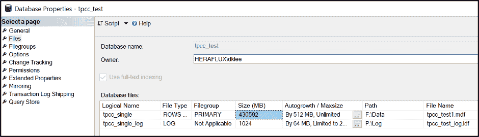

有趣的部分来了。看一下当前文件系统大小与内部填充大小的对比。记录内部填充大小，因为这是我们不久将用来帮助一些数学。

现在，你需要多少文件？这是我的标准 DBA 回答——视情况而定。出于本测试的目的，我将添加七个 NDF 数据文件来补充主 MDF。根据您的工作量，您的里程可能会有所不同。

这些文件需要有多大？取 MDF 上的内部填充大小，除以您想要的数据文件总数，并四舍五入到最接近的兆字节。如果数据库是活动的，并且添加了大量数据，那么您可能希望再添加一些数据，以便在我们完成这项任务时达到平衡。

| 选择 f.name 作为[文件名]，f.physical_name 作为[物理名]，将((f.size/128.0)转换为十进制(15，2))转换为[总大小(MB)]，CAST(f . size/128.0–CAST(file property(f . name，' space used ')AS int)/128.0 AS DECIMAL(15，2))AS[可用空间 MB]，f .[文件 id]，fg . Name AS[文件组名]，f.is_percent_growth，f.growth，fg.is_default，fg.is_read_only，fg.is _ 自动增长 _ 所有文件FROM sys . database _ files AS f WITH(no lock)将外部联接 sys.filegroups 作为 fg WITH (NOLOCK)ON f .数据空间标识= fg .数据空间标识ORDER BY f.[file_id]选项(重新编译)； |

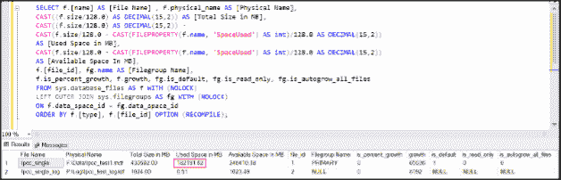

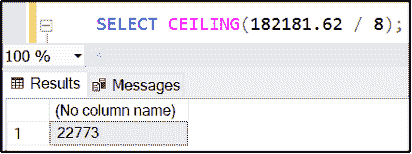

现在是时候决定是将它们放在同一个磁盘上，还是分布在更多的磁盘上了。我在这台服务器上这样做是为了利用磁盘控制器队列来更广泛地分布存储活动，并在压力下获得更好的整体性能。我已经将另外三个虚拟磁盘连接到该虚拟机，这四个磁盘分布在该虚拟机的四个磁盘控制器上。所有磁盘都格式化为 64KB NTFS 分配单元大小，并启用大 FRS 标志。让我们在每个磁盘上放置两个这样的文件，第四个保存 MDF 的最后一个 NDF。

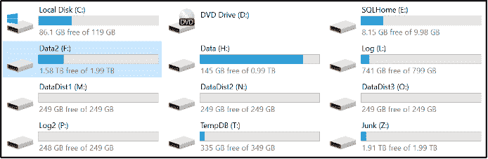

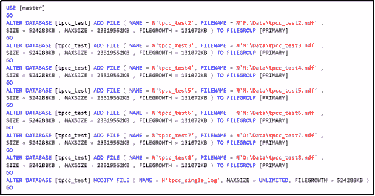

这里有一个技巧:我将每个新 NDF 文件的最大文件大小设置为当前主文件空间消耗的百分比。

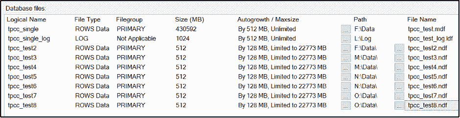

现在，我们将使用一个鲜为人知的命令来清空 MDF 文件。这将完全耗尽文件，但由于我们限制了附加的 NDF 文件的文件增长，以限制它们的增长率，此命令将一直运行，直到我们填满 NDF，然后失败。执行此操作需要更长的时间，但它在运行时保持数据库在线。这个正在运行的进程可能会对 CPU 和 I/O 造成一点性能影响，所以在运行这个操作时考虑时间是很重要的。

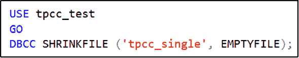

您可以使用上面列出的内部已用空间查询来观察流程的工作；主 MDF 正在耗尽，而其他 NDF 文件正在慢慢填满。

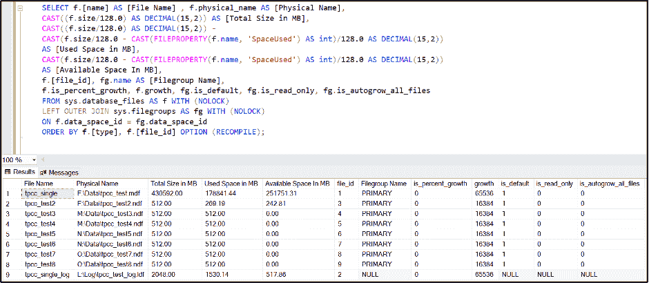

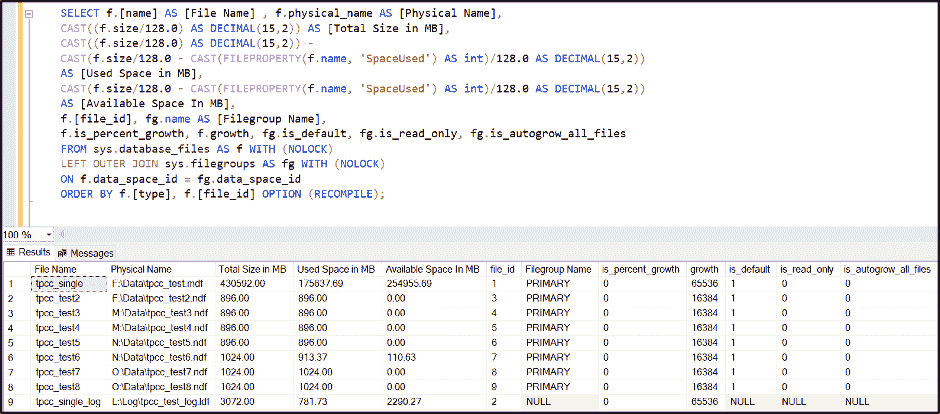

同样，这个过程需要时间来完成。当它最终“完成”时，由于 NDF 文件的最大文件大小限制，EMPTYFILE 命令将失败。

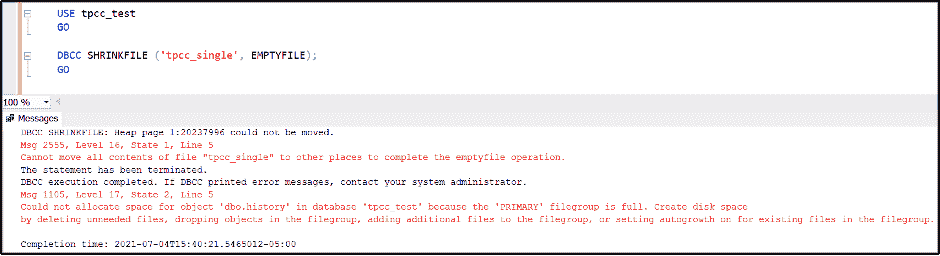

仅供参考—索引优化例程可能会导致此流程出现循环阻塞，我在运行此流程时遇到过两次，因此如果您看到这种情况，请密切关注。

现在，您的内部数据消耗空间率几乎相同。

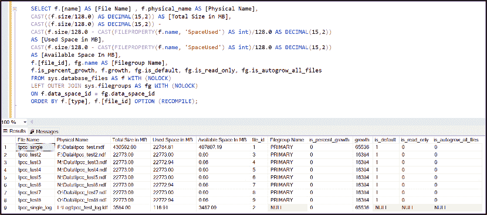

验证数据文件之间的自动增长速率现在是否相同。取消 NDF 文件的文件增长限制。

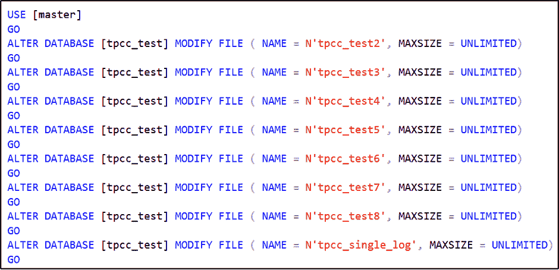

对主 MDF 文件执行一次性收缩，将其缩小到与其他文件相同的大小。

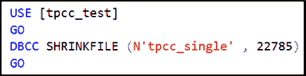

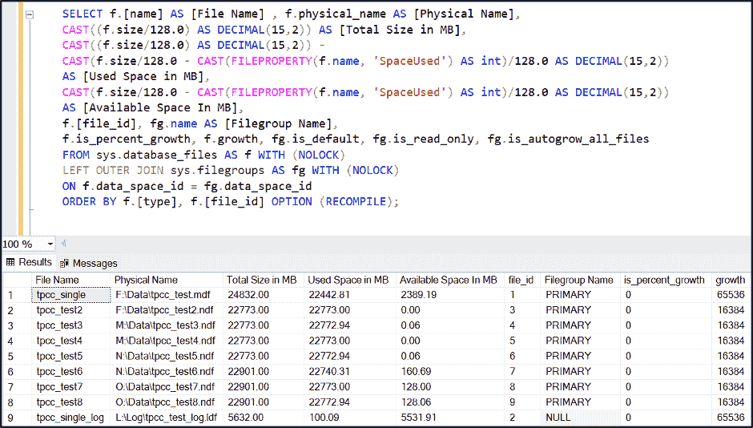

它很可能会稍微失去平衡。SQL Server 在内部文件填充率的循环算法方面做得非常好，当您通过正常使用继续添加数据时，它会完成平衡，然后在内部进行循环填充。如果您需要增加某些文件的大小以使它们相匹配，那么就这样做吧，SQL Server 会相应地进行填充，最终达到平衡。

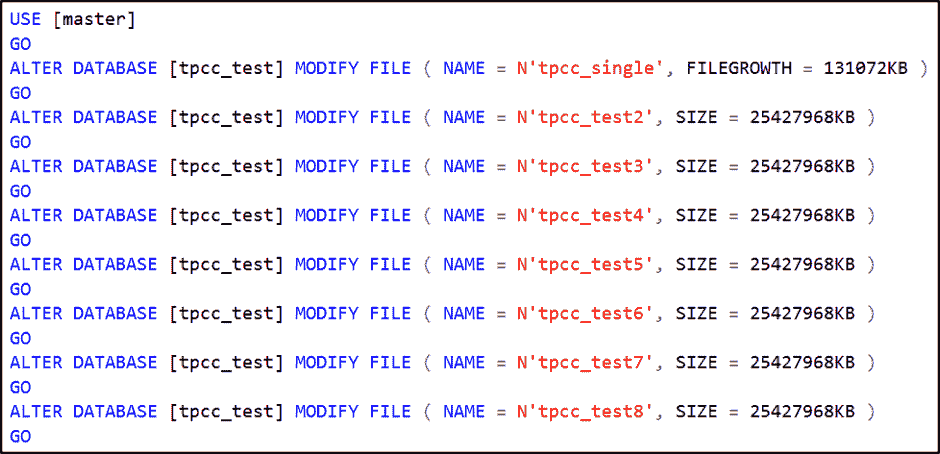

您还可以检查是否需要以相同的速率启用所有文件的自动增长。这可能意味着数据库用户可能需要从数据库中退出才能进行更改。  在维护窗口期间执行此操作。

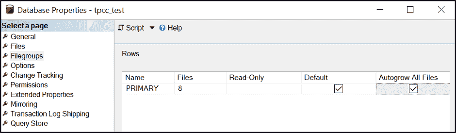

对您的 SQL Server 磁盘停止率进行抽样，看看一旦投入使用，您会有什么不同的体验。

我希望这能帮助您提高 SQL Server 数据库数据文件的操作效率，从而获得更好的性能。让我知道这如何为你工作！

*更新:如果您遇到如下错误，只需将主 MDF 文件缩小并重复 emptyfile 操作。*

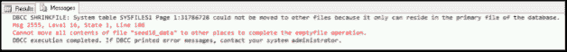