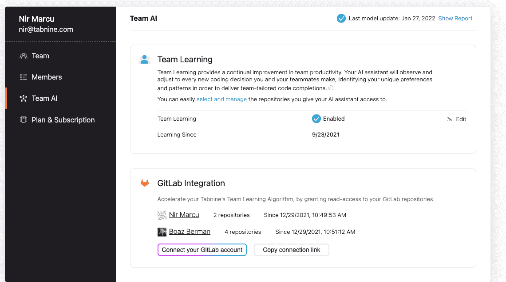

# Tabnine、GitLab 利用人工智能更快地构建定制应用

> 原文：<https://devops.com/tabnine-gitlab-build-custom-apps-faster-with-ai/>

Tabnine 今天透露，它已经[将其代码完成工具与 GitLab 持续集成/持续交付(CI/CD)平台集成。](https://www.webwire.com/ViewPressRel.asp?aId=285964) Tabnine 的平台[采用人工智能(AI)加速应用开发](https://www.webwire.com/ViewPressRel.asp?aId=285964)。

Tabnine 生态系统和业务发展副总裁布兰登·荣格(Brandon Jung)表示，目标是让开发人员更容易根据使用 AI 创建的定制模型自动编写代码。这些模型将驻留在 GitLab 提供的 CI/CD 平台中。他指出，开发者现在可以为他们的私有源代码创建定制模型。

Jung 补充说，Tabnine AI assistant 随后可以接受由内部 DevOps 团队定义的客户私人代码、风格和安全最佳实践的培训。该助手可从开发人员的集成开发环境(IDE)中访问，精通 35 种编程语言。

代码完成工具并没有消除开发人员编写代码的需要；相反，一旦开发人员开始基于 CI/CD 平台中存储的模型编写代码，它就会完成代码。

GitLab 全球联盟副总裁 Nima Badiey 表示，总体目标是在组织推出比以往更多的应用程序开发计划的时候提高开发人员的生产力。这些应用程序中有许多是使用多种编程语言构建的，而每个开发人员可能并不完全掌握这些语言。

此外，Badiey 指出，随着时间的推移，人工智能模型将提高正在创建的代码的质量。他补充说，这应该使审查更准确的代码变得更容易，因为它是在机器的帮助下创建的。

总的来说，GitLab 一直在努力将人工智能纳入 DevOps 工作流。该公司去年[收购了 UnReview](https://devops.com/gitlab-acquires-unreview-to-further-ai-ambitions/) ，这是一家使用机器学习算法的工具提供商，该算法根据代码评审员之前工作的质量和他们当前的工作量来确定将他们分配给某个项目。

目前还不清楚人工智能将在多大程度上广泛嵌入 DevOps 工作流。然而，算法得到更广泛的应用只是时间问题。如今，采用 DevOps 的组织投入大量资源来维护平台，如果更多任务和流程实现自动化，这些平台可能会更易于管理。理论上，更多的资源可以用于构建应用程序，而不是维护 DevOps 平台。

无论如何，越来越多的组织开始提高开发人员的生产力。开发人员很难找到也很难留住，因此组织有兴趣寻找方法来提高现有开发人员构建能够推动更广泛的数字业务转型计划的应用程序的速度。当然，应用程序开发速度的提高也会对应用程序的部署速度产生重大影响。

当然，并不是 IT 界的每个人都完全适应人工智能。然而，大多数 DevOps 组织高度致力于尽可能多地自动化流程。未来唯一不同的是确定这些过程将在多大程度上由人类和机器来自动化。