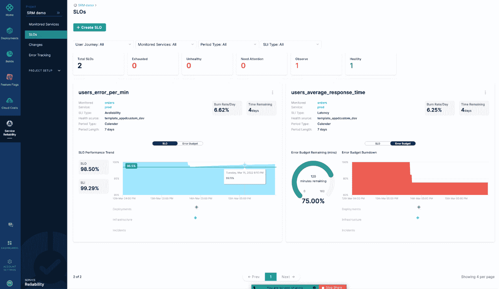

# Harness 收购 ChaosNative 以融合混沌工程

> 原文：<https://devops.com/harness-acquires-chaosnative-to-meld-chaos-engineering-devops/>

Harness 本周宣布,[收购了 ChaosNative](https://www.prnewswire.com/news-releases/harness-acquires-chaosnative-bringing-leading-chaos-engineering-solution-to-award-winning-software-delivery-platform-301507820.html?tc=eml_cleartime) ,作为将 chaos engineering 与 DevOps 工作流更深入整合的计划的一部分。

同时，该公司[在其持续集成/持续交付(CI/CD)平台](https://www.prnewswire.com/news-releases/harness-expands-software-delivery-platform-with-acquisition-of-chaosnative-and-launches-two-new-modules-to-help-developers-rapidly-deliver-resilient-reliable-secure-software-301507809.html?tc=eml_cleartime)中增加了线束服务可靠性管理(SRM)和线束安全测试编排功能。

作为一门学科，混沌工程指的是在软件系统上进行实验，测试其在面对计划外停机时的弹性。目标是故意使资源不可用，以查看应用程序环境如何调整或是否失败。

管理这些混沌工程任务的 ChaosNative 的 LitmusChaos 平台于今年早些时候捐赠给了云计算原生计算基金会。

Scott Sanchez，Harness 的首席营销官。该公司计划将 chaos engineering 进一步左移，以使开发人员能够在将应用程序部署到生产环境之前测试其弹性。

在 DevOps 工作流中采用混沌工程仍处于早期阶段。许多 IT 领导者的绩效是根据应用程序环境的稳定性来衡量的。Sanchez 指出，他们应该故意破坏一些东西，作为使应用程序更具弹性的努力的一部分，这种想法需要心态的转变。

然而，他补充说，一旦 IT 领导者开始意识到[混沌工程](https://devops.com/?s=chaos+engineering)实际上如何提高应用程序的可用性，这种做法变得更广泛地实施只是时间问题。

与此同时，Harness 正在寻求自动化更多较低级别的任务，这些任务现在的 DevOps 团队通常是手动管理的。Harness SRM 使 DevOps 团队能够自动跟踪与 Harness CI/CD 平台内特定管道相关的服务水平目标(SLO)。

同时，Harness STO 模块使得跨多个管道的安全测试更加简单。

总的来说，随着同时构建的应用程序数量的增加，现在人们更加关注开发运维团队的生产力。然而，挑战不仅在于应用程序的数量，还在于它们之间存在的依赖关系。

Harness 正在为 CI/CD 平台提供案例，该平台通过采用例如机器学习算法来识别哪些应用程序最有可能在构建完成之前失败，从而自动化开发运维任务。目标是减少开发运维团队浪费在等待构建完成上的时间，因为他们发现应用程序几乎立即就失败了。

随着整体环境变得更加复杂，维护 DevOps 平台的时间、精力和成本自然会有所不同。然而，随着 DevOps 流程变得更加自动化，平台本身也变得更容易被更广泛的组织访问。如今，开发人员设置并支持 CI/CD 环境所需的工作量通常相当大。

然而，随着越来越多的组织依赖定制应用来驱动数字业务流程，DevOps 最佳实践何时以及在何种程度上被更广泛地采用只是一个问题。毕竟，在数字化转型时代，应用停机的总成本只会上升。