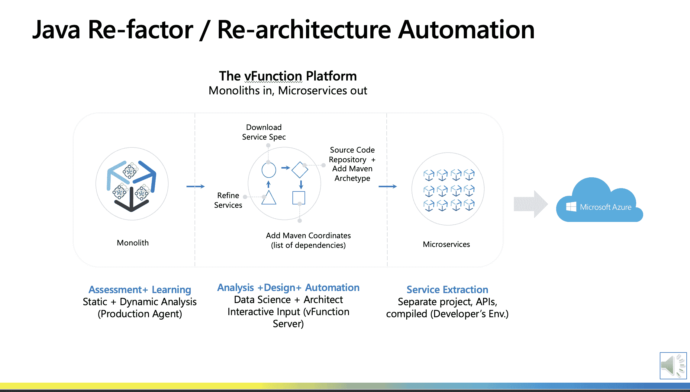

# 微软利用 vFunction 为 Azure 重构 Java 应用

> 原文：<https://devops.com/microsoft-taps-vfunction-to-refactor-java-applications-for-azure/>

微软已经与 vFunction 合作，以便更容易地将单片 [Java 应用](https://devops.com/?s=Java%20applications)转换为一组可以部署在微软 Azure 云上的微服务。

微软服务行业解决方案小组正在提供 [Java 重构服务](https://www.globenewswire.com/news-release/2022/04/12/2420907/0/en/The-Industry-Solutions-Organization-at-Microsoft-Partners-with-vFunction-to-Unveil-New-Java-Refactoring-Service.html)，通过该服务，IT 团队将能够将 Java 应用程序提升和转移到云，然后使用[代理软件和注入了人工智能(AI)的 vFunction 应用程序转换引擎](https://devops.com/vfunction-automates-conversion-of-java-apps-to-microservices/)来分析 Java 代码，将它们转换为一组微服务。

vFunction 首席执行官默蒂·拉法林表示，目标是消除目前将 Java 应用程序转移到云中所需的繁重工作。Rafalin 指出，vFunction 应用程序转换引擎是必需的，因为大多数易于迁移到云的 Java 应用程序都已经迁移了。他说，其余的 Java 应用程序具有不同程度的依赖性，如果没有能够解析 1000 多万行代码和数千个 Java 类库的静态字节码分析平台的帮助，它们就太复杂了，无法迁移到云上。

他补充说，一旦这些应用程序被转换为一组微服务，就有可能实现任何内部 it 环境都无法达到的规模水平。他指出，随着微服务应用程序在云计算环境中不断发展，相同的 vFunction 平台也可以用于帮助组织不断优化微服务应用程序。

Rafalin 说，从长远来看，vFunction 还希望增加对需要迁移到云的 Microsoft.Net 应用程序的支持。他指出，许多复杂的 Java 和 Microsoft.Net 应用程序仍在内部 IT 环境中运行，因为组织正遭遇因分析瘫痪而产生的惰性。

总的来说，[微软在与亚马逊网络服务(AWS)争夺云优势的战斗中继续获得动力。尚不清楚 Java 应用程序转移到云的速度。然而，大多数单片应用程序都有更容易维护和支持的组件，作为一个独特的微服务。一般来说，组织正在采用微服务来构建更具弹性的应用程序。在一个微服务变得不可用的情况下，对服务的请求被重新路由到另一个微服务，以确保应用适度降级，而不是简单地完全崩溃。当然，挑战在于，随着时间的推移，数百个微服务之间可能存在的依赖关系可能比那些被取代的整体应用程序更难管理。](https://devops.com/a-closer-look-at-azure-devops/)

基于微服务的应用不太可能在短期内完全取代整体应用，但大部分新应用都建立在基于微服务的框架之上。因此，许多 DevOps 团队现在管理着越来越复杂的 IT 环境中各种基于单片和微服务的应用程序。不太清楚的是，团队能够在多大程度上利用现有的 DevOps 工具和平台，以企业 IT 组织所需的规模构建和部署这两种类型的应用程序。