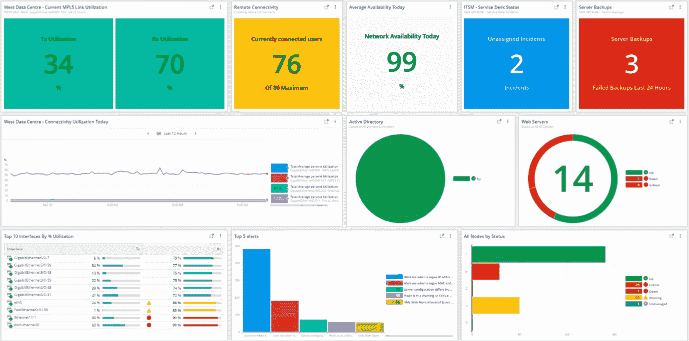

# 网络安全管理软件产品推出统一观测平台

> 原文：<https://devops.com/solarwinds-unveils-unified-observability-platform/>

网络安全管理软件产品本周推出了一个可观察性平台，该平台通过一个公共用户界面提供了该公司开发和收购的一系列工具和技术。

网络安全管理软件产品首席产品官罗希尼·卡斯特里表示，[网络安全管理软件产品混合云可观测性](https://www.businesswire.com/news/home/20220420005156/en/SolarWinds-Launches-Comprehensive-Observability-Empowering-Customers-to-Accelerate-Digital-Transformation)平台也让更多的组织能够负担得起可观测性平台。

他补充说，该平台还可以更容易地发现、映射和理解依赖性，从而更容易实现和维护服务水平目标。

Kasturi 说:“网络安全管理软件产品混合云可观察性是一套通过多层提供的工具，除了使管理云计算和内部 it 环境中的配置、报告和规划任务变得更容易外,[还使自动发现 IT 问题的根本原因变得更简单。](https://digitalanarchist.com/videos/featured-guests/increased-automation-solarwinds)。

随着 IT 团队越来越多地区分仅仅监控 IT 环境和实现可观察性，从而允许他们使用机器学习算法和其他形式的数据科学主动发现异常，可用于管理 IT 的深度和洞察力水平正在显著提高。Kasturi 指出，事实上，可观察性正迅速成为任何 IT 管理工具提供商的赌注。

当然，不缺少可观测平台。Kasturi 说，网络安全管理软件产品混合云可观测性旨在与现有的监控工具一起部署，而不是要求 IT 团队淘汰和替换他们已经使用的工具。

尚不清楚 It 组织接受可观察性的程度。作为最佳 DevOps 实践的核心原则，可观察性一直是一个目标。然而，即使是最先进的 DevOps 团队，到目前为止也只实现了对基于一组预定义指标的 IT 环境的持续监控。一个可观察性平台不仅能发现异常，还能使 DevOps 团队跨日志、指标和分布式跟踪发起查询，从而在性能问题变成重大中断之前识别其根本原因。

然而，最大的挑战可能不是技术，而是简单地理解发起什么查询。部分由于基于[微服务的](https://devops.com/6-advantages-of-microservices/)应用的兴起，IT 环境变得越来越复杂，可能影响高度动态 IT 环境的潜在排列数量越来越超出任何 IT 团队手动跟踪的能力。很明显，DevOps 团队今天依赖的许多传统监控工具需要合理化，以支持注入机器学习算法的工具，这些算法能够识别复杂 It 环境中的模式。

与此同时，在接下来的几个月里，IT 团队将需要花费大量的时间来试验可观测性平台。毕竟，应用程序不会神奇地自我检测。然而，一旦 IT 团队找到了一种方法来聚合可以从一个应用程序环境中收集的日志、指标和跟踪，定义一组最终可以更广泛应用的最佳实践就变得容易了。