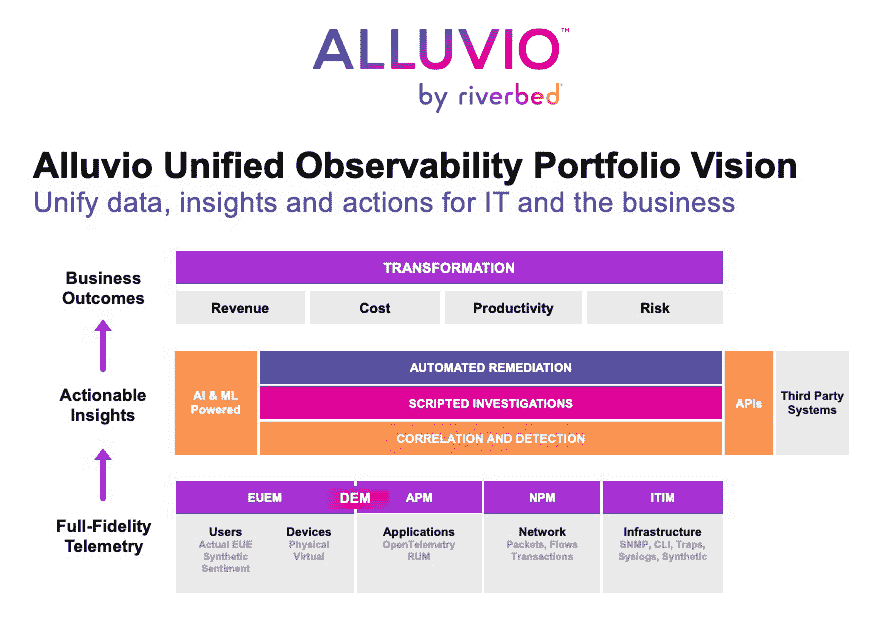

# Riverbed 推出统一观测平台

> 原文：<https://devops.com/riverbed-unveils-unified-observability-platform/>

Riverbed 今天发布了一个统一观测平台的测试版，它将在 Riverbed 品牌的 Alluvio 下提供。

Riverbed 产品管理高级副总裁吉姆·汉森(Jim Hansen)表示，Alluvio by Riverbed observability 平台将几个现有的网络和应用性能管理平台结合成一个单一的产品，现在注入了机器学习算法，以提供对 IT 环境的更深入的见解。

Hansen 补充说，我们的目标是提供一个开放的[可观察性](https://devops.com/?s=observability)平台，不仅可以聚合从 Riverbed 和第三方产品收集的数据，还可以确定解决 IT 问题的最佳方法。

他说，定于今年晚些时候全面上市的 Alluvio by Riverbed observability 平台将与现有的观察平台不同，它将使 it 团队不仅能够确定 IT 问题的根本原因，还能指出应该采用哪些流程来解决它。

通过这次发布，Riverbed 试图重新定位自己。此前，该公司提供网络和应用性能管理平台以及各种网络软件和硬件。汉森指出，这些产品现在都是一个数据源，可以通过河床观测平台输入到 Alluvio。

当然，可观察性一直是任何 DevOps 最佳实践的核心原则。然而，实现这一目标被证明是难以实现的。当今使用的大多数 IT 监控工具都是为跟踪一组预定义的指标而设计的。每当出现问题时，IT 团队通常会在作战室召开会议，通过比较报告和由监控工具生成的各种仪表板来尝试发现问题的根本原因，例如性能问题。发现一个问题可能需要几周时间，而一旦确定了问题的根源，通常只需要几分钟就可以修复。

相比之下，可观察性平台承诺通过将 IT 环境生成的所有数据聚集在一个平台内来减少发现 IT 问题所需的时间，该平台可以关联事件并使识别异常行为变得更容易。有了这些见解，it 团队发起查询变得简单多了，这使他们能够更快地解决问题。

随着组织越来越依赖软件来推动数字业务转型计划，这些见解也越来越多地用于推动业务决策。然而，Riverbed 最近进行的一项调查发现，四分之三的业务决策者(75%)表示，他们的组织难以从技术基础设施生成的数据中收集可操作的见解。

IT 团队不可避免地会遇到的挑战是，他们并不总是知道要问的正确问题，这是一个可以通过机器学习算法来解决的问题，这些算法能够识别指示需要解决的 IT 问题的异常。

已经不缺乏可观测平台。现在的问题是确定在日益工具化的分布式 IT 环境中使用哪种可观测性平台。