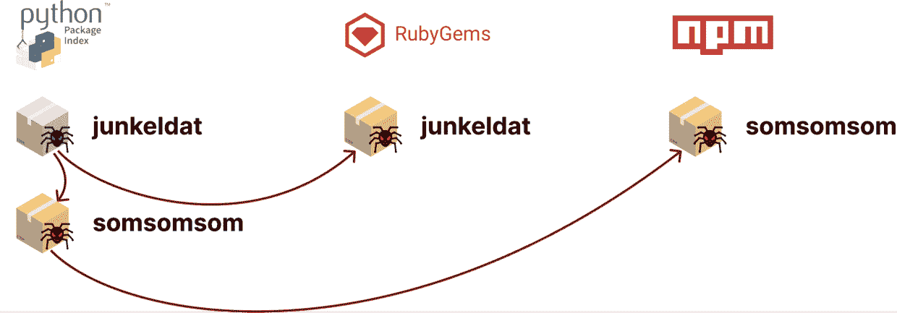

# Checkmarx 报告强调了 AppSec 协作的必要性

> 原文：<https://devops.com/checkmarx-report-highlights-need-for-appsec-collaboration/>

Checkmarx 发布的一份研究报告发现，随着网络攻击者工业化他们的恶意软件开发过程，使用多种编程语言开发的基本恶意软件是相同的。

代码扫描工具提供商 Checkmarx 分享了用多种编程语言编写的恶意包的例子。这些示例包共享多年来未被发现的相同的危害指标。例如，一个用于 Python 应用程序的“junkel dat”PyPI 包，在 Ruby 版本的包中也出现了漏洞。

Checkmarx 的供应链安全负责人 Tzachi Zornstain 表示，就像其他使用多种编程语言的开发团队一样，网络犯罪分子似乎也在分享技术。他补充说，这些例子强调了开发团队需要共享安全情报，即使他们使用不同的编程语言构建应用程序。Zornstain 指出，使用一种编程语言的开发团队有一种忽略应用程序安全问题的趋势，这些问题似乎只影响用另一种编程语言编写的应用程序。

Zornstain 说，包裹在如此长的时间内未被检测到的事实是由于——至少部分是由于——生态系统中缺乏信息共享。

当然，网络攻击者试图利用许多开发团队对开源项目的隐性信任。然而，Zornstain 说，现在越来越多的网络犯罪分子正在齐心协力地破坏下游软件组件，每个组件都必须经过审查。他建议，事实上，组织不应该使用陌生人提供的任何代码。

核心问题是，许多开源项目是由少数程序员维护的，他们贡献自己的时间和精力来构建其他人可以免费使用的组件。他们中的许多人认为，确保软件安全的责任在于决定部署该软件的组织。他们也没有责任去追踪那些散布恶意软件版本的网络罪犯。

不幸的是，许多依赖这些代码的 IT 供应商和大型企业 IT 组织并没有为项目做出任何有意义的贡献，无论是在融资方面还是在帮助开源维护者发现和修复漏洞方面。然而，许多同样的组织正在评估，从安全的角度来看，如果没有这些贡献，他们所使用的开源软件实际上是否是可持续的。因此，这些酝酿已久的开源软件安全问题升级为更大的危机可能只是时间问题。

无论如何，DevSecOps 最佳实践将需要在更深的层次上应用于应用程序开发。组织不能假设他们所依赖的软件组件已经被其他人扫描过漏洞。开发团队很容易犯错误。对更高安全级别的需求可能会延长开发过程，但另一种选择——恶意软件肆虐——就不那么令人满意了。