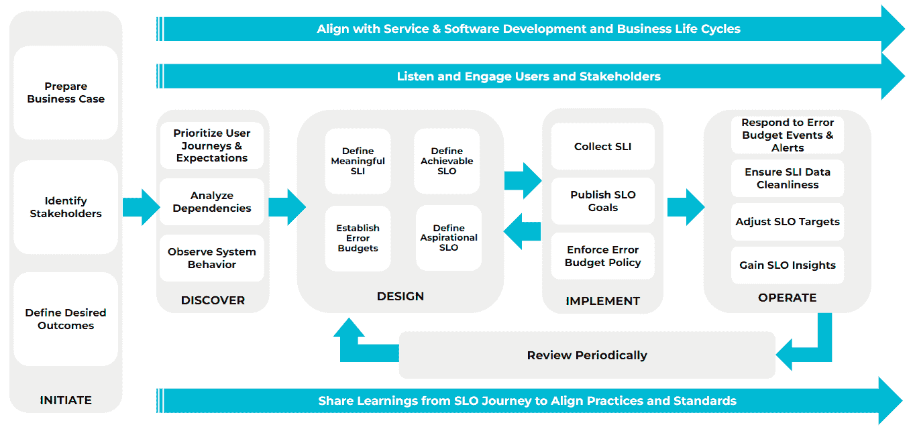

# Nobl9 分享 SLO 代码方法

> 原文：<https://devops.com/nobl9-shares-slo-as-code-methodology/>

Nobl9 发布了定义服务级别目标的开放规范 1.0 版本，称为 [OpenSLO](https://www.businesswire.com/news/home/20220510005542/en/OpenSLO-Specification-Moves-to-Version-1.0) ，此外，还定义了可重复的 SLO 方法。

首席运营官 Nobl9 的 Kit Merker 表示,[服务水平目标开发生命周期](https://www.businesswire.com/news/home/20220511005428/en/Nobl9-Introduces-Service-Level-Objective-Development-Lifecycle) (SLODC)方法学代表了一种努力，即创建一套实现和维护 SLO 的最佳实践，这些 SLO 作为代码在应用程序环境中实现。

Dimensional Research 代表 Nobl9 对 300 多名 IT 经理和高管进行的调查发现，只有 29%的受访者没有实施 SLO 的计划。已经实施或计划实施 SLO 的受访者中有整整 94%的人打算将它们直接映射到业务运营中，91%的人表示他们期望这一举措能够改善决策。超过 80%的受访者还表示，他们的组织正在计划增加 SLO 的使用，87%的受访者表示 SLO 应该能够提高微服务的整体性能。

挑战在于大多数组织对其 IT 环境的了解有限。例如，该调查发现，不到一半的受访者(46%)了解其所有 IT 环境。分别只有 45%和 35%的人声称对容器和微服务有可见性。超过四分之三(78%)的人说混合云使得[的可观测性](https://devops.com/?s=observability)更加困难。

具有讽刺意味的是，45%的公司报告说他们已经使用了 11 种或更多的观察和监控工具。从好的方面来看，31%的公司雇佣了站点可靠性工程师(sre ),而将近一半的公司(46%)计划设立这个职位。

Nobl9 试图通过提供一个开源的 SLO 规范来促进 SLO 的广泛采用，该规范定义了一个通用接口，用于在基于 Git 的工作流中构建 SLO。自从 OpenSLO 最初启动以来，已经添加了更多的功能，包括 DataSource 对象，该对象使得重用连接细节更容易，并且使得创建 SLO 不那么冗长，并且已经定义了三个警报:AlertCondition、AlertPolicy 和 AlertNotifcationTarget。

Nobl9 还发布了一个 OpenSLO-to-Nobl9 转换器，可以在需要时将 OpenSLO YAML 文件转换成 Nobl9 YAML。

当然，SLO 并不是一个新想法。几十年来，它们一直被用作跟踪 IT 服务性能的指标。然而，随着越来越多基于微服务的应用程序的构建和部署，跨应用程序维护 SLO 变得越来越具有挑战性，这些应用程序比传统的单片应用程序具有更多的依赖性。最终，每个 IT 团队都需要提供某种客观的基准来评估他们在交付应用程序服务时的整体效率。SLO 代码旨在使收集确认是否达到服务级别的指标变得更简单。Mercer 指出，这些 SLO 随后会被跟踪并整合到从财务运营到供应链的各个方面。

不清楚这些年来对 SLO 的依赖是否已经减弱，或者应用程序环境是否变得过于复杂而无法跟踪有意义的指标。然而，随着应用程序越来越多地被视为服务，SLO 在现代应用程序环境中被更广泛地采用只是时间问题。当然，挑战在于定义 SLO 比维护它容易得多——尤其是在当今高度动态的应用程序环境中，服务往往会出乎意料地出现、变化并最终消失。