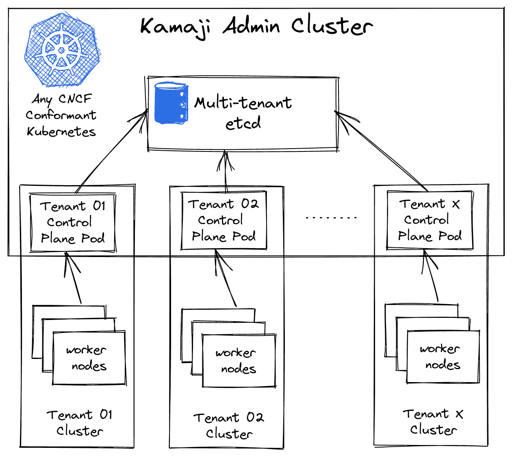

# Clastix 推出 Kamaji，这是一款用于托管 Kubernetes 服务的新开源工具

> 原文：<https://devops.com/clastix-launches-kamaji-a-new-open-source-tool-for-managed-kubernetes-service/>

*大规模运行 Kubernetes 集群，减轻运营负担。*

**kube con+CloudNativeCon EU 2022，2022 年 5 月 16 日—**[Kubernetes 多租户专家 Clastix](https://clastix.io) 今天宣布推出 [Kamaji](https://github.com/clastix/kamaji) ，这是一款全新的开源工具，可以前所未有地轻松构建和运营托管的 Kubernetes 服务。

Kubernetes 的采用增长迅速。云本地计算基金会( [CNCF](https://cncf.io) )最近的一份报告发现，超过 96%的组织正在使用或评估 Kubernetes——这是自 2016 年早期调查开始以来的最高纪录。有了这种事实上的地位，Kubernetes 现在正走向类似于 Linux 的“幕后”,更多的组织利用来自云和服务提供商的托管服务和打包平台。

全球超大规模公司如 AWS、Azure、GCP 和其他一些公司正在引领这个市场，而区域云提供商和大公司由于缺乏合适的工具，正在努力为他们的开发人员提供同等水平的体验。此外，用于内部部署的 Kubernetes 解决方案是为企业优先的方法而设计的，大规模部署时成本太高，需要的管理工作没有竞争力。Kamaji 项目旨在通过利用多租户和简化如何大规模运行集群来解决这一难题，同时减轻运营负担。

**剖析托管的 Kubernetes 服务**

在构建托管 Kubernetes 服务时，最具结构性的选择之一是如何大规模部署、管理和操作多个集群。由于所有这些集群都必须具备弹性、隔离和成本优化，因此管理它们会给运营团队带来太大的压力。

因此，在 Clastix，我们采用了使用 Kubernetes 本身来编排其他 Kubernetes 集群的想法。这个想法，也被称为“kube inception”，并不是一个新的想法，但我们只是试图将它推向一个新的水平。为了实现这个目标，Kamaji 将任何符合标准的 Kubernetes 集群转变为“管理集群”,以协调其他称为“租户集群”的 Kubernetes 集群。

与每个 Kubernetes 集群一样，租户集群有一组节点和一个控制平面，由几个组件组成:API 服务器、调度器和控制器管理器。Kamaji 所做的是将这些租户集群组件部署为在管理集群中运行的 pod。现在，我们让租户集群控制平面的所有无状态组件作为一个轻量级单元运行，而不是多个虚拟机。我们没有提到 etcd，它是保存集群状态的键值数据存储，我们将在后面讨论。

租户工作节点是什么？它们只是工作节点:连接到租户集群的 API 服务器的常规实例，例如虚拟或裸机。我们的目标是管理数百个集群的生命周期，而不是一个，那么我们如何再添加一个租户集群呢？如您所料，Kamaji 只是在管理集群中部署一个新的租户控制平面作为新的 pod，然后它加入新的租户工作节点。

所有使用 Kamaji 构建的租户集群都完全符合 CNCF Kubernetes 集群，并且与大家都知道和喜欢的标准工具链兼容。

**保存状态**

将租户集群控制平面放入 pod 是最简单的部分。此外，我们必须确保每个租户集群保存状态，以便能够存储和检索数据。所有问题都是关于在哪里以及如何部署 etcd，以使其对每个租户集群可用。

让每个租户集群化其 etcd 最初似乎是个好主意。但是，我们必须考虑 etcd 的弹性，因此要用 quorum 副本来部署它，每个副本都有自己的持久卷。但是在 Kubernetes 中管理大规模的数据持久性可能会很麻烦，导致降低数据持久性的运营成本增加。

每个租户集群专用的 etcd 集群无法很好地扩展托管服务，因为用户仅根据他们消耗的工作节点资源付费。这意味着，要使服务具有竞争力，控制租户控制平面消耗的资源非常重要。

因此，我们必须找到一种替代方案，同时牢记我们的目标，即实现弹性和成本优化的解决方案。由于我们可以使用外部 etcd 集群部署任何 Kubernetes 集群，因此我们探索了租户控制平面的这一选项。在管理集群上，我们可以部署一个多租户 etcd 集群来存储租户集群的状态。

借助这种解决方案，弹性由通常的 etcd 机制保证，并且 pod 数量保持在控制之下，因此它解决了弹性和成本优化的主要目标。这里的权衡是，我们必须运行外部 etcd 集群并管理访问，以确保每个租户集群仅使用其数据。此外，etcd 的大小也有限制，默认为 2GB，最大可配置为 8GB。

在 Clastix，我们通过汇集多个 etcd 和分割租户控制平面来解决这一问题。第一次基准测试表明，我们可以为多个租户集群提供服务，而多个 etcd 要低一个数量级。

**硬多租户**

借助 Kamaji，云提供商和大型组织可以创建托管 Kubernetes 服务，以最简单、最自动化的方式为其用户提供与公共云提供商相同的体验。租户工作节点由基础设施隔离，而控制平面在管理集群的不同 Kubernetes 名称空间中运行。网络策略和策略引擎可用于进一步隔离不同租户集群的控制平面。客户端应该看不到 Kamaji 构建的集群和专用集群之间的区别。最后，Kamaji 实现了一个完整的硬多租户环境，其中每个租户作为其集群的管理员，不与其他租户共享任何东西。我们对 Kamaji 项目感到非常兴奋，因为它看起来很有前途，并期待社区的支持，使它变得更好。

**关于 Clastix**

Clastix 是 Kubernetes 多租户解决方案的领导者。Clastix 产品可帮助任何规模的组织克服第二天的挑战，自信地运行基于 Kubernetes 的基础设施。Clastix 是 [Capsule](http://capsule.clastix.io) 的作者，这是一个用于在 Kubernetes 中实现多租户的开源运营商，目前被客户用于生产，如 [Fastweb、](http://www.fastweb.it) [Wargaming](https://wargaming.com/en/) 和许多其他公司。有关 Clastix 多租户解决方案的更多信息，请访问 [clastix.io](http://clastix.io) 或发送消息至 [hello@clastix.io](mailto:hello@clastix.io) 。

**媒体联系**
马塞罗·卢斯托
[马塞罗@clastix.io](mailto:marcello@clastix.io)