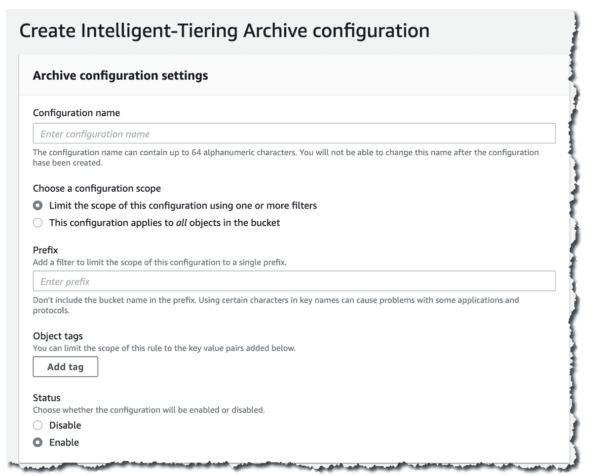

# 通过数据分类节省 AWS 成本

> 原文：<https://devops.com/saving-on-aws-costs-with-data-classification/>

对于许多组织来说，云正在成为一个巨大的成本中心。虽然经常被吹捧为成本节约者，虽然许多云迁移是由节省 IT 成本的愿望驱动的，但云确实会在减少资本支出的同时增加运营支出。此外，与传统的 IT 投资不同，云成本是不可预测的，很快就会失控。

然而，虽然云带来了问题，但它也为你提供了解决问题的工具。例如，在 [AWS](https://devops.com/optimizing-aws/) 上，成本的主要组成部分是通过古老的简单存储服务(S3)交付的对象存储。S3 是现代数据湖、大规模媒体库、网站内容、非结构化内容存储库等的基础。

幸运的是，S3 提供了一种存储分层机制，可以显著降低不常用内容的成本。为了有效利用存储分层，您需要采用数据分类的概念，即自动发现不经常访问的数据，并将其动态移动到最合适的存储层。

### 什么是数据分类？

术语“数据分类”是指将非结构化和结构化数据组织成代表不同数据类型的类别的实践。

[数据分类是一种组织实践](https://satoricyber.com/data-classification/data-classification/) ，可以帮助你实现两个关键目标:

*   了解您存储了哪些数据类型
*   确定每个数据类型 所在的位置

下面是几个由[Gartner](https://www.gartner.com/en/documents/3980741):定义的数据分类用例

*   控制知识产权 —D 数据分类帮助您控制对数据的访问并定义合适的位置。
*   减少攻击面 —Y 您可以在存储敏感数据的位置使用数据分类来减少攻击面。
*   识别法规管理的数据 —D 数据分类使您能够将数据分类到特定的合规类别中，确保您满足相关法规设定的要求，如[【GDPR】](https://cloudian.com/guides/data-protection/gdpr-data-protection/)、[HIPAA](https://www.hhs.gov/hipaa/for-professionals/index.html)和[PCI DSS](https://www.exabeam.com/information-security/pci-security-7-steps-to-becoming-pci-compliant/)。
*   提供对内容的访问 —U se 数据分类根据数据类型、用途等配置访问权限。
*   删除数据冗余 —U se 数据分类识别并删除冗余或陈旧数据。
*   优化业务活动 —D 数据分类可以帮助您设置元数据标记，以优化您不同的业务活动。
*   了解你的数据模式 —D 是关于数据使用和位置的信息。

### 什么是亚马逊 S3 智能分层？

[S3 智能分层](https://aws.amazon.com/s3/storage-classes/intelligent-tiering/) 是一个云存储类， 监控访问模式以确定每个对象的最佳存储层。它会自动将不太频繁访问的 对象转移到成本较低的访问层。

存储分层是 [节约云成本](https://spot.io/resources/cloud-cost-4-cost-models-and-6-cost-management-strategies/) 的关键策略。智能分层是一种自动化存储分层机制，可以在数据访问模式演变时节省存储成本，而不会影响性能或产生运营开销。

关键 使用 亚马逊 S3 智能分层的案例有:

*   数据具有 变化的访问模式—Un 可预测的、变化的或未知的访问模式，与保留期或对象大小无关。

*   不常修改的数据 —Y 您可以将此存储类别用作几乎任何不常修改的工作负载的默认存储类别，尤其是数据分析、数据湖和用户生成内容(UGC)。

请注意，除了常规的 S3 GB/月存储成本和与每个存储层相关的数据传输费用之外，S3 智能分层还需要额外的每 GB/月成本。

### S3 智能分层的工作原理

S3 智能分层 基于机器学习算法监控和预测用户行为，将存储的数据分配到适当的访问层。 这些算法是针对存储在 S3 的数万亿个对象的数据流量模式进行训练的。 智能分层允许在粒度对象级别进行管理，当每个对象的访问模式发生变化时，将其移动到不同的存储层。

如果某个对象 30 天未被访问，S3 智能分层会自动将其重新定位到 不常访问的 层。如果您已经 90 天没有访问某些对象，AWS 会将它们移动到 归档即时访问 层。 为了实现更低的存储成本，您可以决定使用归档层 ，这些归档层可在 分钟 或数小时内访问。

下面是 S3 智能分层访问层讲解:

*   频繁访问层(自动) —T his 是默认的访问层。 在这里，一旦 被创建或移动到 S3 智能分层 ，任何对象 就开始其生命周期。只要一个对象被连续访问，它就会停留在这一层。频繁访问层提供高吞吐量性能和低延迟。
*   非频繁访问层(自动) —I 如果组织在 30(连续)天内没有 访问 某个对象，AWS 会将该对象移至非频繁访问层。这一层提供高吞吐量性能和低延迟。
*   归档即时访问层(自动) —I 如果某个组织连续 90 天没有 访问 某个对象，AWS 会将该对象移动到归档即时访问层。归档即时存取层提供了高吞吐量性能和低延迟。
*   归档访问层(可选) —Y 您可以为异步访问的数据激活归档访问层。选择激活该层后， 归档访问层 会自动归档组织在 90 天内未访问的任何对象。您可以 调整存档前的最后访问时间，最长可指定 730 天。
*   深层归档访问层(可选)—对于访问频率更低的数据， 您可以启用深层归档访问层。激活该层后，智能分层会将组织至少连续 180 天未访问过的任何对象移动到深层归档中。您可以 指定存档前的最后访问时间，最长为 730 天。

### 如何使用 智能分层 削减成本

S3 智能分层存储系统使用自动存储类别优化来最大限度地降低存储成本。亚马逊 S3 API、AWS CLI 和 AWS 管理控制台允许您设置 S3 智能分层，以自动归档异步访问的数据。

### 如何 将数据移动到 S3 智能分层

您可以使用直接传输数据的 PUT 请求将数据移动到 S3 智能分层。或者，您可以设置 S3 生命周期策略，将对象从标准 S3 存储类别移动到 S3 智能分层。

要通过 PUT 操作将数据直接上传到 S3 智能分层，请在x-amz-存储类 标头中指定智能分层。例如，以下 PUT 请求使用智能分层在 S3 存储桶中存储一个映像:

PUT/image-for-class ification . jpg HTTP/1.1

主机:myBucket.s3\. <地区>. Amazon AWS . com(http://amazonaws.com/)

日期:Fri，2021 年 1 月 7 日 18:15:00 GMT

授权:<your-Authorization-string>

内容类型:图片/png

内容长度:15342

预期:100-继续

x-amz-storage-class:智能 _ 分层

### 如何 启用 S3 智能分层归档层

归档层(即归档访问、深层归档访问)允许您以低廉的成本存储数据，并在几分钟或几小时内访问数据。您可以使用管理控制台 CLI 或 S3 API 来创建存储桶、对象标记级配置或使用 前缀 来激活归档访问层(或两者都使用)。您可以通过 AWS 管理控制台、亚马逊 S3 API 或 AWS CLI 创建存储桶、前缀或对象标记级别的配置来激活任一归档访问层(或两者都激活)。

通过 S3 控制台启用 S3 智能分层自动归档:

1。通过 AWS 管理控制台打开 [亚马逊 S3 控制台](https://console.aws.amazon.com/s3/) 。

2。在 桶 列表中选择一个桶，选择 属性 。

3。进入 S3 智能分层归档 配置 ，选择 创建配置 。

4。在 档案配置设置 中输入配置的描述性名称。

5。在 选择配置范围 部分选择您想要使用的配置范围。Y 您还可以选择将配置范围限制到 bucket 中的特定对象——使用共享前缀或对象标签(或两者都使用):

通过选择 限制配置范围用一个或多个过滤器 限制该配置的范围 。

下的 前缀 ，指定单个前缀为 定义配置范围。

要使用对象标签定义配置范围，选择 添加标签 并指定 键 下的值。

6。选择 启用 和 呃 状态 。

7。转到 归档设置 ，选择要启用的归档访问层。您可以两者都选。

8。选择 创建 来设置配置。

*图片来源:* [AWS](https://d2908q01vomqb2.cloudfront.net/da4b9237bacccdf19c0760cab7aec4a8359010b0/2020/10/29/archive-conf10-1.png)

### 结论

在本文中，我展示了数据分类概念，特别是通过亚马逊 S3 智能分层机制应用的数据分类概念，如何帮助您大幅降低 AWS 上的存储成本。这只是由数据分类和机器学习推动的云节省的一个例子，您可以将其扩展到云部署的其他部分:

利用亚马逊 Macie 等人工智能分析服务来识别个人身份信息(PII)等敏感数据，并将其移动到最合适的存储介质或存储层。

使用 Amazon Trusted Advisor 等工具自动识别未使用或未充分利用的云资源，如块存储卷和快照。

将您的分析扩展到内部环境和其他云环境，以确定哪种环境最适合您的数据。

我希望这将有助于您提高云中存储成本的可见性和控制力。