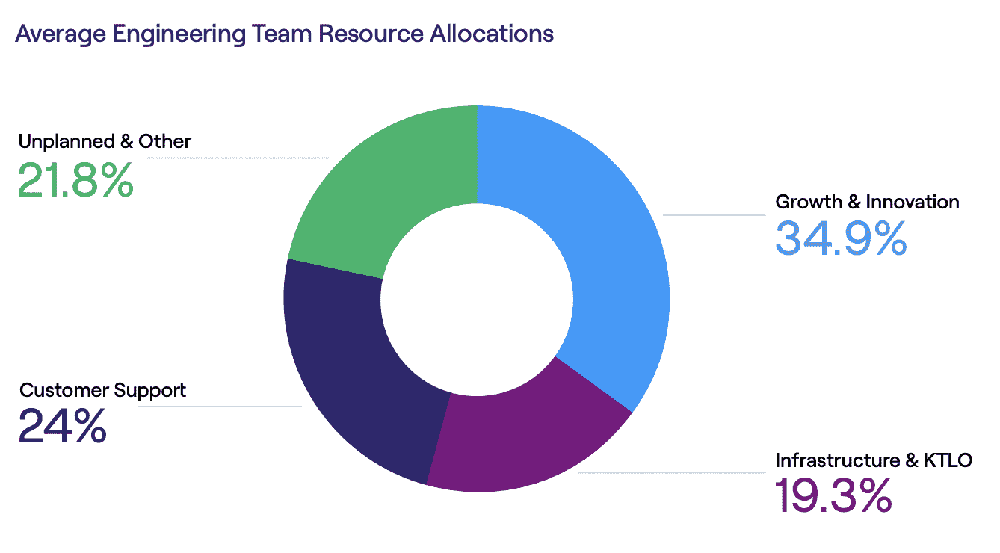
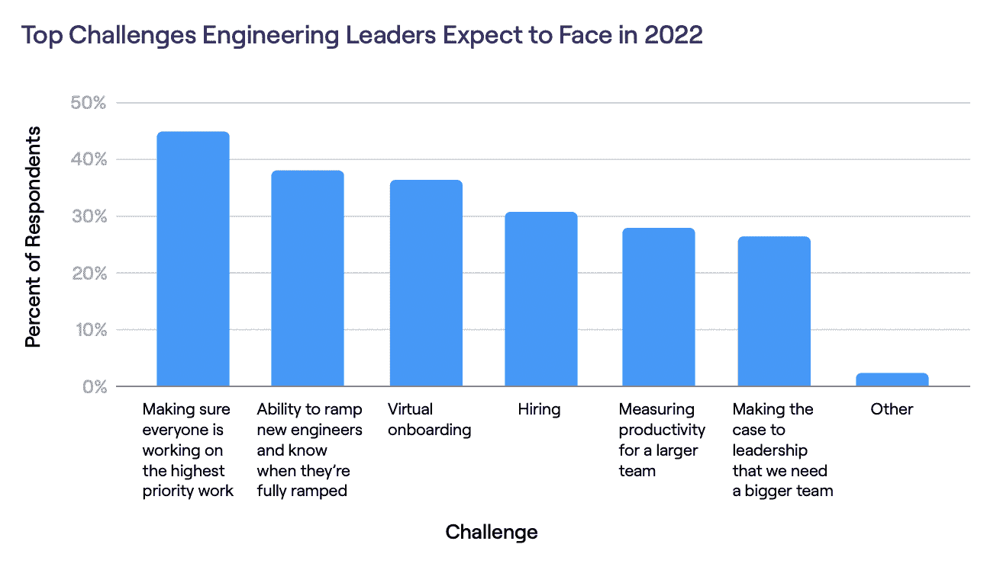

# 可见性如何帮助开发人员关注创新

> 原文：<https://devops.com/how-visibility-helps-devs-focus-on-innovation/>

随着[软件工程领导者](https://devops.com/linearb-launches-dev-interrupted-community-to-help-software-engineering-leaders-continuously-improve/)适应由远程和混合工作模式定义的未来，他们正在改变工作组织的优先顺序，以弥补面对面协作的不足。根据[水母](https://www.jellyfish.com/en-es/)最近进行的一项研究，工程领导者的首要任务是确保他们团队的每个成员尽可能多的时间专注于最优先的工作。为了实现这一目标，这些领导者正在使用实时可见性和数据驱动的决策来指导更有效的管理。

今年早些时候，水母分析了超过 23000 名工程师的工作，并调查了数百名领导者，以更好地了解工程管理的现状。该研究表明，工程领导正在将资源从反应性工作(如响应客户报告的错误)转移到直接影响顶线收入的工作类型。此外，工程团队强调增长和创新，开发使他们的团队和软件能够长期扩展的基础设施类型。

### 区分可见度的优先级

要从被动工作转变为主动工作，工程领导者必须首先了解他们的团队在做什么。如果你不知道今天时间和资源是如何分配的，你怎么能更有效地分配它们呢？在有效地对工作进行优先排序之前，领导者必须了解他们的团队在新项目上需要多少带宽。此外，他们需要数据支持的洞察力，以便将工程团队的优先事项与整个公司的优先事项保持一致。

可见性也是避免计划之外的工作的关键。根据这项研究，2021 年，团队在计划外工作上花费了 22%的时间，同比增长 15%。这种趋势表明，工程领导者可能没有意识到某些类型的工作正在分散对关键任务计划的注意力。当被问及 2022 年面临的最大挑战时，45%的领导者(目前最大的群体)选择了“确保每个人都专注于最高优先级的工作。”

为了深入了解他们的运营情况，一些工程团队正在加倍努力进行数据汇总和分析。根据该报告，虽然所有组织都倾向于在“保持正常运转”和客户支持活动上投入类似的时间，但那些投资于更强大的数据组织的组织能够在创新上多花 29%的时间，在计划外工作上少花 48%的时间。

### 通过数据和指标构建

该报告还发现，接受数据驱动决策的工程领导者看到了更高效、更健康和更专注的团队。这些组织倾向于比他们的同行更快地发布代码并促进更高的协作。相反，不优先考虑数据驱动的决策的组织更有可能经历倦怠、生产力下降和更少关注创新工作。  

这里，拥抱数据和忽略数据的区别再次归结于技术。手动汇总数据和指标是一件乏味且具有挑战性的事情。然而，新兴工具能够自动收集、测量和分析数据，以提供关于团队优先考虑什么的见解。因此，领导者可以更轻松地将工程工作与业务优先事项结合起来，确保更可预测的开发周期，增加财务责任并持续改进运营。

对于每个工程领导者来说，随着团队的扩大，将这种方法应用于数据对于保持效率至关重要。超过 79%的工程领导者预计在 2022 年扩大团队规模，受访者认为员工入职时间、虚拟入职和招聘是他们面临的最大挑战。

尽管工程团队在过去两年中经历了无数挑战，但随着远程和混合工作模式的增多，行业已经适应并变得更加协作。对于寻求提高数据驱动型决策的领导者来说，新的工具和方法将带来更多有意识的工程工作，并改善可见性和运营。