# 如何安全地管理 Jenkins 内部的秘密

> 原文：<https://devops.com/how-to-securely-manage-secrets-within-jenkins/>

持续集成和持续交付(CI/CD)管道是 DevOps 团队软件交付过程的基本组成部分。管道利用自动化和持续监控来实现软件的无缝交付。对于持续自动化，确保 CI/CD 流程中每一步的安全性非常重要。在管道的各个阶段，像访问凭证这样的敏感信息通常是必需的。保护这些信息对于保持强大的安全态势至关重要。这篇文章讨论了如何保护 Jenkins CI/CD 管道中的秘密。

### 在 CI/CD 管道中使用机密

如前所述， [CI/CD 管道](https://devops.com/?s=CI/CD+pipelines)经常需要访问敏感信息，如密码和 API 密钥。以明文形式硬编码它们存在严重的安全风险，并且违反了大多数遵从性框架中的审计准则。利用这些凭证而不暴露它们的机制对于自动化软件交付是非常重要的。

用于安全地存储、管理和访问这些凭证的工具和技术的集合称为机密管理。Secrets 在 IT、DevOps 和云环境中被广泛使用。

秘密包括:
● App 生成密码
●系统对系统密码
● API 密钥
●私有加密密钥
●一次性密码
●证书
●特权账户凭证

CI/CD 管道集成了多个配置管理平台，需要秘密来实现服务到服务的通信。这些平台还需要秘密来认证请求访问 SSH 服务器、数据库、HTTP 服务和其他资源的实体。

### CI/CD 中秘密的目的

机密用于管理 CI/CD 管道内实体的访问权限。一些用例包括源代码控制管理、基础设施连接、协作提供者和验证。让我们更详细地讨论这些用例。

**1。源代码控制管理**
版本控制系统，例如 Git，促进了多人团队之间的协作。这些系统通过管理和存储来自多个开发人员的代码贡献，帮助维护内聚的应用程序开发。由于源代码可能包含组织的一些最有价值的资产，因此正确地认证和管理对 Git 存储库的访问权限非常重要。

秘密管理系统在保护用于将贡献者的机器连接到储存库的凭证方面是重要的。秘密本身不存储在版本控制中，因为恶意用户可以访问它们并策划安全攻击。相反，它们存储在特殊的敏感文件中，这些文件被设计为从存储库的存储和日志中排除。

**2。基础设施连接**
CI/CD 管道通常由分布在不同基础设施的多台主机上的不同服务组成。这些主机不断地相互通信，并通过 API 调用与服务通信，以实现所需的应用程序功能。API 密钥和系统到系统密码等秘密支持运行这些服务的基础设施之间的安全连接，从而支持多租户和多云 CI/CD 管道。

**3。协作提供者**
CI/CD 渠道涵盖跨多个开发、运营和质量保证环境的协作活动。这些团队依靠多种工具和框架来协作和共享信息。使用秘密进行协作有助于团队确保安全通信，并在双方之间提供信任层。

**4。验证**
身份验证是 CI/CD 和应用安全的关键要素。通过将应用程序连接到身份和访问管理(IAM)解决方案，机密用于确保 CI/CD 管道的安全性和隐私性。这些解决方案提供了用户角色和权限的外部数据库，允许用户登录应用程序，而无需在 CI/CD 管道中暴露他们的凭据。

### CI/CD 中使用机密的示例

为了为改进机密管理打下基础，理解一些简单的用例是有帮助的。在本节中，我们将提供一些 CI/CD 配置的基本示例，这些配置需要访问敏感凭据或其他数据才能发挥作用。

**1。AWS 证书**
作为领先的云 SaaS 平台之一，AWS 是大多数基于云的基础设施的常见选择。与 AWS API 交互以提供和查询资源通常需要使用秘密密钥/访问密钥凭证对。保护这些凭证对于维护 AWS 帐户的安全性至关重要。

**2。基础设施即代码(IaC)**
现代应用架构通常依赖基础设施即代码(IaC)来部署工作负载运行的底层系统。对这种配置进行编码使得维护一个可重复的、可伸缩的和安全的基础设施变得更加容易。在配置这个基础设施的过程中，工程师通常需要将敏感信息部署到节点上，比如 SSH 密钥和 API 凭证。通过 IaC 和 CI/CD 自动化基础架构配置是一种常见模式，而管理机密是该工作流的重要组成部分。

**3。环境变量**
环境变量是在计算机上配置进程的常见约定，在大多数 CI/CD 管道中都有一致的用法。在处理 CI/CD 工作流时，动态设置值并保留它们以供其他流程和脚本使用的能力是一种强大的抽象。在许多情况下，敏感值需要通过环境变量来传递，这再次强调了对有效机密管理的需求。

### 保护詹金斯内部的秘密

[Jenkins](https://www.jenkins.io/) 需要访问大量凭证，以便与构成完整 CI/CD 管道的所有平台和应用程序进行交互。Jenkins 附带了一个默认的凭证插件，它提供了一个内置的秘密存储。它还附带了凭证绑定插件，可以将凭证绑定到环境变量。

将机密存储在 Jenkins 控制器中使管道中的应用程序能够多次引用机密，即使它们只被创建过一次。虽然 Jenkins credentials 插件提供了一种存储和管理机密的简单方法，但任何 Jenkins 管理员和管道作者都可以访问它们。因此，开发运维团队应确保正确配置访问权限，以确保 CI/CD 管道的安全。

本节讨论了在 Jenkins 中保护机密的一些可用选项。

### 詹金斯接受的秘密类型

Jenkins secrets 插件支持的凭证包括:秘密文本、用户名/密码对、秘密文件、SSH 用户名和证书。对于有限数量的机密，可以单独存储，而大量机密通常最好使用凭证文件进行管理。

### **在詹金斯管理秘密**

如果您准备好将秘密安全地注入到您的 Jenkins 管道中，请遵循以下最佳实践。

**1。一次性密码(OTPs)**
一次性密码通过确保一个用户名-密码组合不能使用多次来帮助防止用户帐户被接管。虽然帐户始终保留用户名，但用户每次登录时都会收到一个 OTP。这使 Jenkins 管理员和用户的帐户安全，防止秘密暴露给不想要的个人。

**2。避免硬编码机密**
删除任何硬编码到 CI/CD 配置和 Jenkinsfiles 中的机密。这使敏感的凭据信息远离管道，使恶意参与者无法访问。

**3。通过将机密存储在多个 Jenkins 文件中减少攻击面**
将机密存储在多个文件中有助于实施凭证最小暴露原则。这使得尽可能少的应用程序和用户可以使用凭据。

**4。使用授权控制来管理机密权限**
开发团队应该配置安全检查，以确保请求资源访问的应用程序具有有效应用程序的属性。这些应用程序应该能够根据 RBAC 策略中分配的权限访问各种资源。

**5。遵循最小特权原则**
只将权限授予绝对需要访问管道内秘密的应用程序。团队应该一致地审核权限，以在管道的整个生命周期中维护最小特权原则。

### 管理和存储机密

本节将介绍三个实际使用 Jenkins with secrets 和 Akeyless secrets 管理平台的基本示例。

●第一个例子将突出一个完全不安全的例子:使用明文环境变量存储敏感凭证。
●第二个例子将集中于使用原生 Jenkins 特性和插件进行秘密管理。
●第三个例子将展示使用第三方工具进行秘密管理的一些好处。

**明文示例**
首先，我们将在 Jenkins 中创建一个基本的“自由式”项目，并将其连接到 GitHub 存储库:

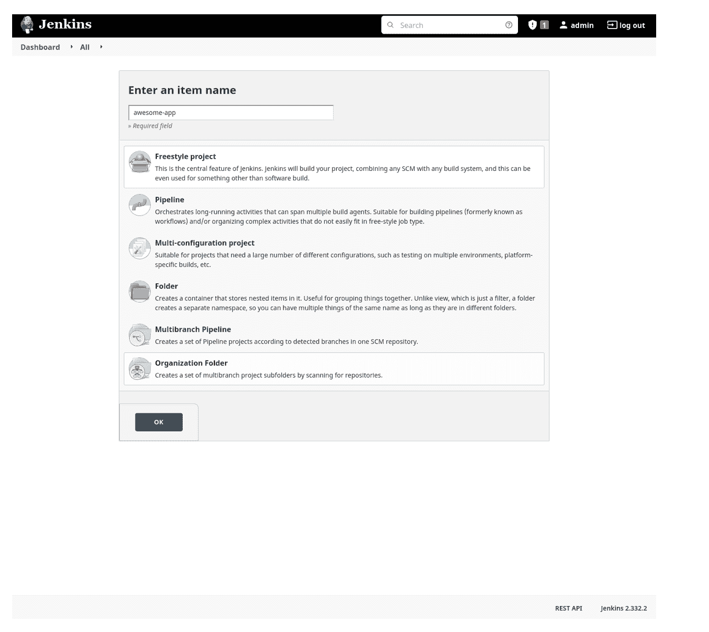

**图 1:项目创建**

无论我们选择如何管理代码中的秘密，使用 Jenkins 内置的凭证机制来访问 GitHub 存储库都是有意义的:

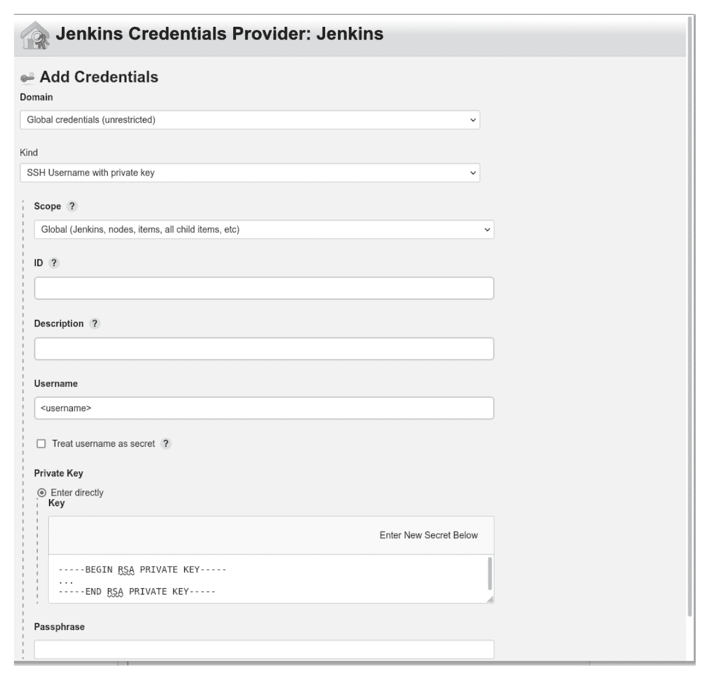

**图 2:配置 GitHub 凭证**

我们实际的代码将是一个非常基本的 Python 应用程序，它进行 API 调用。API 需要一个文本字符串形式的简单 API 密钥进行身份验证:

#!/usr/bin/env python
导入 os
导入请求
API _ KEY = OS . environ[' API _ KEY ']response = requests . get(" https://the dogapi . com/v1/breedies？api_key={}”。【格式(api_key))
打印(响应)

Jenkins 提供了配置环境变量的能力；但是，如果没有额外的插件，它们只能针对 Jenkins 环境或实例进行全局设置:

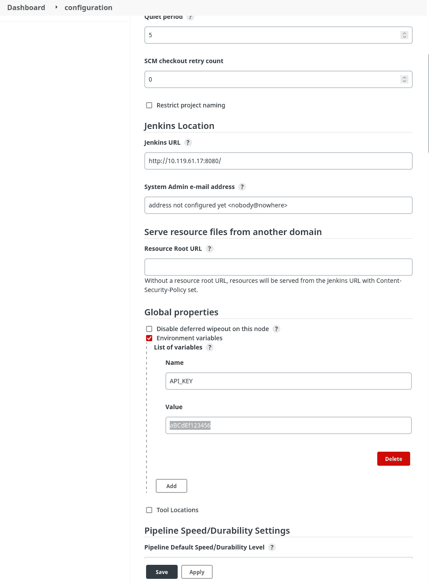

**图 3:配置全局环境变量**

代码将从刚刚配置的环境变量中读取 API 键。下面是构建步骤的配置:

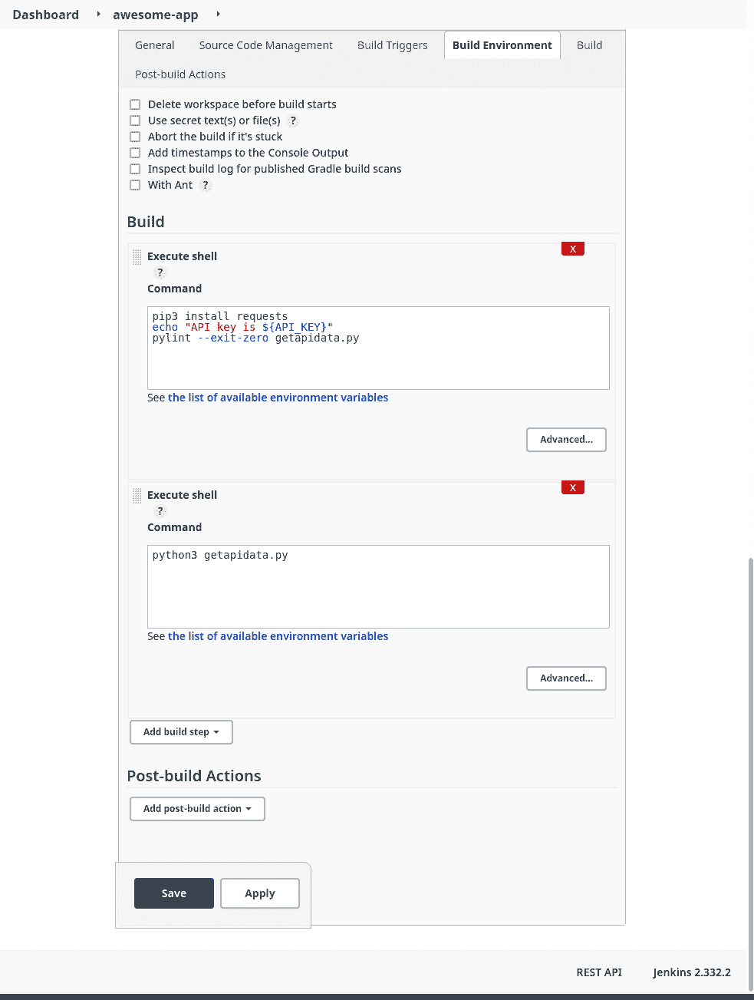

**图 4:构建配置**

构建步骤运行一些简单的林挺，然后实际执行代码。下面是一个成功构建的部分日志:

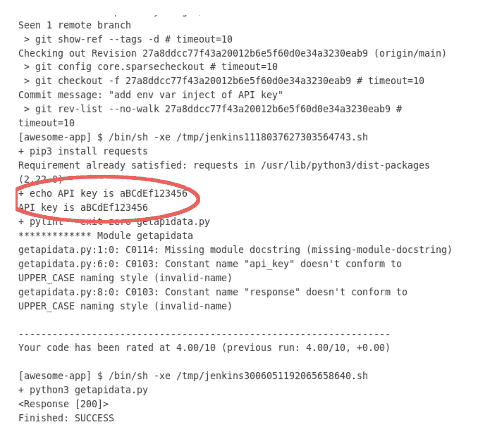

**图 5:使用暴露的秘密构建日志**

API 密钥显然已经在一个构建步骤中用一个简单的指令暴露在一个明文日志中。微小的配置错误可能会导致违规或危害。

## **詹金斯的秘密文本示例**

现在，我们可以通过使用内置的凭据处理程序来尝试提高构建环境的安全性:

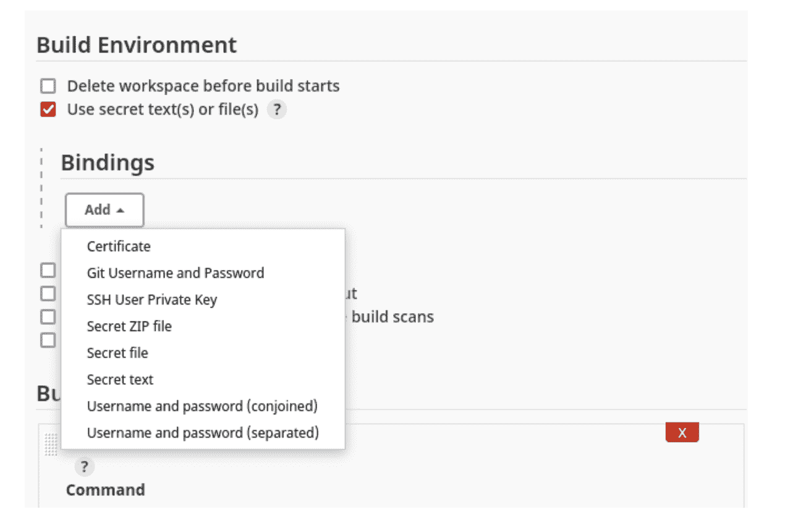

**图 6:配置构建环境以使用秘密**

在本例中，我们将使用一个简单的“秘密文本”凭证绑定来存储 API 密钥:

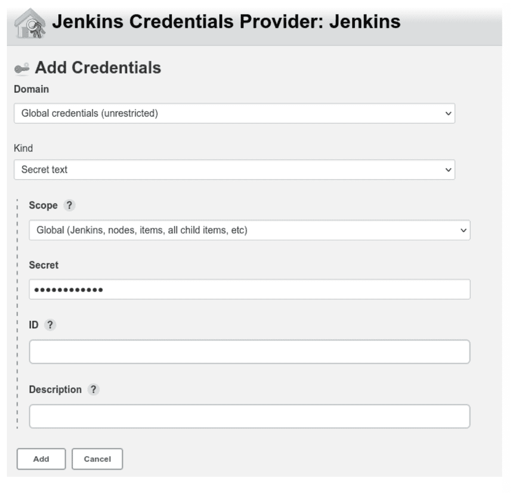

**图 7:添加秘密凭证**

接下来，我们将构建作业配置为使用新的凭据变量:

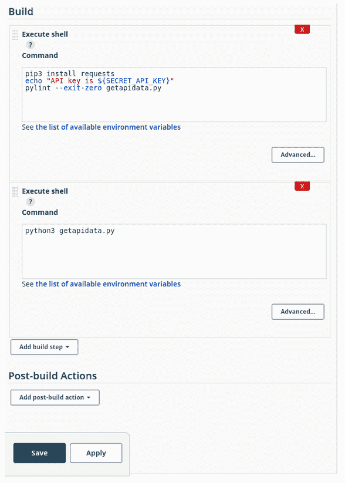

**图 8:更新的构建配置**

现在，在运行另一个构建作业后，我们再次检查构建日志:

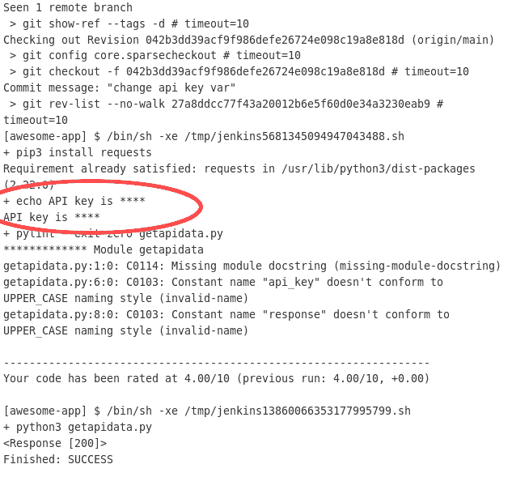

**图 9:用模糊的秘密构建作业**

即使我们将构建步骤配置为将变量内容打印到日志中，Jenkins 凭证处理程序也知道该值是敏感的，并且会混淆任何日志或输出中的实际值。

尽管这极大地提高了构建的安全性，但还是有一些警告。虽然这对于用户数量有限的小型 Jenkins 部署来说足够好，但是在大型分布式 Jenkins 体系结构中管理多个用户和团队的访问和正确的权限范围很快变得复杂且难以有效管理。此外，集群中的每个 Jenkins 实例以及任何具有适当权限的用户仍然可以访问存储在 credential 变量中的秘密值。

如果任何节点遭到破坏，跨多个部署和上下文的机密都可能面临风险。用户仍然必须手动保护和配置 Jenkins 基础架构，该基础架构现在兼作机密存储。如果有一种方法可以使用敏感凭证，而不必将它们存储在 Jenkins 中，那会怎么样？

### 机密管理工具示例

让我们试着用无钥匙来管理我们的秘密。因为我们正在与 Jenkins 部署集成，所以我们可以遵循与 Jenkins 一起工作的文档。Akeyless 集成了公开可用的 Hashicorp Vault 插件，因此设置 Jenkins 很简单。

接下来，我们将使用 Akeyless 创建一个免费帐户，并配置一个密码:

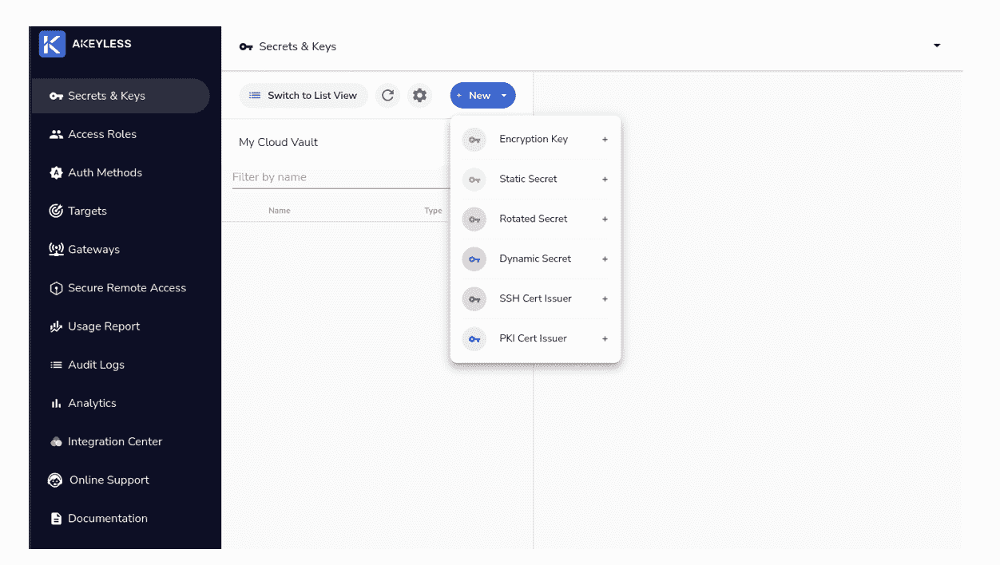

**图 10:在无密钥中创建秘密**

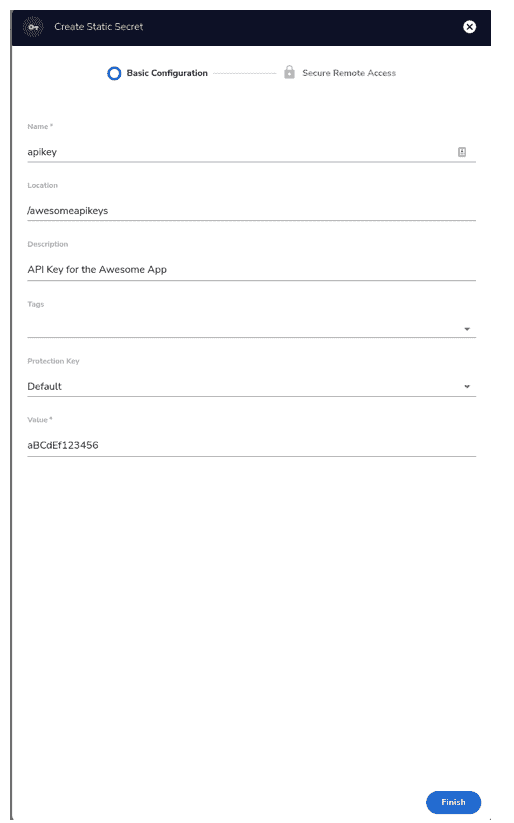

图 11:创造一个秘密(续)。

下一步是创建一个有权访问刚刚创建的机密的访问角色:

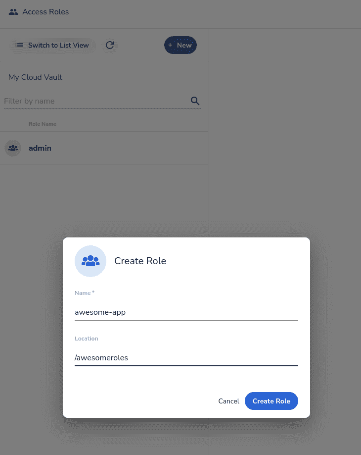

**图 12:创建一个角色**

现在，我们需要给我们的访问角色正确的权限来查看机密:

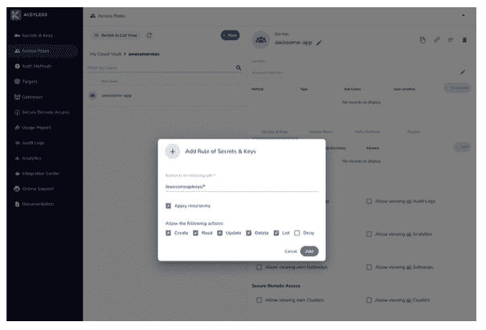

**图 13:授予角色权限**

我们需要在无密钥端创建的最后一件事是身份验证方法。这就是我们如何给予外部实体(如我们的 Jenkins 部署)对 Akeyless 进行 API 调用和检索机密的能力:

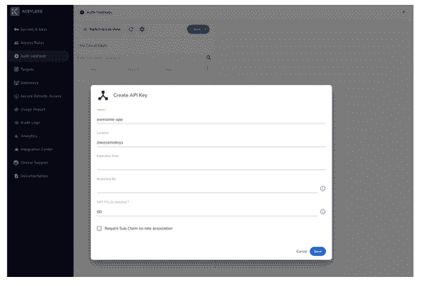

**图 14:创建一个授权方法**

一旦创建了身份验证方法，一定要通过下载 CSV 文件来保存访问 ID 和密钥；否则，这些值将不会再次显示。最后，我们需要将新创建的角色与这个访问方法相关联:

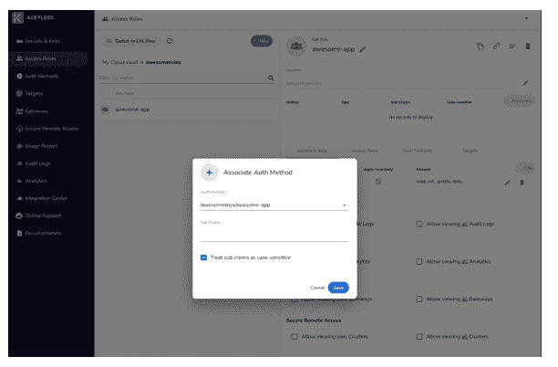

**图 15:将授权方法与访问角色**相关联

下一步是根据上一步中引用的无密钥文档配置 Jenkins 构建环境:

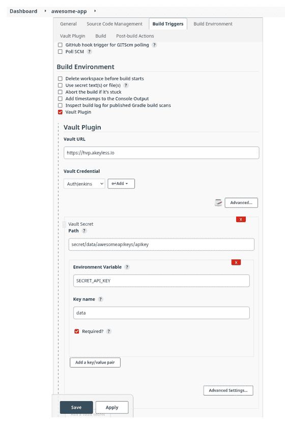

**图 16:无 Akeyless 的 Jenkins 构建配置**

现在，我们将运行另一个构建，这次配置为利用我们已配置的无密钥存储区:

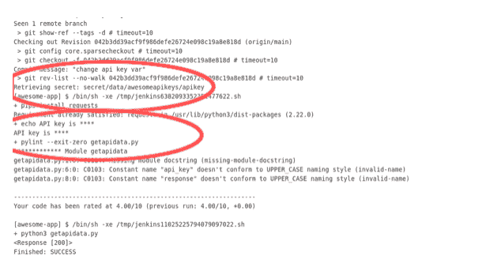

**图 17:使用无密钥配置构建日志**

在日志中，现在有一个步骤，詹金斯从 Akeyless 金库检索秘密。在构建日志中，凭据值仍然是模糊的。我们现在已经有了一个与我们的 Jenkins 实例集成的第三方机密管理平台。

这看起来像是实现相同结果的额外步骤，但是一个完全专注于秘密管理的外部工具是一个强大的抽象。Jenkins 首先是一个 CI/CD 工具，秘密管理作为一个附加组件提供。在这种情况下，它将永远无法提供专用机密管理平台可以提供的一流功能、管理能力和安全保证:

●具有 SLA 保证的托管基础设施
●零知识加密
●直观、可访问的机密管理和组织
●与行业标准 DevOps 工具和平台集成

像 Akeyless 这样的工具也不再需要管理复杂的自托管基础设施。只需点击几下鼠标，我们就能拥有一个工作秘密端点。

### 结论

由于安全性是 CI/CD 管道的首要考虑因素，因此在 Jenkins 中使用机密时遵循最佳实践非常重要。Jenkins 管道依靠秘密进行身份验证、协作和基础设施管理。CI/CD 机密管理对大多数团队来说都是一个挑战，因为在粒度级别实施访问控制非常复杂。
借助秘密管理工具，Jenkins 用户获得了一个集中且安全的资源来管理操作 CI/CD 管道所需的许多凭证。他们受益于使用简化、标准化的方法来访问他们需要的所有机密，而不用担心安全性。简而言之，机密管理器加快了开发运维工作流程。

同时，安全团队通过全面了解机密的位置和使用方式而受益。借助自动化流程和集中化访问策略，机密管理平台还能帮助安全团队遵守安全法规。