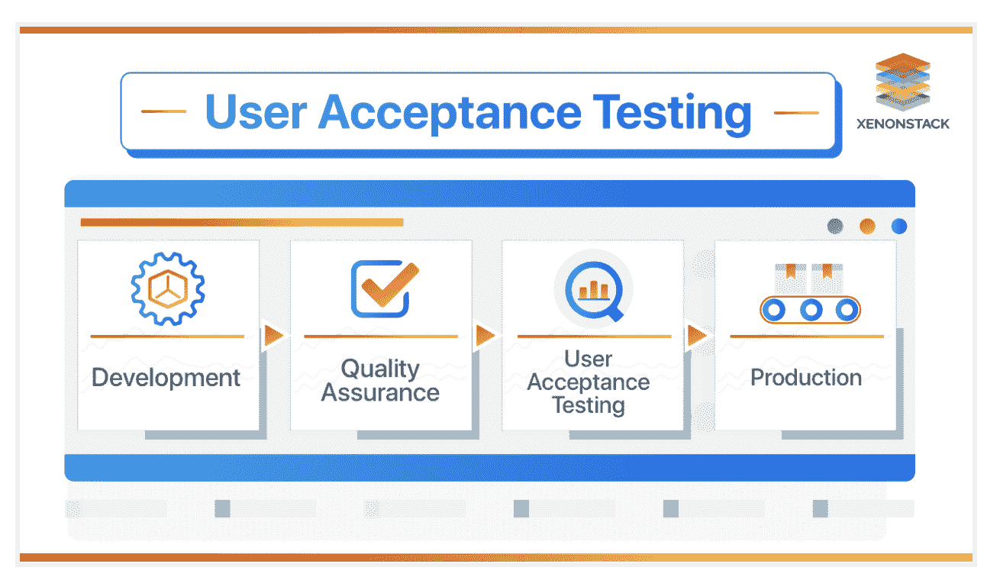
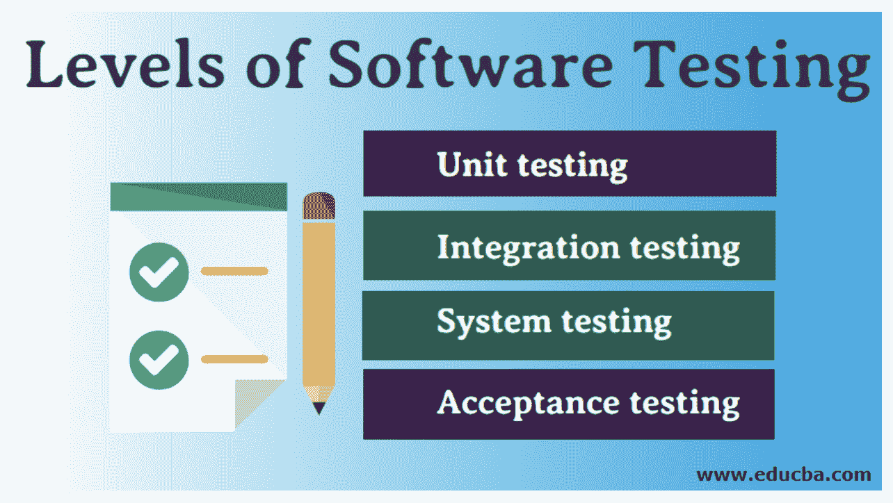

# 什么是用户接受度测试，为什么它如此重要？

> 原文：<https://devops.com/what-is-user-acceptance-testing-and-why-is-it-so-important/>

任何参与软件开发的人都知道确保积极的最终用户体验有多重要。一种方法是通过使用[用户验收测试](https://devops.com/?s=user+acceptance+testing) (UAT)。

UAT 是您可以作为整体质量保证流程的一部分来执行的测试类型之一。

[来源](https://www.xenonstack.com/insights/what-is-user-acceptance-testing)

这有助于你确定你的产品是否已经上市，以及在被真正的最终用户使用时是否能有效发挥作用。

UAT 帮助您避免实施充满讨厌的错误的软件、迭代、升级或定制，这些错误会破坏用户体验并使您的软件不可用(更不用说对您的企业声誉造成的损害)。

当风险如此之高时，很容易理解为什么企业需要这样的流程。 在这篇文章中，我们来看看用户接受度测试，为什么它如此重要，以及品牌可以利用它来获益的六种方式。

## 什么是用户接受度测试(UAT)？

用户验收测试(有时称为最终用户测试，用户测试或 beta 测试)是任何软件整个测试过程的最后一步。

在产品管理术语中，验收测试被称为 *beta* 测试，一小组早期采用者测试平台并提供用户反馈，让您知道解决方案是否满足用户期望和业务需求。

在系统、功能和所有其他测试完成之后，在产品上市之前完成。

下图显示了用户验收测试之前的一些质量保证(T2)测试。

[来源](https://www.educba.com/levels-of-software-testing/)

从图中可以看出，随着开发工作的推进，UAT 从 [单元测试](https://securityboulevard.com/2022/05/what-is-unit-testing-6-best-practices-to-do-it-right/) 到集成测试，然后是系统测试，最后是验收测试。

这个最后的阶段可以说是软件开发中最关键的部分，因为它确保了积极的最终用户体验。

顾名思义，它帮助你确定你的平台是否会被最终用户接受。

测试人员(最终用户)从测试平台的预期结果清单开始工作，然后记录当他们试图执行不同的任务时发生了什么，例如:

*   登录用户账户
*   将商品放入购物车
*   结账
*   购买多件商品可享受免费送货服务

……等等。

如果在执行每项任务时都达到了预期的结果，则软件被批准发布。如果没有，它将被送回给开发人员。

这个测试过程需要不同利益相关者之间的合作，包括项目发起人、企业所有者、分析师、QA 团队和开发人员。

## 为什么 UAT 对软件开发如此重要？

虽然项目可以从 UAT 中获益的方式有很多(下面我们将会看到其中的一些)，但是这个过程经常被开发人员忽略。

许多人认为这是一个耗时且不必要的过程，这很不幸，因为验收测试实际上有助于提高软件质量以及任何新实现软件的整体接受率。

想一想:你绝不会驾驶一辆未经测试的汽车，是吗？同样，企业也不应该冒险去实现未经测试的软件。

考虑到通过确保你的软件按照预定的测试计划运行而节省的时间和金钱，很明显这是开发者需要更加认真对待的事情。

事实上，远不是许多开发者认为的那样耗费时间，UAT 实际上可以 *获得* 很多时间。 如何？ 通过防止不必要的浪费。

在项目结束时，用户验收测试远远不是一次性的，因为诸如附加阶段、热修复、发布/进一步修改或定制和升级等因素，用户验收测试超出了业务应用程序项目的范围。

看一看:

*   **附加阶段:** 如果您选择在此阶段推出或分阶段升级现有应用程序，每个阶段可以有不同类型的用户、不同的公司(针对母公司、收购、合并等。)、附加位置等。，并且您需要为每个单独的阶段计划和进行单独的额外验收测试。
*   **热补丁:** 日常运营中的 Bug 报告或开发者测试可能会导致热补丁。然而，最终用户必须测试这些错误修复，以确保它们确实解决了最初报告的问题。
*   **进一步修改:** 软件创作者定期发布更新，包括有限分发版(LTR)和一般分发版(GDR)。LTR 版本通常修复特定问题领域的问题，而 GDR 版本通常在发布前经过大量测试。两者都需要测试，以确保它们符合用户的实际情况，这样您就可以实现您的业务目标。
*   **升级:** 每个人都想为自己的客户提供最好、最先进的体验。这就是为什么在大多数情况下，品牌会定期更新软件，以跟随行业趋势，跟上最新的创新技术。无论您采用何种升级方法，无论是少量定制还是大量定制，根据业务需求完成您的计划都是至关重要的。这将有助于确保项目的最终结果符合最初的业务需求。
*   **隐私政策更新** :许多最终用户可能喜欢软件的整体功能，但他们可能希望增加与其他平台的集成，或者能够使用不同于当前接受的支付方式。虽然这些升级和修改可能很容易完成，但您可能需要更改您在 [隐私政策生成器](https://onehourprofessor.com/best-privacy-policy-generators/) 中输入的信息，以确保您的用户合法同意第三方对其数据的任何新用途或访问。

现在你已经理解了什么是 UAT，为什么它如此重要，让我们来看看用户接受度测试的一些好处，让你更好地了解在你自己的业务中利用它的各种不同方式。

## 用户接受度测试的好处

从核心来看，用户接受度测试对于任何类型的在线平台的成功推出和/或维护都至关重要，无论是简单的移动应用还是更复杂的应用，如电子商务网站。

如果测试对象不能按预期工作，有问题的业务功能会被记录下来，并被送回给开发人员进行修复。

进行最终检查可以确保您的平台构建良好，性能符合预期，并且用户接受最终产品。

下面列出了 UAT 的主要优势:

*   **好处:**UAT 过程允许你证明软件所需的功能是以一种适合真实世界使用和环境的方式运行的。因此，验收测试关注软件性能 *和* 用户行为，以确保 [测试软件的功能](https://securityboulevard.com/2022/01/the-role-of-functional-testing-in-application-security/) 和最终用户的思维过程之间的交互是一致的。
*   **好处:** 此外，你将得到一个更好的软件，因为它将由每天使用它的同一批人来测试和验证。您将获得快速识别和修复任何损坏功能的最佳机会。因此，很容易看出你在这些测试周期中投入的时间将如何导致软件质量的显著提高。
*   **好处:** 不仅如此，UAT 提供的质量审查也是利益相关者确保项目获得健康投资回报(ROI)的好方法。此外，它保持了较低的维护成本，并且在早期修复可用性/功能性问题更加便宜和快速。
*   **好处:** 您还可以确保您的软件与第三方平台相集成，包括 [各种网站构建商](https://onehourprofessor.com/best-website-builders/) 、电子邮件营销软件、项目管理工具、通信应用程序以及您或您的最终用户有效使用软件可能需要的一切。例如，如果您的软件应该允许社交媒体共享，那么您希望确保最终用户能够轻松共享，而无需经历多个步骤，这些步骤会降低对该软件的积极体验。

如您所见，用户接受度测试对于新业务应用和软件增强的成功部署至关重要，对于确保组织的效率和成功也是如此。

这个过程帮助你降低风险，提高项目的投资回报率。但最重要的是，UAT 确保您的客户不会默认成为验收测试员，这将对您的业务产生负面影响。

## 使用 UAT 的 6 种方法

这里有六种方法可以让你利用这个过程获得更好的结果。

1.  使用用户验收测试进行内部开发。
2.  使用测试流程来审查新功能。
3.  邀请用户参与测试，帮助他们对品牌更加投入，成为品牌大使。
4.  使用 beta 测试作为一项高级功能，将用户转化为更高级别的套餐，增加公司的销售额。
5.  作为数字营销活动的一部分，在社交媒体平台、电子邮件和其他渠道上分享关于 UAT 及其成果的信息。

除了测试流程的最初目标之外，这些只是您的组织从 UAT 中获益的几种不同方式。

还有记住， *都是关于用户* 。

UAT 不仅仅是另一种测试技术。该测试将用户置于讨论的中心，让用户回答如下问题:

*   用户能够无误地使用软件吗？
*   解决方案符合承诺的规格吗？它是否以预期的方式运行？
*   当用户采取意想不到的行动时，软件是否继续工作？

……等等。

无论平台是内部构建还是由第三方公司构建，所有解决方案都必须经过用户验收测试，因为您的用户是为您的解决方案买单的最终受众。因此，值得花时间来确保您的软件解决方案满足用户期望和业务需求。

## 规划和管理 UAT 进程

成功的 UAT 测试过程的关键是理解你的目标用户的需求和他们的预期行为。 通过这种方式，您将能够开发定义好的验收标准，这样您就可以提出高效的测试来快速完成测试过程。

此外，由于目标是评估产品的市场准备情况，因此记录所有证据并与开发团队一起跟踪进度以及向利益相关方报告非常重要，这样每个人都在同一页面上。

也就是说，这里有五个步骤可以帮助你计划和管理用户测试过程:

第一步:计划。 用户验收测试策略主要包括在计划步骤中概述的时间框架。

第二步:设计测试用例。 测试用例覆盖了平台在现实使用中的核心功能框架。设计测试用例时，需要做以下工作:

*   确定目标用户和利益相关者的需求
*   根据用户旅程和产品规格设计测试用例
*   总结测试操作手册、验收标准等。
*   准备测试数据，如注册、使用三天、使用一周等。

第三步:组建你的 UAT 团队。 验收测试团队由真实世界的最终用户或不属于开发或测试阶段的用户组成，以确保客观性。你不应该让开发人员去测试他们自己的软件，因为他们可能会给测试过程带来偏见(尽管是无意的)。

第四步:执行并记录测试用例。UAT 团队执行测试用例，以及相关的随机探索性测试，之后所有的 bug 都被记录到 bug 追踪器中，并给出重现的步骤。

第五步:修复漏洞。 一旦你执行了测试用例，你需要跟踪标签和用户反馈。开发团队可以考虑测试人员发现的所有 bug，并根据严重性开始修复 bug。

第六步:确认解决方案，并让利益相关者签字同意。 一旦运行了所有的 UAT 测试并且有了结果，就可以做出接受的决定。如果所有用户都满意，那么就可以开始了。如果没有，那就不行。

## 最后但并不是最不重要的

UAT 是软件开发生命周期的最后一个阶段。但是，这也是确保软件成功的最重要的事情之一。请记住，为了使这个过程有效，应该将它视为验证，而不是验证。使用您的测试过程在更小的范围(作为测试功能的一种方式)和更大的环境(模拟真实世界的过程)中验证功能，这样您就可以获得产品的最终用户视图，这将最终帮助您提高软件的健壮性和可用性。

你准备好使用 UAT 来获得对你的软件的反馈，从而提高最终用户的满意度了吗？下面分享你的想法！