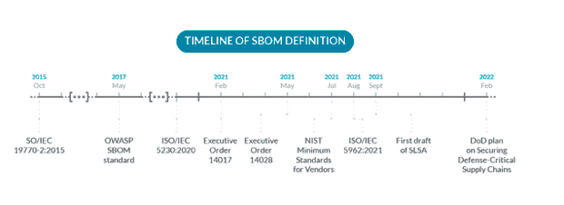
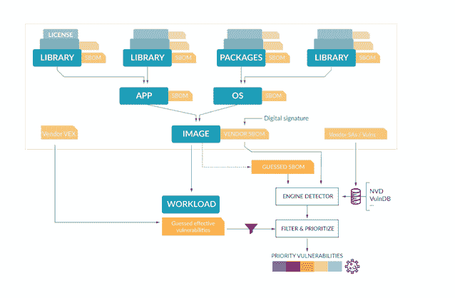

# SBOMs 101:你需要知道的

> 原文：<https://devops.com/sboms-101-what-you-need-to-know/>

最近的安全事件让业界对缺乏代码依赖、攻击软件供应链、软件材料清单(SBOM)、T2、数字签名、出处、证明等知识议论纷纷。事实是，每次出现新的漏洞时，不仅需要花费大量的时间和精力来检测漏洞发生的时间、地点和方式，还需要衡量对我们环境中运行的应用程序和服务的实际影响。

如果我们有一种方法来列举我们使用和生产的所有软件组件，并且可以很容易地分发和消费，那会怎么样？这是 SBOMs 正在努力解决的问题。

## 什么是软件材料清单(SBOM)？

一个 SBOM 只是一个工件，包含一个完整的软件包依赖关系、文件、许可和其他资产的列表，它们共同组成了一个软件。想想成分表，但是对于软件来说。

NTIA 将 SBOM 定义为一个正式的记录，它包含了在构建软件中使用的各种组件的细节和供应链关系。这些组件，包括库和模块，可以是开源的或专有的，免费的或付费的，数据可以是广泛可用的或访问受限的。

这个概念并不新鲜，物料清单(BOMs)是工业流程中常见的现有部分。它们非常类似于成分列表，尽管 BOM 通常也包括层次结构的概念。每个组件都被分解为一系列子组件，每个子组件都包含自己的 BOM。

在 SBOMs 中，片段通常是抽象库、模块、二进制文件、编译器、文件等。，它们通常包括许可信息(Apache 2.0、GNU、BSD 等。)和附加元数据。

## SBOM 历史

sbom 可能看起来很新，但是开源社区意识到了对这种东西的需求，并在 10 多年前创建了 sbom。[软件包数据交换](https://spdx.dev/) (SPDX)标准创建于 2010 年，用于交流包括组件、许可证、版权和安全参考在内的 SBOM 信息。

近年来，由于与供应链相关的攻击的增加，该问题变得突出起来。这是一个简短的时间表。

*   2015 年 10 月–SWID 标签标准，来自 NIST，发布为[ISO/IEC 19770-2:2015](https://www.iso.org/standard/65666.html)。
*   2017 年 5 月–OWASP SBOM 标准 [CycloneDX](https://cyclonedx.org/) 的初稿。
*   2020 年 12 月——ISO 开源许可合规性国际标准([ISO/IEC 5230:2020](https://www.iso.org/standard/81039.html)—信息技术——open chain 规范)发布，要求提供一个管理所供软件材料清单的流程。
*   2020–2021—[NTIAs 发布最新作品](https://www.ntia.gov/SBOM) ，作为围绕软件材料清单(SBOM)的持续软件组件透明工作的一部分。
*   【2021 年 2 月—[美国供应链第 14017 号行政命令](https://www.whitehouse.gov/briefing-room/presidential-actions/2021/02/24/executive-order-on-americas-supply-chains/) 。
*   【2021 年 5 月—[关于改善国家网络安全的第 14028 号行政命令](https://www.whitehouse.gov/briefing-room/presidential-actions/2021/05/12/executive-order-on-improving-the-nations-cybersecurity/) 。
*   【2021 年 7 月——NIST 发布第 14028 号行政命令 下的 [软件供应商或开发商验证(测试)的推荐最低标准。](https://www.nist.gov/itl/executive-order-14028-improving-nations-cybersecurity/recommended-minimum-standards-vendor-or)
*   2021 年 8 月–SPDX 发布为 [ISO/IEC 5962:2021](https://www.iso.org/standard/81870.html) 标准。
*   2021 年 9 月——[【SLSA】](https://slsa.dev/)(软件工件的供应链层次)框架的初稿。
*   2022 年 2 月——国防部关于 [保护国防关键供应链](https://media.defense.gov/2022/Feb/24/2002944158/-1/-1/1/DOD-EO-14017-REPORT-SECURING-DEFENSE-CRITICAL-SUPPLY-CHAINS.PDFhttps://media.defense.gov/2022/Feb/24/2002944158/-1/-1/1/DOD-EO-14017-REPORT-SECURING-DEFENSE-CRITICAL-SUPPLY-CHAINS.PDF) 的计划，其中包括软件供应链。

而这仅仅是开始。2022 年将成为行业如何应对 SBOM 和[软件供应链安全挑战的转折点。](https://sysdig.com/blog/software-supply-chain-security/)

## SBOM 在哪里适用？

SBOM 适用于软件产品构造中使用的任何软件组件，无论是外部还是内部的，开源或专有文件、包、模块或共享库。这也包括固件和嵌入式软件。硬件可能参与软件(网络设备、加密设备、芯片等)的分发或执行。)但不被视为 SBOM 的一部分，尽管 CycloneDX 等标准支持将设备作为一种组件类型。

在一个理想的世界里，每个软件公司都会在每个可交付产品上附加一个 SBOM，每个人都可以完全看到软件中使用的组件。这将有助于准确了解哪些漏洞正在影响该软件。但是我们不在那个理想的世界里。

## 带 SBOMs 的典型资产

● **开发依赖。**每次开发人员包含第三方依赖项(开源或内部组件)时，通常都会添加可传递的依赖项——依赖项本身正在使用的模块或包。因此，一个详细的 SBOM 也将使那些可传递的依赖变得可见。
● **软件应用或软件包。**当一个应用程序被分发时，SBOM 将帮助用户快速识别应用程序版本、软件包中包含的辅助工具以及构建过程中涉及的所有部分。这使得识别漏洞或解决可能由错误的软件依赖引起的问题变得更加容易。
● **集装箱图片。容器映像基本上是一个文件系统，由一个基本的映像发行版加上一组在构建过程中添加的附加包和组件组成。
● **主持人。**主机包括例如虚拟机设备映像、AWS AMI 等。SBOM 将包括基本操作系统类型、供应商、版本和主机中安装的每个包的综合列表，这些包来自基本操作系统(例如，Linux 发行版)或从外部来源手动部署。
● **硬件设备。**示例包括防火墙、物联网设备或运行软件的手机。**

SBOMs 应该捕获任何和所有多级依赖关系。因此，举例来说，如果 libfoobar-1.5.3-r3-u8 包是 SBOM 的一部分，那么它也应该包含每个包的名称、版本、许可等等。用于组装 libfoobar-1.5.3-r3-u8，以及其中每一个的组件，从而产生一个多级树，其中每个节点都被分解成它的依赖项。

同样重要的是要指出，每当这些资产中的一个发生变化——产品的每个发布或者甚至每个构建——就应该创建一个新的 SBOM 来匹配那个版本的变化。

## 为什么你需要一个 SBOM

你需要 SBOM 的原因和你需要食物配料清单的原因一样。你可以检查是否存在过敏原，是否存在动物源性物质(对于纯素食者)，化学防腐剂等。当然，你可以不检查配料表就吃食物，但是你承担了一些风险。这同样适用于软件:在沙盒环境中使用依赖项进行快速测试可能没问题，但是在将关键服务部署到生产环境中，或者在具有严格法规遵从性的环境中交付软件时，您肯定想要知道其中的内容。

没有 SBOM，你就没有那种能见度。对于用来组装它的包和库来说，一个软件变成了一个不可理解的黑盒。

第三方依赖项的 SBOM 的可用性使得为您的软件构建 SBOM 更加容易，只需将您自己的“成分”添加到现有的依赖项列表中。当然，您的软件也可以是更复杂产品的输入或依赖项，消费者可能会要求 SBOM 的存在作为他们供应商要求的一部分。

了解不同软件需要哪些许可证也非常重要。否则，在多种许可类型下使用第三方库分发软件可能会违反使用条款或迫使您公开源代码，这可能会带来不便，甚至会给您的公司带来麻烦。

最后，SBOM 是漏洞扫描过程的一个关键要素。假设您有一个准确的 SBOM，以及来自不同供应商和来源的可靠和更新的漏洞源，那么找到软件中存在的漏洞是非常简单的。没有 SBOM，漏洞扫描软件需要计算和猜测；制作自己的不精确版本的 SBOM，这对于某些组件来说可能相当棘手甚至是不可能的。

一个好的 SBOM 应该允许组织回答这样的问题，“我容易受到 CVE-2022-22965 (Spring4Shell)漏洞的攻击吗？”[利用此漏洞](https://sysdig.com/blog/software-supply-chain-security/)需要在运行可被利用的 Java 包的主机或容器中同时发生一系列条件:

●使用 SpringCore 版本 5.3.0 到 5.3.17、5.2.0 到 5.2.19 或更旧版本，不支持的版本
●使用 JDK 9 或更高版本
●运行 Apache Tomcat 作为 Servlet 容器
●将库打包为 WAR
●使用 spring-webmvc 或 spring-webflux 依赖关系

这些情况中的大多数都可以在综合 SBOM 的内容中进行检查，通过首先集中修复可利用的应用程序，可以更容易地评估您环境中的风险。

## 创建 SBOM

目前，生成 SBOMs 很复杂，因为有多种竞争标准、发行版等。这使得采用速度慢于预期。

有许多工具可以帮助你为一个软件创建 SBOM。在你甚至考虑生产一个 SBOM 之前，构建过程是完全自动化的(SLSA 框架中的第一级)并且 SBOM 创建被集成为构建管道的一部分是非常关键的。

接下来，这些是开源工具和相应的 SPDX 或 CycloneDX(截断)SBOM(两个最常见的标准)的一些示例执行和输出。

### 瞄准目标

Syft 可以从文件系统或容器映像生成 SPDX 或 CycloneDX 格式的 SBOM，默认情况下使用 docker sbom 命令将它嵌入 Docker 中。

$ syft neo4j:latest
剖析影像
编目套装软体【376 套装软体】名称型态
程式码点 11.0.15 java 封存档
FastInfoset 1.2.16 java 封存档

util-Linux 2 . 36 . 1-8+deb 11u 1 deb】

当使用-o flat 将输出设置为 spdx-json 格式时，它将生成如下文档:

$ syft -o spdx-json neo4j:最新
✔解析图像
✔编目包【376 包】{
" spdxid ":" SPD xref-document "，
"name": "neo4j-latest "，
"spdxVersion": "SPDX-2.2 "，
" creation info ":{
" created ":" 2022-06-23t 10:09:23
" external refs ":[
{
" reference category ":" SECURITY "，
" reference locator ":" CPE:2.3:a:Oracle-corporation:CodePointIM:11 . 0 . 15:*:*:*:*:*:*:*:"，
" reference type ":" CPE 23 type "
}，
……
{
" reference category ":" PACKAGE _ MANAGER " "
" files ":[
{
" SPD xid ":" SPD xref-9e 950849 D3 FBC 974 "，
" comment ":" layerID:sha 256:ad 6562704 f 3759 FB 50 f 0d 3 de 5 f 80 a 38 f 65 a 85 e 709 b 77 FD 2449125390 f 30 b 6 be "，
" license 结论":" noassession

这不仅包括包，还包括映像中的文件、元素之间的关系、许可信息等等。

### cyclonedx/bom

Node.js 包 [cyclonedx/bom](https://npm.io/package/@cyclonedx/bom) 允许您从 cyclonedx 格式的节点项目生成 SBOM。从 github.com/fastify/fastify 生成 SBOM 时的输出示例如下:

$ cyclonedx-BOM
$ cat BOM . XML
<？xml 版本="1.0 "编码="utf-8 "?>
<BOM xmlns = " http://cyclone dx . org/schema/BOM/1.3 " serial number = " urn:uuid:be 53 de 33-6897-49ca-855d-926383866 c21 " version = " 1">
<元数据>
<时间戳>2022-06-23t 10:03:17.00 >
<作者>Matteo Collina</作者>
<姓名>法斯蒂奇</姓名>
<版本>4 . 1 . 0</版本><描述>
<！ [CDATA[快速且低开销的 web 框架，for node . js]]>
</描述>
…
</组件>
</元数据>
<组件>
<组件 type = " library " BOM-ref = " pkg:NPM/% 40 fastify/[【受电子邮件保护】>[CDATA[为 fastify 框架构建和管理 AJV 实例]]>
</描述>
<许可证>
<许可证>
<id>MIT</id>
</许可证>
</许可证>
<purl< <](/cdn-cgi/l/email-protection)/purl>
<external references>
<reference type = " website ">
<URL>https://github.com/fastify/ajv-compiler#readme</URL>
</reference>
<reference type = " issue-tracker ">
<URL>https://github.com/fastify/ajv-compiler/issues< [【邮件保护】](/cdn-cgi/l/email-protection)/>
<依赖关系 ref="pkg:npm/ [【邮件保护】](/cdn-cgi/l/email-protection)”/>
<依赖关系 ref="pkg:npm/ [【邮件保护】](/cdn-cgi/l/email-protection)/>
<依赖关系 ref="pkg:npm/ [【邮件保护】【邮件保护】 >
<dependency ref = " pkg:NPM/](/cdn-cgi/l/email-protection)[【邮件保护】](/cdn-cgi/l/email-protection)/>
<dependency ref = " pkg:NPM//>
<dependency ref = " pkg:NPM/[【邮件保护】](/cdn-cgi/l/email-protection)/>
</dependency

### snickles 2 spdx

Snyk 的 snyk2spdx 工具利用 [Snyk 的开源 API](https://snyk.io/product/open-source-security-management/) 从你的代码库中创建一个 SBOM。不幸的是，在撰写本文时，这个存储库已经过时并且没有维护。

### 其他工具

还有[个在线工具](https://sbom.democert.org/sbom/)允许导入不同格式或手动添加组件到 SBOM 定义，然后下载。NTIA 还出版了“[如何为 SBOM 一代](https://ntia.gov/files/ntia/publications/howto_guide_for_sbom_generation_v1.pdf)提供指导”，这是一个关于如何生成一个 SBOM 的简单说明和指导的集合。有趣的是，该指南包含了“完整性断言”的概念，以应对某些组件的依赖关系缺失的情况。

## 供应商提供的还是猜测的 BOM？

理想情况下，产品供应商应该告诉我们每一个组件，并以数字签名文档的形式提供，以防止篡改或修改。但我们离这个圣杯还很远，没有多少供应商生产和提供这些信息。这是一个复杂的过程，涉及到多种工具和部件，SBOM 分布有多种标准。在一个理想的世界里，每个供应商都会以一种通用的标准提供一份 100%准确、全面、有数字签名的物料清单。但在现实世界中，我们通常需要扫描工具来生成“猜测”的物料清单。这更难，因为许多组件是不透明的，并且很难发现构建期间使用的依赖项或库。

尽管如此，扫描是必要的，因为供应商的 SBOM 可能是错误的。供应商的构建过程可能会受到影响，因此一些组件可能会被故意从他们的 SBOM 中忽略，这就给我们带来了以下问题:SBOM 可能是错误的或不准确的吗？

是的。自动 SBOM 的质量取决于构建 SBOM 过程的质量和自动化程度。

很容易产生根级(比如你直接构建的软件的版本和细节)和第一级依赖(包和第三方库)。对于可传递的依赖关系来说，这样做变得更加困难，并且当您在树中导航得更深时会更加困难。许多组件可能不提供自己的 SBOM，检测依赖关系可能很复杂或者根本不可能，就像在具有剥离信息的静态链接二进制文件中一样。

即使在构建阶段有了完善的工具链和完善的 SBOM 信息，攻击者也可以篡改 SBOM 的内容(即修改静态的伴随文件或工件)来隐藏它包含易受攻击或恶意组件的事实。然后，消费者将取回 SBOM 的修改版本，并错过这些危险的组件。一种常见的推荐做法是给 SBOM 艺术品添加数字签名，以确保消费者能够验证其真实性和完整性。

更糟糕的是，攻击者可能会破坏构建管道本身，并修改创建 SBOM 的过程，这将导致经过数字签名但被更改的组件列表。

从扫描工具的角度来看，软件组件通常是一个黑盒，或者可以从分析中获得的信息量可能非常有限，因为其中的大部分(如 pom.xml 或 go.mod 文件)在构建期间是可用的，但在最终的交付产品中却被删除了。

一个恰当的比喻是在实验室分析食物，而不是从生产商那里得到成分表。分析或扫描将产生定量数据(框中观察到的内容)与提供的 SBOM，后者可能包含定性数据，可能会丢失或在分析中不可见。

为了最大限度地降低劣质 sbom 或攻击的风险，建议组织使用扫描解决方案，即使存在供应商提供的 sbom。

## SBOMs 和漏洞

漏洞是一种弱点或缺陷，攻击者可以利用它来绕过安全边界、访问系统等等。它们是攻击或损害软件供应链的典型方式。

寻找一个软件(或运行的主机、容器映像等)中的漏洞。)，您需要将“已知”漏洞与软件中的组件集相匹配。这称为漏洞扫描。这也是 SBOM 发挥作用的地方，因为它包含了组成软件的软件包和版本的完整列表。

然后，另一个大问题出现了:已知的漏洞来自哪里？(注意，漏洞需要提前知道，你无法检测到一个未知的漏洞。)研究人员和黑客发现了它们，它们最终出现在人类或计算机可以使用的漏洞数据库中。漏洞有两个主要来源:供应商和独立提供商。

供应商可以为他们产品中的漏洞提供 feeds，比如主要的 Linux 发行版或者像 Go、npm 等软件包库。供应商对漏洞如何影响产品有很好的了解。然而，他们也可能在严重性方面有偏见。

像 [NIST](https://nvd.nist.gov/) 、[米特](https://cve.mitre.org/)、[开源漏洞数据库](https://osv.dev/)这样的独立提供商和像 Snyk 和 VulnDB 这样的商业产品收集、分析和提供漏洞信息。缺点是评分是客观的，没有漏洞如何应用于不同产品的具体背景。在某些情况下，漏洞甚至可能不会影响特定于供应商的产品版本，因为它是分叉的或者补丁是反向端口的。

由于漏洞信息交换存在不同的格式和标准，因此使用漏洞馈送可能具有挑战性，例如:

●[Red Hat OVAL](https://access.redhat.com/solutions/4161)——一种 XML 格式，用于 Red Hat Enterprise Linux、Openshift 和其他 Red Hat 产品，也可用于 [Ubuntu](https://ubuntu.com/security/oval) 。
●不同的 JSON feeds，比如 [Debian Security Tracker。](https://security-tracker.debian.org/tracker/)
●像 [OSV](https://osv.dev/docs/) 这样的 API 允许查询特定的开源包版本。
●针对人类而非自动化处理的安全建议，如 [Gentoo security](https://www.gentoo.org/support/security/) 。
● [NVD CVE JSON v5.0](https://cveproject.github.io/automation-cve-services#json-overview) ，试图创建一个标准的 CVE 格式。
●共同安全咨询框架([CSAF](https://www.oasis-open.org/committees/tc_home.php?wg_abbrev=csaf))——网络安全漏洞问题的标准化自动披露。
●漏洞可利用性交换( [VEX](https://www.ntia.gov/files/ntia/publications/vex_one-page_summary.pdf) )，已经作为 CSAF 的概要文件实现。

VEX 很有趣，因为它允许供应商提供一种“负面”的安全建议，例如，某个漏洞不适用于某个组件，因为软件包中的子模块甚至没有在产品中使用。

另一个有助于确定漏洞优先级的来源是 CISA 的[已知被利用漏洞](https://www.cisa.gov/known-exploited-vulnerabilities-catalog)目录(KEV)，这是一个更新的漏洞列表，具有指定的 CVE ID、可靠的证据表明正在被恶意利用以及明确的补救措施(如供应商更新)。

下图描述了完整的漏洞管理流程:

一个典型的流程由一个扫描工具组成，该扫描工具能够通过分析容器映像、主机或工作负载，或直接通过消耗预先计算的 SBOM(或两者)来创建 SBOM。).扫描工具然后匹配来自不同来源的已知漏洞(通常是供应商为相应的 Linux 发行版提供的来源，加上像 NVD 这样的通用来源),以报告影响软件的漏洞列表。

您可以看到一个使用 spdx-to-osv 工具将 Kubernetes SBOM(每个版本都公开提供)与来自 OSV 的已知漏洞进行匹配的示例。

检测到的漏洞列表可以使用其他信息进行管理和优先级排序，如供应商提供的 VEX(不可利用的漏洞)、KEV list 或 Sysdig 提供的 [risk spotlight information](https://sysdig.com/blog/eliminate-noise-prioritize-risk-spotlight-sysdig/) ，这些信息可以检测工作负载执行期间有效加载的包。这将过滤掉容器映像中的包，但这些包不会被执行，因此它们是不可利用的。

## 陷阱

尽管有很多关于供应链安全的讨论以及不断增长的工具和产品，但许多这些工具通过分析组件和猜测依赖关系来生成 SBOMs。

在大多数情况下，在每个上游组件上生成 SBOM 的最佳方法仍然需要定制的解决方案。这意味着 sbom 不完整或不准确，更不用说不同的现有格式(CycloneDX、SPDX、SWID)和缺乏标准化的分发机制，使得 sbom 的更广泛消费相当困难。

另一个需要考虑的问题是，SBOM 的局限性会蔓延到漏洞扫描器。例如，丢失的软件包可能会导致误报(未报告现有漏洞)，而对自定义软件包版本应用补丁程序可能会导致误报。一般来说，任何没有在漏洞数据库中反映版本的软件包定制都可能导致误报/漏报问题。漏洞信息没有单一的提供者，也没有单一的交换标准。理想情况下，每个供应商都会提供他们自己的安全建议来源，并允许对现有的弱点进行完美的识别。

## 结论

SBOM 是确保软件供应链安全的关键要素，也是漏洞匹配和管理的基础。随着软件消费者和政府对其提供商的安全要求和软件质量的集体提高，它变得越来越重要。

在撰写本文时，仍然存在不同的竞争标准、过多的工具和许多不确定性；大多数演员仍在努力达到目标。但普遍的共识是，我们需要确保供应链的安全，在共同标准上达成一致，并使 SBOM 成为构建过程的重要组成部分。

开始保护供应链的一个有趣举措是 [SLSA 框架](https://slsa.dev/)，它在软件供应链中引入了不同的成熟度级别，因此您可以从零开始，逐步实现不同的机制，以尽可能提高供应链中任何一个环节的弹性。