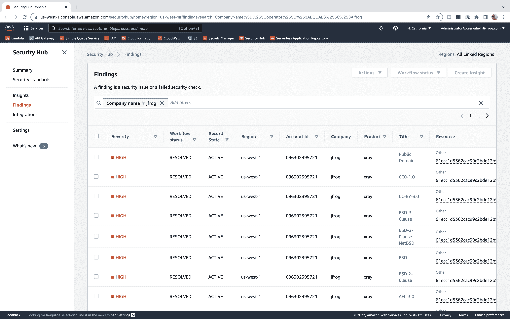

# JFrog 与 AWS 合作，提高云应用程序的安全性

> 原文：<https://devops.com/jfrog-aligns-with-aws-to-improve-cloud-application-security/>

在本周的 AWS re:Inforce 活动上，JFrog 宣布[将其 JFrog Xray 软件组合分析工具与 AWS Security Hub](https://www.businesswire.com/news/home/20220726006123/en/JFrog-Streamlines-Security-Threat-Detection-and-Response-with-AWS) 集成，AWS Security Hub 是一种云安全状态管理(CSPM)服务，每当检测到安全问题时都会提醒 it 团队。

此外，JFrog 还宣布它正在参与一个 [AWS 市场供应商洞察工具的预览。AWS 创建了 Marketplace Vendor Insights，对 AWS marketplace 上提供的第三方软件](https://securityboulevard.com/2022/07/aws-adds-more-tools-to-secure-cloud-workloads/)进行网络安全和合规风险评估。

JFrog 的合作伙伴营销经理 Steve Bohac 表示，JFrog Xray 与 AWS Security Hub 的集成将通过 AWS Security Hub 集中交付，简化 IT 团队接收网络安全警报的流程。AWS 本周类似地将 Amazon GuardDuty 恶意软件保护服务与 AWS Security Hub 集成在一起。

总的来说，通过 AWS Security Hub 访问的安全服务旨在使已经在 AWS 云上部署了应用程序工作负载的 it 团队更容易采用 DevSecOps 最佳实践。Bohac 指出，例如，JFrog Xray 被设计为使用 AWS Lambda 无服务器计算框架进行部署。

这些服务的出现正值一系列高调的应用程序违规事件发生后，作为更好地保护软件供应链的更大努力的一部分，对云安全的关注正在上升。一般来说，云平台比内部 IT 环境更安全；然而，用于构建和部署云应用程序的过程通常是有问题的，因为经常会犯错误。开发人员通常使用 Terraform 等开源工具来提供云基础设施和加速应用程序开发。大多数开发人员的网络安全专业知识有限，因此不可避免地会出现错误配置，而网络犯罪分子已经越来越善于发现和利用这些错误配置。

网络安全专业人员的长期短缺意味着大多数组织无法跟上工作负载在云中部署的速度。

幸运的是，越来越多的组织也开始采用 DevSecOps 最佳实践来使软件供应链更加安全。挑战在于，无论花费多少时间和精力来教育开发人员，总会有一个开发团队犯错误。JFrog Xray 等工具使得在部署应用程序之前发现这些问题变得可行。

尚不清楚 DevSecOps 对云应用程序安全性产生有意义的影响可能需要多长时间。已经部署在云平台上的应用程序数量已经数不胜数。至少在理论上，随着对这些应用程序的审查和更新，随着 DevSecOps 最佳实践被更广泛地采用，它们应该变得更加安全。然而，云应用程序的整体安全性可能需要数年时间才能得到实质性改善。

最终，下一代云应用应该会比他们的前辈更加安全。与此同时，希望任何存在安全缺陷的易受攻击的云应用程序在 IT 团队投入修复它们所需的资源之前不会被利用。实际上，这是一场与时间的赛跑。