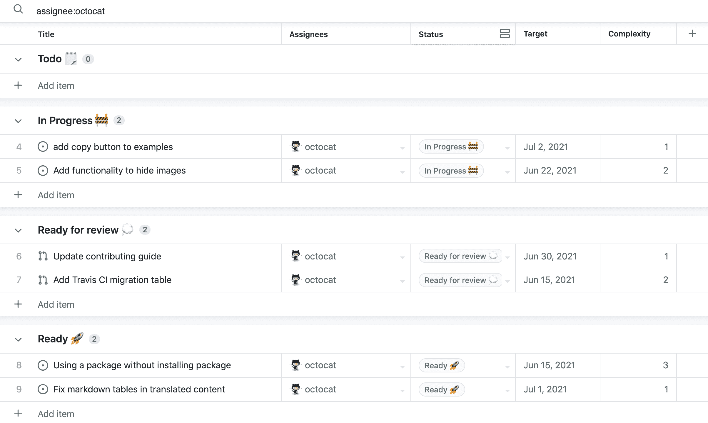

# GitHub 增加了简化软件开发管理的工具

> 原文：<https://devops.com/github-adds-tools-to-simplify-management-of-software-development/>

GitHub 已经发布了由 GitHub Issues 支持的[项目，这是一套基于电子表格界面管理应用程序开发项目的工具。](https://github.blog/2022-07-27-planning-next-to-your-code-github-projects-is-now-generally-available/)

GitHub 产品管理副总裁马里奥·罗德里格斯表示，这些工具使 DevOps 团队能够更容易地对问题进行筛选、排序和分组，并提出请求。例如，该功能可以配置和跟踪循环速度和当前工作状态，并使用累积流程图创建可视化效果。

在今年剩下的时间里，Rodriguez 说 GitHub 还计划增加额外的功能，包括自定义触发器、条件和动作逻辑，以及由 GitHub Issues 支持的项目的移动版。

Rodriguez 说，总的目标是为 DevOps 团队提供一套项目管理工具，使组织能够计划他们在哪里编码。他补充说，在许多情况下，这种方法消除了部署一套单独的项目管理应用程序的需要。

随着越来越多的组织开始依赖软件来驱动数字业务流程，管理所有正在进行的应用程序开发项目显然已经成为一项重大挑战。Rodriguez 说，GitHub 一直在开发由 GitHub 问题驱动的项目，为组织提供一套工具，不仅 DevOps 团队可以访问这些工具，应用程序所有者和业务负责人也可以访问这些工具，以跟踪各种项目的状态。

他指出，大多数组织还没有达到收入增长完全依赖于软件开发和部署速度的地步。然而，Rodriguez 说，随着 DevOps 团队更经常地与业务中的其他部门合作，由 GitHub 问题驱动的项目可以为任何人提供对易于使用的类似电子表格的应用程序的访问。

Rodriguez 补充说，总的来说，GitHub 致力于在组织争夺最佳人才的时候改善开发人员的体验。他指出，如果工资和福利相等，选择哪家公司工作取决于应用程序开发体验的质量。

作为最广泛使用的代码库的提供商，GitHub 一直在扩展其平台的覆盖范围和功能，以解决一系列 DevOps 工作流问题。DevOps 团队需要解决的问题是，相对于他们用来构建和部署应用程序的持续集成/持续交付(CI/CD)平台，如何将这些工作流锚定到代码存储库。

无论采用何种方法，毫无疑问，DevOps 团队现在可以构建更具可扩展性的工作流。这一点非常重要，因为组织同时管理的并发应用程序开发计划的数量在最近几年中已经大幅增加。Rodriguez 说，用于管理这些项目的基础平台需要可扩展，以防止工作流变得过于僵化。

目前还不清楚业务领导对 DevOps 工作流价值的理解程度，但随着业务流程的不断发展，有效竞争的能力可能取决于应用程序开发团队的敏捷性。