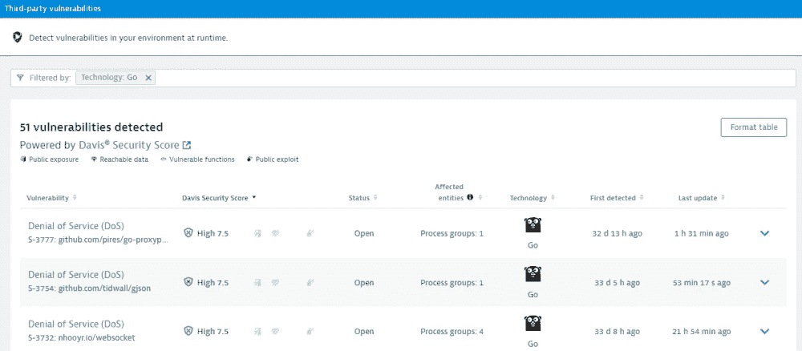

# Dynatrace 扩展了应用程序安全模块的范围

> 原文：<https://devops.com/dynatrace-extends-reach-of-application-security-module/>

Dynatrace】扩展了为其可观察性平台提供的应用安全模块，以防止运行时环境中的漏洞，包括 Java 虚拟机(JVM)、Node.js 运行时和。NET CLR。

此外，Dynatrace 还扩展了对使用 Go 编程语言构建的应用程序的支持。

Dynatrace 应用程序安全模块利用现有的 Dynatrace 跟踪和人工智能(AI)技术来实时检测威胁，然后应用适当的策略来自动保护应用程序。Dynatrace 应用安全方法的核心是其用于应用工具的 OneAgent 软件，该软件收集数据并将其反馈给一个可观测性平台，该平台包括一个被称为 Davis 的 [AI](https://digitalcxo.com/video/leadership-insights-intelligence-tools-and-ai/) 引擎。

Dynatrace 应用安全产品营销总监阿米特·沙阿表示，通过扩展应用安全模块以支持最广泛采用的编程语言的运行时，Dynatrace 现在可以提供整个应用堆栈的实时可见性和漏洞分析，包括自定义代码、开源和第三方库、语言运行时、容器运行时和容器编排器。

Shah 指出，Dynatrace 平台不仅可以自动识别这些层中的漏洞，还可以通过只显示与实际运行的代码相关的警报来分析这些漏洞，从而减少误报。他补充说，如果没有这些能力，开发团队就不可能在没有任何上下文的情况下优先考虑他们的应用程序修复工作。

Shah 说，总的来说，实现和维护应用程序的安全性需要更多的责任来左右摇摆。他指出，虽然在应用程序部署之前发现尽可能多的漏洞至关重要，但在应用程序部署之后，让在运行时发现漏洞变得更简单也很重要。Shah 补充说，目标是使 DevOps 团队能够采用他们用来管理和优化应用程序的相同的可观测性平台，同时确保应用程序的安全性。

Shah 指出，Dynatrace 方法还提供了额外的好处，即避免了召开“作战室”来发现这些应用程序环境中的所有漏洞可能存在于何处的需要。

组织面临的主要[应用](https://devops.com/the-future-of-application-development/)安全挑战是应用的部署速度。由于长期缺乏人才和专业知识，网络安全团队跟不上发展步伐。因此，更多的应用程序安全责任被转移到了开发人员和开发运维团队，以及 IT 和安全运营团队。Shah 指出，实际上，随着网络安全团队将更多精力放在保护运行时环境上，应用程序安全最终成为 IT 组织内部的一项团队运动。

在减少应用程序环境中定期引入的漏洞数量方面，这种方法可能还需要一段时间才能产生重大影响。然而，随着更多专门解决应用程序安全性的工具和平台的部署，应用程序安全性的整体状况将稳步改善。

然而，与此同时，针对 IT 堆栈应用层的攻击数量将不幸地继续增加，因为网络犯罪分子将更多精力放在利用每天都在增加的即时和零时差应用程序漏洞上。